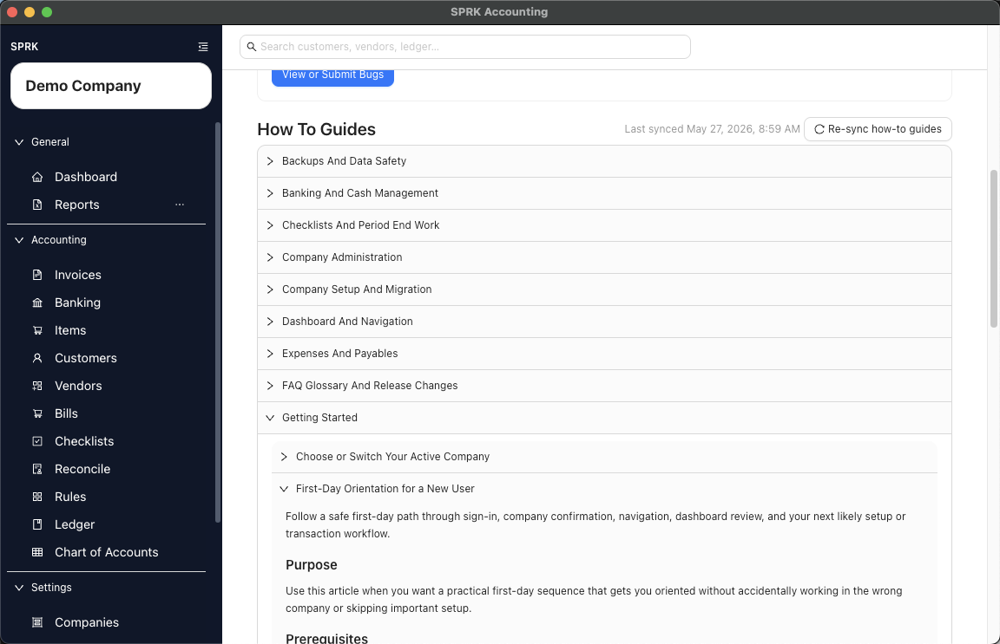
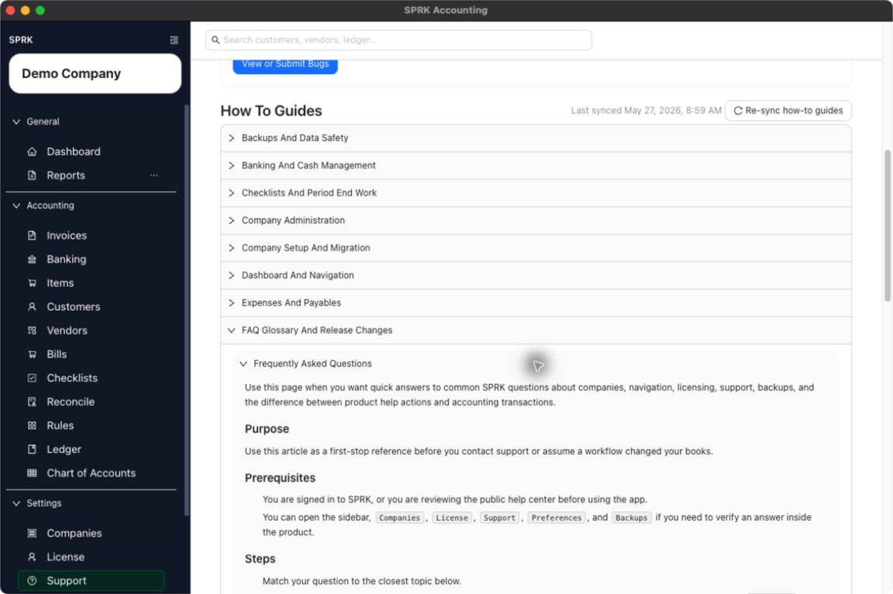

# Frequently Asked Questions

Use this page when you want quick answers to common SPRK questions about companies, navigation, licensing, support, backups, and the difference between product help actions and accounting transactions.

## When To Use This

Use this article as a first-stop reference before you contact support or assume a workflow changed your books.

## Before You Start

- You are signed in to SPRK, or you are reviewing the public help center before using the app.
- You can open the sidebar, `Companies`, `License`, `Support`, `Preferences`, and `Backups` if you need to verify an answer inside the product.

## Steps

1. Match your question to the closest topic below.
2. If your question is about which company you are editing, check the active company selector in the sidebar or open `Companies` to confirm the current selection.
3. If your question is about company creation limits, open `License` to review license details and usage information.
4. If your question is about troubleshooting, updates, or built-in help topics, open `Support`.
5. If your question is about backup timing or backup location, open `Preferences` and then select `Backups`.
6. Use these quick answers for the most common questions:

- `Does switching companies change my transactions?` No. It changes which company you are viewing, but it does not post or edit transactions by itself.
- `Do demo companies count toward the first real company limit?` No. Current product guidance says demo companies do not count toward the first real company allowance.
- `Does adding or viewing a license post anything to the books?` No. Licensing affects workspace access and visibility only.
- `Does downloading a support log or checking for updates affect balances?` No. Those are product-support actions, not accounting entries.
- `Can I create another company without a license?` Your first real company is free. Additional real-company creation may show a license prompt.
- `Where do I confirm backup timing?` In `Preferences` under `Backups`, where the schedule is shown in local device time.
- `Where do I find quick in-product help topics?` In the `Support` tab under `How To Guides`.
- `How do I confirm what version I am using?` Check the version shown in the sidebar footer.
- `Where do I confirm whether a workflow is covered?` Start with the section README that matches the product area, then open the linked workflow page.

## What Happens Next

You can answer common SPRK usage questions quickly and route yourself to the right product area for confirmation.

- Reading FAQ guidance does not create, edit, reverse, or delete a journal entry.
- Switching companies changes working context only and does not post a transaction by itself.
- License, support, backup, and update-reference actions described on this page do not affect account balances unless you separately enter or classify accounting transactions elsewhere in SPRK.

## If Something Looks Wrong

- Assuming a settings or support action changes the books just because it changes what you can see.
- Forgetting to confirm the active company before starting a workflow.
- Treating usage statistics or backup settings as accounting entries.

## Related

- [Switch between companies](../company-setup-and-migration/switch-between-companies.md)
- [View license information](../licensing/view-license-information.md)
- [Use the support tab](../support-and-troubleshooting/use-the-support-tab.md)
- [Review backup settings visible in the product](../backups-and-data-safety/review-backup-settings-visible-in-the-product.md)
