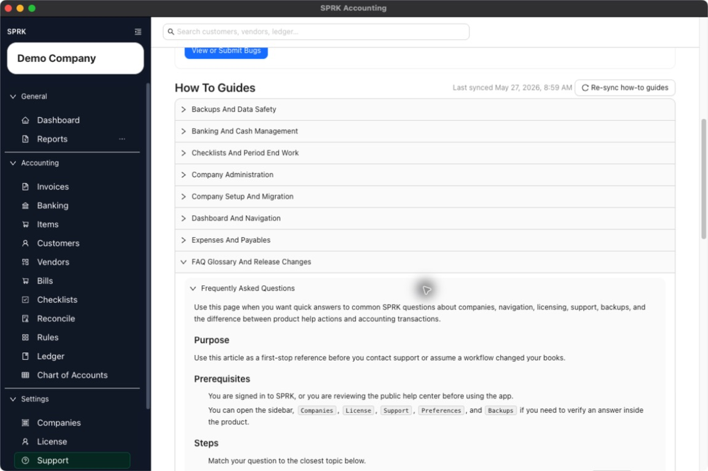

# Frequently Asked Questions

<!-- Screenshot status: Review needed -->

Find quick answers to common questions about setup, everyday work, imports, reconciliation, backups, and support.

## Getting started

### How do I know which company I am working in?

Check the company name in the sidebar before entering or importing records. Use [Switch between companies](../company-setup-and-migration/switch-between-companies.md) when you need a different company.

### Does a demo company count toward my first real company?

No. Demo companies do not count toward the first real-company allowance.

### Where can I see my SPRK version?

Check the version shown in the sidebar footer. Include it when you contact support.

## Invoices, bills, and payments

### Should an unpaid invoice use a bank account in `Receive to`?

Usually no. Choose an Accounts Receivable control account when the invoice should remain open until payment. Choose a bank or cash account only when the invoice is paid now. See [Create an invoice](../sales-and-receivables/create-invoices.md).

### Should an unpaid bill use a bank account in `Pay from`?

Usually no. Choose an Accounts Payable control account when the bill should remain open until payment. Choose a bank, cash, or credit-card account only when the bill is paid now. See [Create a bill](../expenses-and-payables/create-bills.md).

### Is recording a payment the same as matching a bank transaction?

No. Record the payment against the invoice or bill first. Then match the imported bank row to that existing payment so the same cash movement is not recorded twice.

## Imports

### Which import should I use?

Start with [What each import can bring into SPRK](../company-setup-and-migration/understand-import-and-migration-boundaries.md). Bank, invoice, bill, journal, setup, and Company File imports serve different purposes.

### What should I do before confirming an import?

Confirm the active company, use the template for that import, review the preview totals and warnings, and keep a copy of the source file. See [Before you import](../company-setup-and-migration/before-you-import.md).

### An import completed, but something looks wrong. What should I send support?

Send the company name, import type, file name, run time, visible counts or warnings, and the source file when it is safe to share. See [Collect import run details for support](../support-and-troubleshooting/collect-import-run-details-for-support.md).

## Reconciliation and reports

### Why does the reconciliation difference need to be zero?

A zero difference means the selected cleared activity agrees with the statement ending balance. Resolve missing, duplicate, or incorrectly cleared items before finishing. See [Finish a reconciliation](../reconciliation/finish-a-reconciliation.md).

### How do I find what makes up a report total?

Select a supported amount or account row to open its journal detail. See [Open supporting details from a report](../reports-and-financial-review/use-report-drilldown-behavior.md).

## Backups and Company Files

### Where do I check backup timing and location?

Open `Preferences`, then `Backups`. Review the schedule, saved location, latest status, and `Run Backup Now` result. See [Review backup settings and run a backup](../backups-and-data-safety/review-backup-settings-visible-in-the-product.md).

### Is a Company File the same as a routine backup?

No. A Company File is a package for exporting or importing one company. Keep routine backup and Company File workflows separate. See [Export and import Company Files](../backups-and-data-safety/export-and-import-company-files.md).

## Get more help

### A page or task seems to be missing. What should I check?

Confirm the active company, open the product area that owns the task, and make sure required setup records exist. See [Find a missing page or task](../support-and-troubleshooting/troubleshoot-common-navigation-or-workflow-confusion.md).

### How do I contact support?

Open `Support` to review the activity log and contact options. Include the company, page, task, expected result, actual result, and any visible error. See [Use the Support tab](../support-and-troubleshooting/use-the-support-tab.md).

## Related

- [Product glossary](./product-glossary.md)
- [Collect the right details before contacting support](../support-and-troubleshooting/collect-the-right-details-before-contacting-support.md)
