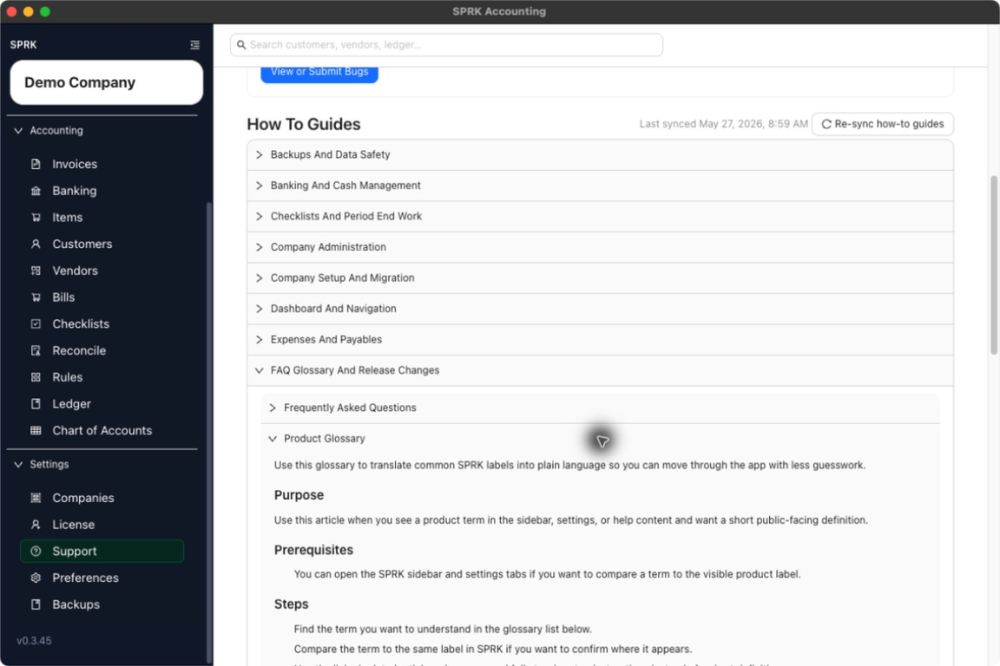

# Product Glossary

Use this glossary to translate common SPRK labels into plain language so you can move through the app with less guesswork.

## When To Use This

Use this article when you see a product term in the sidebar, settings, or help content and want a short public-facing definition.

## Before You Start

- You can open the SPRK sidebar and settings tabs if you want to compare a term to the visible product label.

## Steps

1. Find the term you want to understand in the glossary list below.
2. Compare the term to the same label in SPRK if you want to confirm where it appears.
3. Use the linked related articles when you need full step-by-step instructions instead of a short definition.
4. Use these public definitions for the current visible product terms:

- `Active company`: The company currently selected in the sidebar and used by the rest of the app until you switch again.
- `Backups`: The settings area that controls automatic backup timing, backup location, and manual backup runs for this device.
- `Checklists`: Repeatable operational task lists used to track accounting or close-style work without posting transactions by themselves.
- `Chart of Accounts`: The list of accounts you classify transactions to and report from.
- `Dashboard`: The top-level summary view for recent business activity and quick navigation.
- `How To Guides`: Built-in support topics shown from the `Support` tab.
- `License`: The settings area for saved license details, purchase access, and tenant-wide usage visibility.
- `Preferences`: Personal and device-level settings such as appearance, formatting, update preferences, and sidebar customization.
- `Reconcile`: The area used to match account activity to a statement balance and track cleared or unmatched items.
- `Rules`: Saved bank-transaction classification logic used from banking workflows.
- `Support Activity Log`: The current-session troubleshooting log you can download or clear from the `Support` tab.
- `Tenant Stats`: Workspace-wide usage counts shown in the `License` area.

## What Happens Next

You can interpret common SPRK terms more consistently and navigate to the right workflow page when you need more detail.

- Looking up a glossary term does not post or modify a transaction.
- Definitions on this page explain product labels only and do not change company balances.

## If Something Looks Wrong

- Treating a navigation label as proof that a transaction was created.
- Assuming tenant-wide terms such as `License` or `Tenant Stats` describe one company only.
- Using a short definition when you actually need the full workflow article.

## Related

- [Move between major app areas](../dashboard-and-navigation/move-between-major-app-areas.md)
- [Understand the chart of accounts structure](../ledger-and-chart-of-accounts/understand-the-chart-of-accounts-structure.md)
- [Start a reconciliation](../reconciliation/start-a-reconciliation.md)
- [Use the support tab](../support-and-troubleshooting/use-the-support-tab.md)
