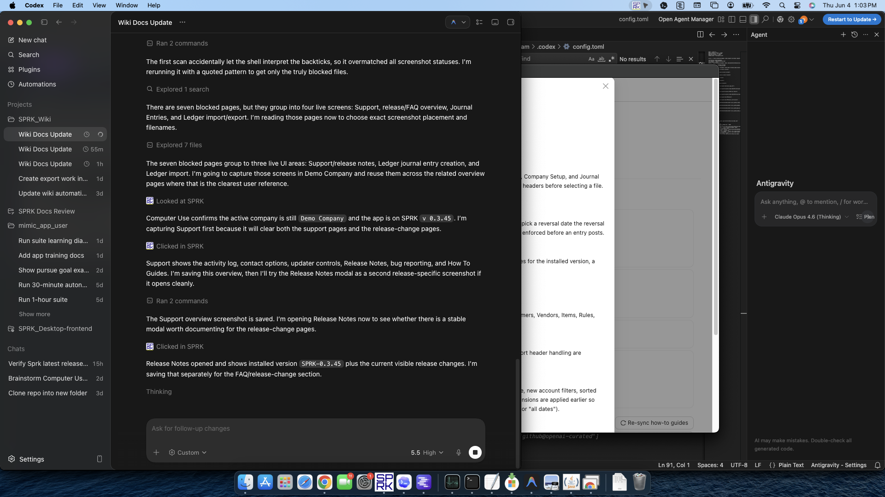

# User-Facing Release Change Summaries

Use this article to understand how SPRK release-change notes should be read by end users: focus on the visible workflow change, the affected app areas, and whether the change has any accounting impact.

## Purpose

Use this workflow when you want to interpret public release notes without confusing a navigation change, update prompt, support improvement, or release-notes modal with a posted accounting transaction.

## Prerequisites

- You can view the SPRK sidebar.
- You can open `Support` if your installed app exposes update controls.
- You have the related workflow article available when you want more detailed instructions.

## Steps

1. Start with the visible workflow change, not the technical implementation.
2. Confirm which app sections the change touches, such as `Support`, `License`, `Backups`, or a transaction page.
3. Check the current app version in the sidebar footer so you know which build you are comparing.
4. If the change relates to downloading or installing an update, open `Support` and use the visible update controls when they are available in your installed app.
5. Use `Release Notes` when it is shown so you can review the visible version context before restarting. Depending on the updater state, the modal can describe the installed version, the downloaded update version, or the latest public release.
6. If the in-app release notes do not load, use the fallback link to the public releases page and continue reading the visible workflow summary there.
7. Read the related workflow article for the affected area so you understand the full user steps after the change.
8. Look for a plain-language statement about general ledger impact whenever the change touches transaction entry, classification, reconciliation, or reporting behavior.
9. If a release note does not mention posting behavior, assume only the documented visible workflow changed and confirm transaction effects in the related accounting article before acting.

## Expected Result

You can read user-facing release summaries with the right frame: what changed on screen, which workflows are affected, and whether the change alters bookkeeping behavior. On 2026-06-06, the Support path showed installed-version release notes for `SPRK-0.3.45` with release sections and an external GitHub release link. Current general ledger impact as of 2026-06-06:

- Reading a release summary does not post or modify any transaction.
- Opening an in-app release-notes modal or public releases link does not post or modify any transaction.
- Downloading an app update, installing an app update, or dismissing an update prompt does not affect the general ledger.
- Only workflow changes that explicitly involve transaction creation, editing, classification, reconciliation, or reporting should be evaluated for ledger impact.

## Common Mistakes

- Treating a release note as accounting advice instead of product guidance.
- Assuming every update changes transaction behavior.
- Assuming every build shows the same release-notes prompt or modal state.
- Ignoring the app version when comparing what you see to documented instructions.

## Related Articles

- [Use the support tab](../support-and-troubleshooting/use-the-support-tab.md)
- [View available reports](../reports-and-financial-review/view-available-reports.md)
- [Review and classify bank transactions](../banking-and-cash-management/review-and-classify-bank-transactions.md)
- [Record journal entries](../ledger-and-chart-of-accounts/record-journal-entries.md)

## Info

- App sections: `dashboard`, `support`
- Last validated: 2026-06-06
- Screenshot status: `captured`
