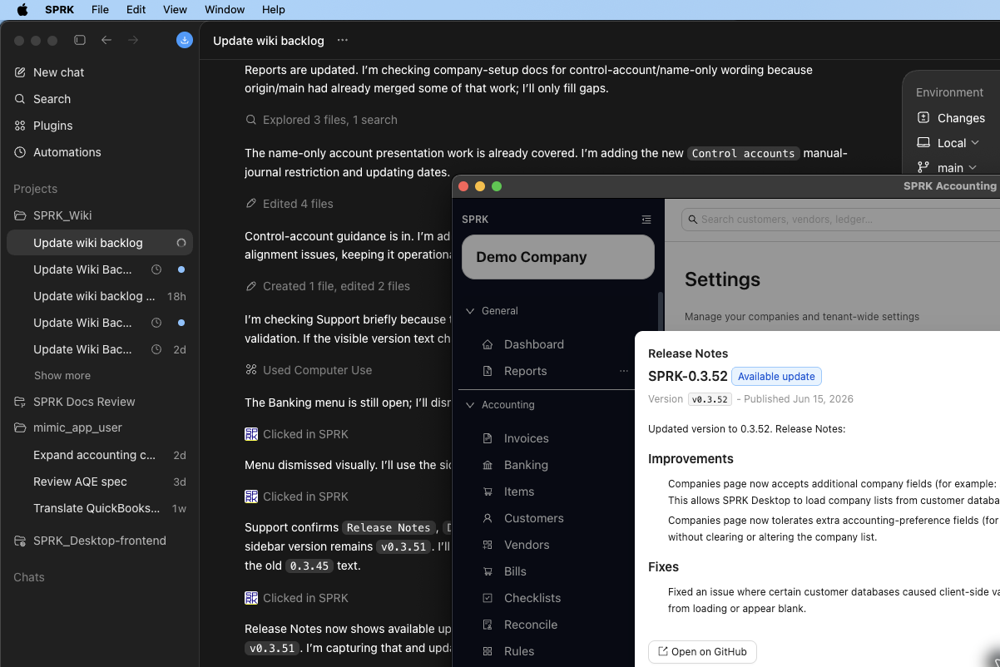

# What Changed In This Release For Documented Workflows

Use this page to review the current set of user-visible workflow areas that now have public documentation coverage and the main behaviors readers should pay attention to in this release cycle.

## Purpose

Use this article when you want a compact summary of the documented workflow areas that matter most to end users in the current wiki release.

## Prerequisites

- You can open the related workflow pages for any area you want to review in detail.
- You can open `Support`, `License`, `Backups`, and the sidebar if you want to compare the current product surface to the documentation set.

## Steps

1. Review the documented workflow areas below to see what end users should notice in the current release cycle.
2. Open the linked workflow page for any area that affects your day-to-day work.
3. Treat each summary as a documentation-level change summary, then confirm the full procedure in the linked article before changing your process.
4. Focus on the current documented workflow additions and clarifications:

- `Support`: Public documentation now covers support-log download and clear actions, current contact options, update controls when supported by the installed app, the conditional `Release Notes` path before restart, public-release fallback behavior, bug-reporting links, database-alignment support boundaries, and built-in `How To Guides`.
- `License`: Public documentation now covers saved license details, the visible purchase path, the tenant usage table, and when company-creation prompts may appear.
- `Backups`: Public documentation now covers automatic backup timing, backup-location visibility, manual backup actions, and visible company-file export/import controls, while keeping restore guidance intentionally limited.
- `Company setup`: Public documentation now covers firm-first client setup, import and migration boundaries, first-company defaults, and control-account maintenance.
- `Imports`: Public documentation now distinguishes starter templates from finalized sample files and explains when to collect import-run details for support.
- `Banking`: Public documentation now covers import template access, vendor/source fields in imported transaction review, transfer counterpart behavior, and matching boundaries.
- `Invoices and bills`: Public documentation now covers document payment history, linked journal review, invoice void behavior, and the current bill action-menu boundary validated in `v 0.3.51`.
- `Ledger`: Public documentation now covers journal import preview and batch behavior, control-account selection restrictions, and document-linked payment journals.
- `Reports`: Public documentation now clarifies active-report export behavior, drilldown navigation, and the boundary between report review and tax filing guidance.
- `Plugins`: Public documentation now covers the settings tab, bundle preview, company availability, public runtime visibility, and troubleshooting for plugin pages that do not appear.
- `Company context`: Public documentation now emphasizes confirming the active company before you create, edit, import, reconcile, or review records.
- `Release interpretation`: Public documentation now distinguishes product updates and support actions from bookkeeping actions so readers do not assume every visible change affects the ledger.

## Expected Result

You can see which user-facing workflow areas gained or clarified documentation in the current release cycle and know where to read the full instructions next. Current general ledger impact as of 2026-06-17:

- Reviewing this change summary does not post a transaction.
- Support, license, backup, and version-reference changes described here do not affect account balances by themselves.
- For accounting workflows, the related article remains the source for specific general-ledger impact details.

## Common Mistakes

- Assuming a documentation update means the underlying accounting behavior changed.
- Skipping the linked workflow article after reading a summary.
- Forgetting that company context should be verified before operational work in shared workspaces.

## Related Articles

- [Use the support tab](../support-and-troubleshooting/use-the-support-tab.md)
- [Understand when an upgrade prompt may appear](../licensing/understand-when-an-upgrade-prompt-may-appear.md)
- [Understand backup schedule behavior](../backups-and-data-safety/understand-backup-schedule-behavior.md)
- [Choose or switch your active company](../getting-started/choose-or-switch-your-active-company.md)
- [Version 1.0 capability matrix](../version-1-0-capability-matrix.md)

## Info

- App sections: `dashboard`, `companies`, `license`, `support`, `backups`
- Last validated: 2026-06-17
- Screenshot status: `captured`
