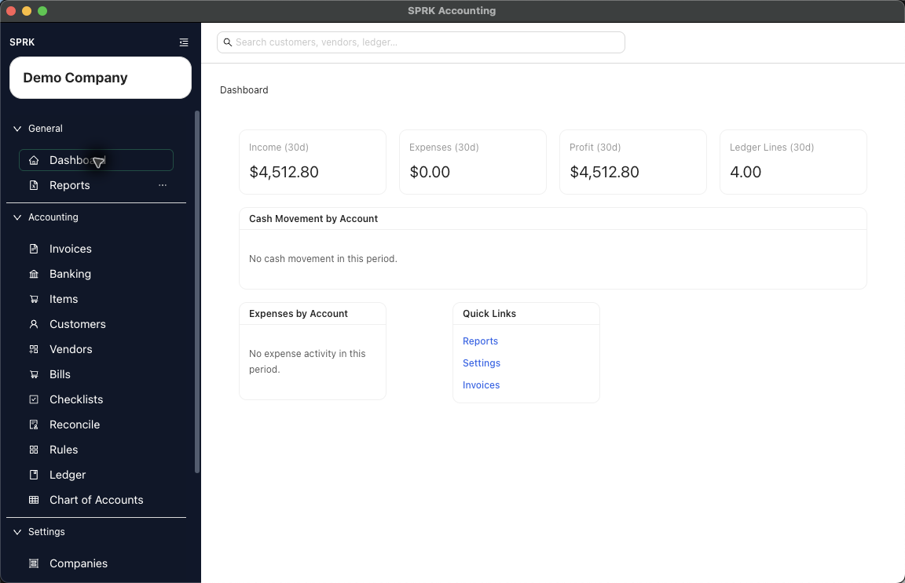

# Getting Started

Sign in, confirm the right company, learn the main navigation, use the dashboard as your starting point, and follow a first-client setup path for firm work.

## In This Section

- [Sign in to SPRK](./sign-in-to-sprk.md)
- [Switch between companies](../company-setup-and-migration/switch-between-companies.md)
- [Move between major app areas](../dashboard-and-navigation/move-between-major-app-areas.md)
- [Understand the dashboard overview](../dashboard-and-navigation/understand-the-dashboard-overview.md)
- [First-day orientation for a new user](./first-day-orientation-for-a-new-user.md)
- [Set up a first client for firm work](./set-up-first-client-for-firm-work.md)

## Related Foundation Workflows

- [Create your first company](../company-setup-and-migration/create-your-first-company.md)
- [Use the Preferences tab](../preferences-and-personalization/use-the-preferences-tab.md)
