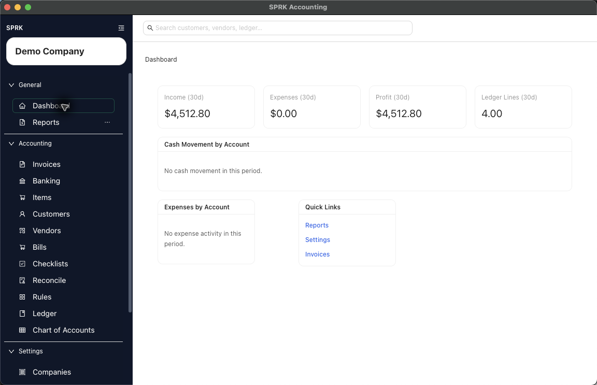

# Getting started

Choose the right company, learn the main parts of SPRK, and complete your first setup steps.

## Start here

- [Take a first-day tour](./first-day-orientation-for-a-new-user.md)
- [Sign in to SPRK](./sign-in-to-sprk.md)

## Common tasks

- [Set up your first client](./set-up-first-client-for-firm-work.md)

## Related

- [Create your first company](../company-setup-and-migration/create-your-first-company.md)
- [Choose your preferences](../preferences-and-personalization/use-the-preferences-tab.md)
