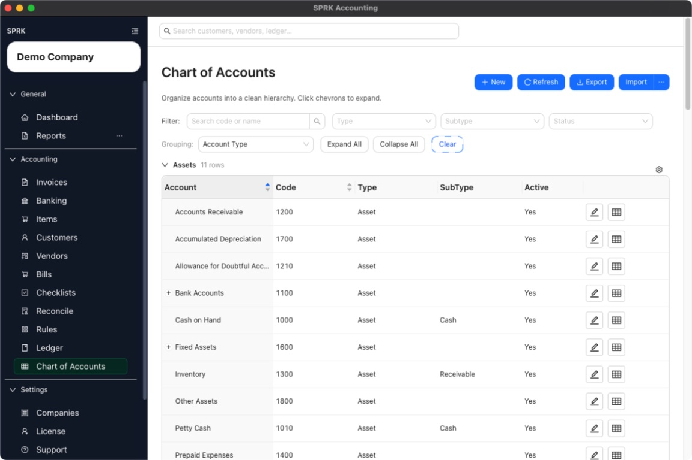

# Ledger and Chart of Accounts

Organize your account list, decide when to use journal entries, make accountant corrections, move ledger data in or out of SPRK, and understand audit-sensitive actions.

Journal Entries search applies across the result set, with `Previous` and `Next` controls available when results span multiple pages.

Backdated journal corrections that affect posted Bank, Cash, or Credit Card reconciliation history require an explicit `Void affected reconciliation?` decision before the save completes.

## In This Section

- [Understand the chart of accounts structure](./understand-the-chart-of-accounts-structure.md)
- [Record journal entries](./record-journal-entries.md)
- [Set up and use dimensions or classes](../company-administration/set-up-and-use-dimensions-or-classes.md)
- [Choose between journal entries and source workflows](./when-to-use-journal-entries-vs-source-forms.md)
- [Common accountant corrections](./common-accountant-corrections.md)
- [Edit linked ledger and bank activity](./edit-linked-ledger-and-bank-activity.md)
- [Review document payment history and linked journals](./review-document-payment-history-and-linked-journals.md)
- [Prepare and review ledger imports and exports](./understand-ledger-import-and-export-behavior.md)
- [Understand audit-sensitive ledger behavior](./understand-audit-sensitive-ledger-behavior.md)
