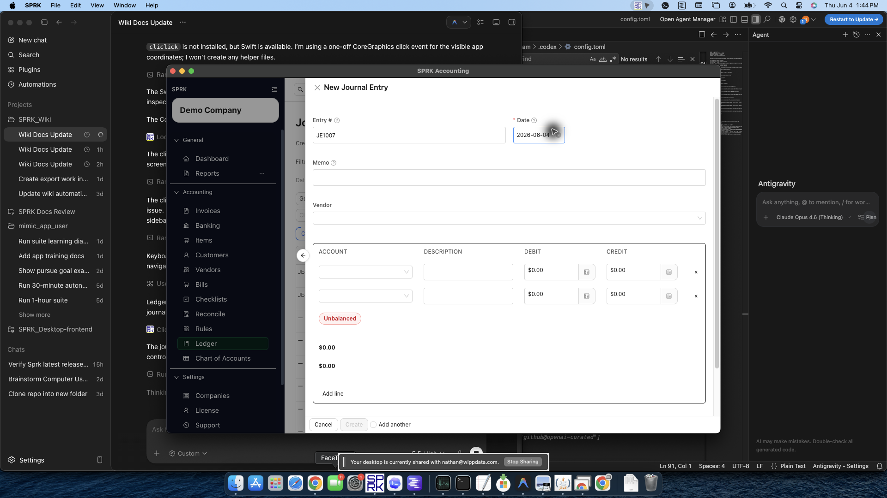

# Common Accountant Corrections

Choose the correction path that preserves the source record, payment history, reconciliation state, and ledger trail.

## Use This Page When

Use this page when review work finds the wrong account, date, customer, vendor, payment status, or posting method and you need to decide where the correction belongs.

## Choose This Path If

| Goal | Use | Check First |
|---|---|---|
| Correct an invoice or customer balance | [Void or correct invoices](../sales-and-receivables/void-or-correct-invoices.md) | Invoice status, balance, active payments, and linked journals |
| Correct a bill or vendor balance | [Void or correct bills](../expenses-and-payables/void-or-correct-bills.md) | Bill status, balance, active payments, and linked journals |
| Undo an invoice or bill payment | [Review payment history and reverse from the linked journal](./review-document-payment-history-and-linked-journals.md) | Document, payment amount, linked payment journal, and reversal date |
| Correct a bank classification before or after confirmation | [Review and classify bank transactions](../banking-and-cash-management/review-and-classify-bank-transactions.md) | Pending vs confirmed state, reconciliation state, and linked journal |
| Repair the accounting link on a confirmed bank row | [Resolve confirmed bank transactions](../banking-and-cash-management/resolve-confirmed-bank-transactions.md) | Current link, candidate GL line, account, amount, date, and memo |
| Reverse or enter an accountant-only adjustment | [Record journal entries](./record-journal-entries.md) | Whether the issue belongs outside customer, vendor, bank, or source-document workflows |
| Choose journal entry vs source workflow | [Choose between journal entries and source workflows](./when-to-use-journal-entries-vs-source-forms.md) | Whether a source document should own the accounting event |
| Investigate a report balance | [Use report drilldown behavior](../reports-and-financial-review/use-report-drilldown-behavior.md) | Supporting entries, source document, date range, and active company |
| Resolve a reconciliation difference | [Resolve common reconciliation exceptions](../reconciliation/resolve-common-reconciliation-exceptions.md) | Statement period, selected rows, reconciled state, and correction date |

## Before You Commit

- Start from the report, list, or transaction where the issue was found.
- Drill into supporting detail before posting a correction.
- Identify the original source workflow.
- Confirm whether the transaction has been reconciled, paid, voided, or linked to another record.
- Use reversal when you need to preserve the original posting and create an offsetting entry.
- Use a correcting journal entry only when the adjustment does not belong to a customer, vendor, invoice, bill, payment, or bank transaction workflow.

## What Not To Assume

- A journal entry is not the first answer for every invoice, bill, payment, or bank issue.
- Deleting history is not a cleanup strategy for making reports look right.
- Reversing an entry twice can duplicate the correction.
- Correcting both a source workflow and a journal entry can duplicate the adjustment unless both are intentionally required.

## If Something Looks Wrong

| What You See | What To Check | What To Do Next |
|---|---|---|
| An invoice or bill correction is being entered as a journal entry | Whether the source workflow should own the correction | Review the invoice or bill workflow first |
| Reconciled bank activity needs correction | Whether the change affects a posted reconciliation period | Review the reconciliation impact before editing or excluding activity |
| A journal correction triggers `Void affected reconciliation?` | Whether the settlement account and journal date affect posted statement periods | Cancel to leave the edit uncommitted, or use `Void and save` only when retaining the old session as `Voided` is the intended audit trail |
| A report balance looks wrong | Whether the underlying transaction should be corrected instead | Use a supported correction or reversal workflow instead of deleting history |
| A reversal already exists | Whether the entry has already been reversed once | Do not reverse the same entry again unless that is the intended correction |
| Both a source workflow and journal entry correction seem possible | Whether correcting both would duplicate the adjustment | Choose one correction path unless both are intentionally required |

## Related

- [Review document payment history and linked journals](./review-document-payment-history-and-linked-journals.md)
- [Review financial results inside the product](../reports-and-financial-review/review-financial-results-inside-the-product.md)
- [AR review workflow](../sales-and-receivables/ar-review-workflow.md)
- [AP review workflow](../expenses-and-payables/ap-review-workflow.md)
