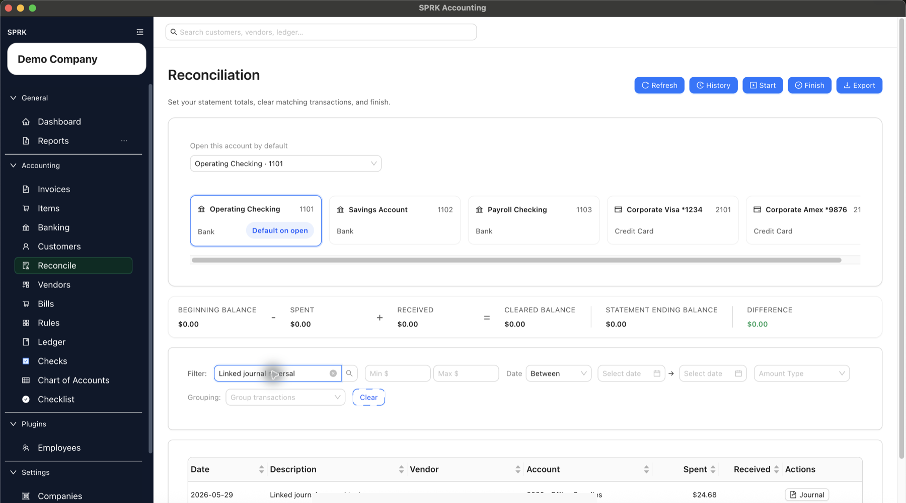
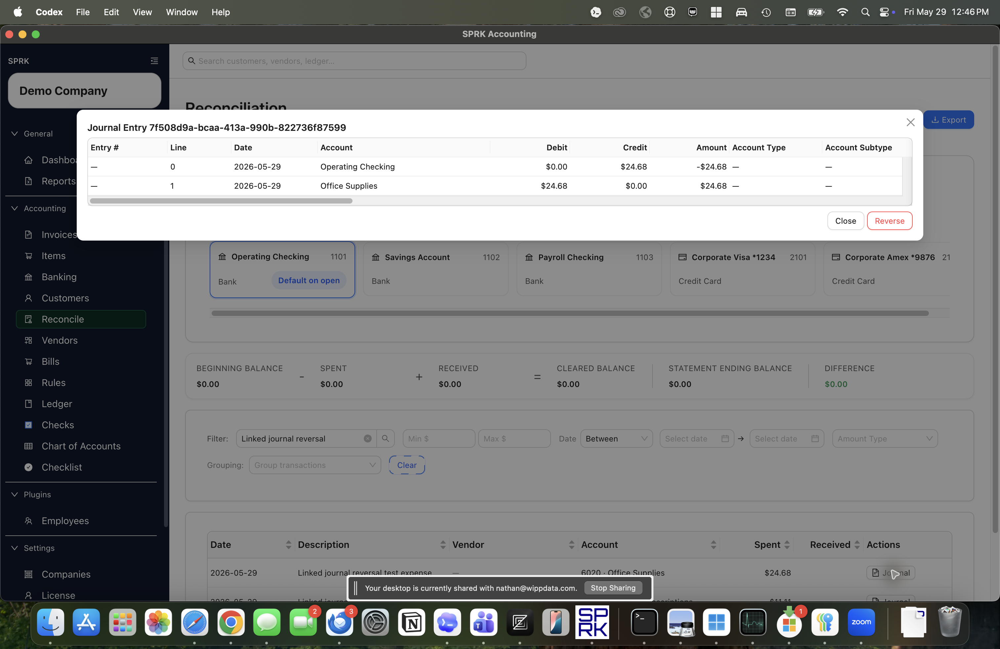
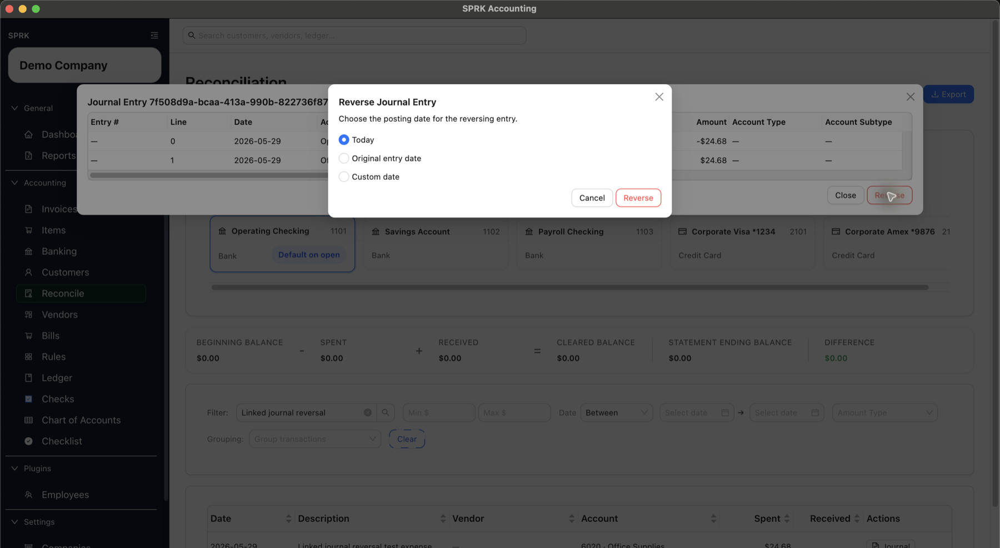

# Edit Linked Ledger and Bank Activity

Review or reverse confirmed bank activity from its linked journal entry, and inspect linked bank-register rows created from journals when that action is available, without deleting the original posting trail.

## Purpose

Use this workflow when a confirmed bank or credit card transaction has a linked journal entry and you need to inspect the posting, reverse the ledger entry, review linked bank-register rows where SPRK exposes them, or correct activity that is already part of reconciliation review.

## Prerequisites

- An active company is selected.
- The bank or credit card transaction is already confirmed.
- The transaction has a linked journal entry. In `Reconcile`, eligible rows show an enabled `Journal` action.
- You know whether the original bank transaction has already been reconciled.

## Steps

1. Open `Reconcile`.
2. Select the bank or credit card account that contains the confirmed transaction.
3. Set the statement ending date far enough forward for the transaction to appear, then filter or search for the row.
4. Confirm the row shows an enabled `Journal` action.

5. Select `Journal` to open the linked journal entry.
6. Review the entry number, posting date, memo, bank-side line, and offset account lines.

7. If the posted journal preview exposes `View bank register`, use it when you need to inspect register rows linked to the journal.
   - `Linked bank register` lists register rows mirrored from Bank, Cash, and Credit Card lines on the journal entry.
   - `Add missing rows` restores eligible missing linked register rows for the journal, but it may report that no missing rows were found.
   - `Exclude` removes an unreconciled linked register row without unposting the journal.
   - Reconciled rows cannot be excluded from this modal.
   - Use `Edit journal entry` for accounting corrections; do not expect to edit the linked register row directly.
8. Select `Reverse`.
9. Choose the posting date for the reversal:
   - `Today` posts the reversal on the current date.
   - `Original entry date` posts the reversal on the same date as the original entry.
   - `Custom date` lets you enter a specific reversal date.
10. Select `Reverse` only after confirming the reversal date and original entry lines.

11. Review `Reconcile`, `Banking`, or `Ledger` to confirm the correction appears in the expected period.

## Expected Result

SPRK preserves the original audit trail and creates a separate reversing entry. Current linked bank and ledger behavior as of 2026-05-29:

- The original journal entry remains in place.
- Linked bank-register rows created from a manual journal preserve that journal as the posting source. They are not the same workflow as confirming a pending imported bank transaction.
- Older single-link journal rows can be adopted into the newer per-line linkage model when SPRK can match the account and normalized amount, so prior linked bank rows can remain tied to the original journal.
- The reversal journal entry flips the original debit and credit lines.
- SPRK prevents reversing a reversal entry.
- SPRK prevents reversing the same original entry more than once.
- If the linked bank transaction has not been reconciled, SPRK excludes the original bank row and marks it as excluded because of the journal reversal.
- If the linked bank transaction has already been reconciled, SPRK leaves the reconciled row in place and creates a confirmed correction bank transaction linked to the reversal journal entry.
- After a successful reversal from `Reconcile`, the reconciliation table reloads and SPRK shows `Journal entry reversed`.

## Common Mistakes

- Treating reversal as delete or edit. The original entry remains visible for audit history.
- Editing linked bank-register accounting directly from the modal. Accounting details still change through the journal entry.
- Reversing before confirming whether the transaction has already been reconciled.
- Choosing a custom reversal date that belongs in the wrong statement period.
- Expecting every historical row to show `Journal`. Rows without a persisted journal link do not have the linked journal action.

## Related Articles

- [Review and classify bank transactions](../banking-and-cash-management/review-and-classify-bank-transactions.md)
- [Resolve common reconciliation exceptions](../reconciliation/resolve-common-reconciliation-exceptions.md)
- [Understand audit-sensitive ledger behavior](./understand-audit-sensitive-ledger-behavior.md)
- [Record journal entries](./record-journal-entries.md)

## Info

- App sections: `reconcile`, `ledger`, `banking`
- Last validated: 2026-05-29
- Screenshot status: `captured`
