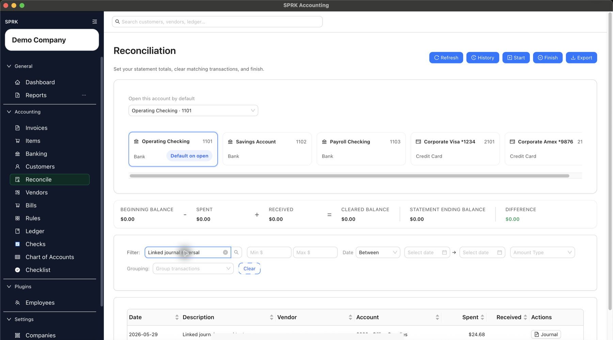
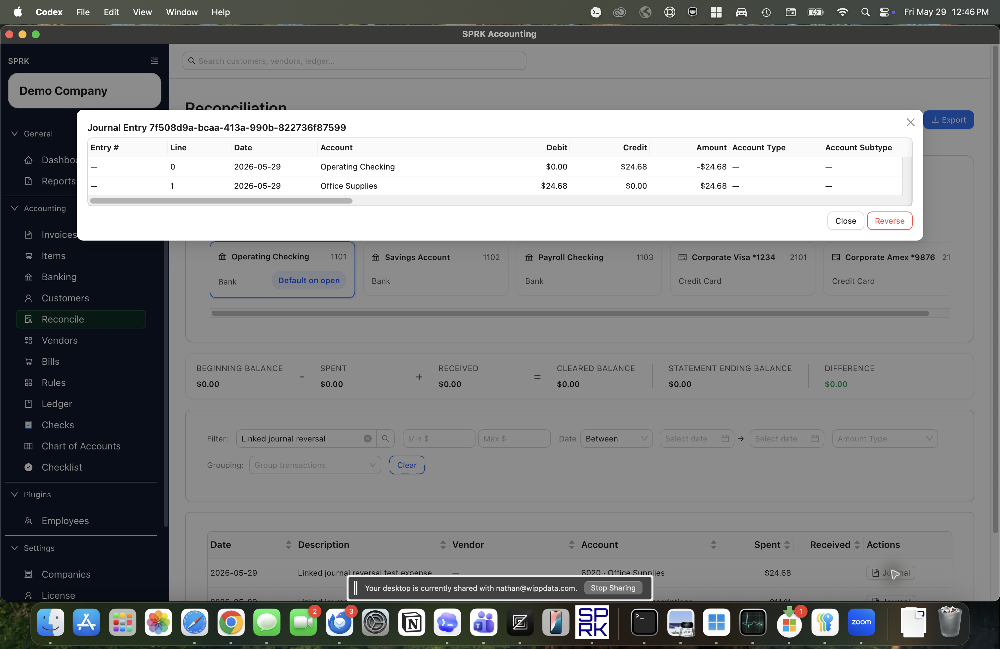
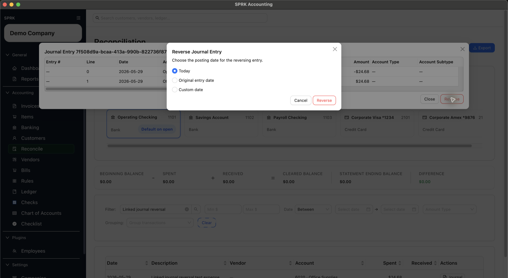

# Edit Linked Ledger and Bank Activity

<!-- Last validated: 2026-07-15 (SPRK 0.4.10, Demo Company) -->
<!-- Screenshot status: Current; related void-confirmation and posted-history screenshots captured 2026-07-15 -->

Review or reverse confirmed bank activity from its linked journal entry, and inspect linked bank-register rows created from journals when that action is available, without deleting the original posting trail.

## When To Use This

Use this workflow when a confirmed bank or credit card transaction has a linked journal entry and you need to inspect the posting, reverse the ledger entry, review linked bank-register rows where SPRK exposes them, or correct activity that is already part of reconciliation review.

## Before You Start

- An active company is selected.
- The bank or credit card transaction is already confirmed.
- The transaction has a linked journal entry. In `Reconcile`, eligible rows show an enabled `Journal` action.
- You know whether the original bank transaction has already been reconciled.

## Steps

1. Open `Reconcile`.
2. Select the bank or credit card account that contains the confirmed transaction.
3. Set the statement ending date far enough forward for the transaction to appear, then filter or search for the row.
4. Confirm the row shows an enabled `Journal` action.

5. Select `Journal` to open the linked journal entry.
6. Review the entry number, posting date, memo, bank-side line, and offset account lines.

7. If the posted journal preview exposes `View bank register`, use it when you need to inspect register rows linked to the journal.
   - `Linked bank register` lists register rows mirrored from Bank, Cash, and Credit Card lines on the journal entry.
   - `Resolve` reviews whether eligible missing linked register rows can be restored for the journal, but it may report that no missing rows were found.
   - `Exclude` removes an unreconciled linked register row without unposting the journal.
   - Reconciled rows cannot be excluded from this modal.
   - Use `Edit journal entry` for accounting corrections; do not expect to edit the linked register row directly.
8. If you are starting from a confirmed bank row instead of a journal preview, use Banking `Categorized` > `Resolve` when the problem is the row's GL link rather than the journal entry itself.
   - `Resolve GL link` can remove the current journal association, link the confirmed bank row to a reviewed existing GL line, or create and link a new GL transaction when the bank row has a valid category or split.
   - Removing the link keeps the bank row confirmed and preserves reconciliation or statement metadata.
   - Suggested GL lines are candidates. Compare account, amount, date, memo, and supporting detail before linking.
9. For a compatible confirmed bank row linked to a simple two-line journal, use the supported edit surface when you need to correct the date, amount, description, memo, party, dimensions, or non-cash target account.
   - Review both the bank row and its paired journal after saving; compatible fields are kept together across the pair.
   - A same-date recategorization of only the non-cash target account does not by itself require reconciliation history to be voided when the settlement account, amount, and posting date remain unchanged.
   - Split rows, changes to the reconciled settlement account, and source-document-owned activity can require reversal, a source workflow, or another blocked correction path instead of direct synchronization.
10. Select `Reverse` when a separate reversing entry is the correct audit trail.
11. Choose the posting date for the reversal:
   - `Today` posts the reversal on the current date.
   - `Original entry date` posts the reversal on the same date as the original entry.
   - `Custom date` lets you enter a specific reversal date.
12. Select `Reverse` only after confirming the reversal date and original entry lines.

13. If SPRK shows a source-document confirmation for an invoice or bill posting, read the document impact before confirming:
   - Invoice or bill recognition journals can require voiding the source document and reversing the posting together.
   - Invoice-payment or bill-payment journals can require reversing the payment application and the journal together so the source document balance reopens correctly.
   - Some linked journals are intentionally not reversible from the ledger and must be corrected from the invoice or bill workflow.
14. If a journal create or edit would affect posted settlement-account history, review `Void affected reconciliation?` before saving. `Cancel` leaves the edit uncommitted; `Void and save` preserves the affected sessions as `Voided` history and releases their bank rows for later reconciliation review.
15. Review `Reconcile`, `Banking`, or `Ledger` to confirm the correction appears in the expected period.

## What Happens Next

SPRK preserves the original audit trail and creates a separate reversing entry.

- The original journal entry remains in place.
- Linked bank-register rows created from a manual journal preserve that journal as the posting source. They are not the same workflow as confirming a pending imported bank transaction.
- Older single-link journal rows can be adopted into the newer per-line linkage model when SPRK can match the account and normalized amount, so prior linked bank rows can remain tied to the original journal.
- Journal-side register `Resolve` and Banking-side `Resolve GL link` are repair workflows. They preserve the audit trail instead of editing a posted row in place.
- The reversal journal entry flips the original debit and credit lines.
- SPRK prevents reversing a reversal entry.
- SPRK prevents reversing the same original entry more than once.
- If the linked bank transaction has not been reconciled, SPRK excludes the original bank row and marks it as excluded because of the journal reversal.
- If the linked bank transaction has already been reconciled, SPRK leaves the reconciled row in place and creates a confirmed correction bank transaction linked to the reversal journal entry.
- After a successful reversal from `Reconcile`, the reconciliation table reloads and SPRK shows `Journal entry reversed`.
- When a source-document confirmation is involved, SPRK also updates the linked invoice, bill, or payment application according to the confirmation.
- Compatible confirmed bank/journal pairs can synchronize supported descriptive and accounting fields, but this is not a blanket in-place edit rule for split, source-document, or settlement-account changes.

## If Something Looks Wrong

| What You See | What To Check | What To Do Next |
|---|---|---|
| Two similar workflows or fields are easy to mix up | Treating reversal as delete or edit | The original entry remains visible for audit history |
| You are about to take an action that may affect the result | Editing linked bank-register accounting directly from the modal | Accounting details still change through the journal entry |
| Two similar workflows or fields are easy to mix up | Treating `Resolve` as delete | Journal-side and Banking-side resolve paths preserve the reviewed source records while updating linkage or creating explicit accounting |
| The result does not match what you expected | Reversing before confirming whether the transaction has already been reconciled | Review the visible state and use the related workflow before continuing |
| The entered value or selection does not produce the expected result | Choosing a custom reversal date that belongs in the wrong statement period | Correct the value or selection before continuing |
| The result does not match what you expected | Confirming a source-document reversal before checking whether it will void a bill or invoice, reverse a payment application, or reopen a source-document balance | Review the visible state and use the related workflow before continuing |
| The page does not show the expected result | Expecting every historical row to show `Journal` | Rows without a persisted journal link do not have the linked journal action |
| A target-account recategorization shows an unexpected reconciliation warning | Whether the settlement account, amount, or posting date also changed | Recheck the full paired edit; the narrower no-void case applies only when those settlement details stay unchanged |

## Related

- [Review and classify bank transactions](../banking-and-cash-management/review-and-classify-bank-transactions.md)
- [Resolve common reconciliation exceptions](../reconciliation/resolve-common-reconciliation-exceptions.md)
- [Understand audit-sensitive ledger behavior](./understand-audit-sensitive-ledger-behavior.md)
- [Record journal entries](./record-journal-entries.md)
