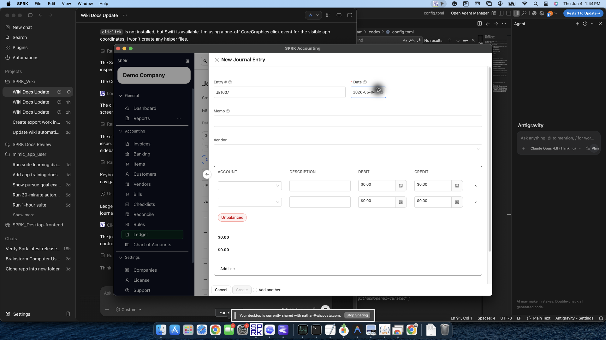

# Record Journal Entries

Create balanced manual journal entries in the `Ledger` page, optionally create linked bank-register rows when that drawer option is available, schedule an automatic reversing entry, save reusable templates when needed, and understand how posting affects the general ledger.

## When To Use This

Use this workflow when you need to record a manual accountant adjustment directly in the ledger instead of using invoices, bills, checks, payments, or banking.

## Before You Start

- An active company is selected.
- The accounts you need already exist in `Chart of Accounts`.
- The accounts are available for manual journal entry. Company-level `Control accounts` can remove source-workflow accounts from new manual journal choices.
- You know the posting date, memo, and debit and credit lines you want to record.

## Common Accountant Scenarios

Use manual journal entries for work such as:

- month-end accruals and reversals
- expense reclasses that do not belong to a source transaction
- owner contributions, draws, or equity adjustments
- depreciation, amortization, allocations, or accountant-only adjustments
- correcting or reversing a prior manual journal entry

Use a source workflow instead when the activity belongs to a customer invoice, customer payment, vendor bill, check, bank transaction, or payment workflow.

## Steps

1. Open `Ledger`.
2. Select `New`, or use the `Create from Template` menu if you already have a saved journal-entry template.
3. Enter the journal header details, including the date and memo.
4. If the entry should reverse automatically after posting, turn on `Create reversing entry` and review `Reversal date`:
   - SPRK currently pre-fills the next day by default when you start a new manual journal entry.
   - Use a reversal date on or after the journal date.
   - Leave the switch off when you only want the original entry.
5. If the journal touches bank, cash, or credit-card accounts and you want it to appear in the bank register immediately, turn on the bank-register option when the drawer exposes it.
   - The option is off by default.
   - When enabled, SPRK creates linked confirmed bank-register rows for eligible bank, cash, or credit-card lines instead of waiting for a separate bank import or manual bank entry.
6. Add each journal line with the correct account and amount.
   - If an expected account is missing from the picker, confirm whether the company has configured it as a `Control accounts` value that should be posted through invoices, bills, banking, or another source workflow.
7. If your company uses dimensions or classes, complete those fields on the related lines.
8. Confirm the entry is balanced before saving:
   - every line must use either debit or credit, not both
   - totals must match before the save action is allowed
9. Select `Create` to post the entry.
10. If you expect to reuse the same layout later, use the save-template option from the journal entry drawer.
11. Review the new entry in the ledger table and use search or filters to find it again later.

## What Happens Next

A balanced journal entry is posted to the ledger and appears in the journal-entry list.

- Saving a manual journal entry creates a new journal entry record and posts each entered debit and credit line to the general ledger.
- The bank-register option, when available and enabled, creates linked confirmed register rows for eligible Bank, Cash, and Credit Card journal lines. The journal entry remains the posting source.
- Eligible bank-side lines are linked individually, so one manual journal can create more than one confirmed bank-register row. Identical amounts on the same account are still separate linked rows.
- When `Create reversing entry` is enabled on a new manual journal, SPRK schedules a linked offsetting journal entry instead of deleting or overwriting the original posting.
- SPRK blocks unbalanced entries from being saved.
- SPRK can block new or changed manual journal lines that use configured control accounts. Existing lines that already use a control account can remain as-is during edit review, but users should not newly assign that account from the manual journal drawer once the setting is active.
- If the entry is off by a very small rounding amount within the current tolerance, SPRK can auto-adjust one line and note that adjustment in the memo before saving.

## If Something Looks Wrong

- Trying to save an entry when debit and credit totals do not match.
- Entering both debit and credit on the same line.
- Assuming auto-reversal is part of the edit flow for existing entries. In the current live flow it appears when creating a new manual journal entry.
- Assuming every manual journal creates bank-register activity. Register rows are opt-in and only mirror eligible bank, cash, or credit-card lines.
- Assuming a control account is missing because it was deleted. It may be intentionally restricted from new manual journals.
- Assuming the ledger page is only for review. In the current product it is also the manual journal-entry posting page.

## Related

- [When to use journal entries vs source forms](./when-to-use-journal-entries-vs-source-forms.md)
- [Common accountant corrections](./common-accountant-corrections.md)
- [Understand the chart of accounts structure](./understand-the-chart-of-accounts-structure.md)
- [Prepare and review ledger imports and exports](./understand-ledger-import-and-export-behavior.md)
- [Understand audit-sensitive ledger behavior](./understand-audit-sensitive-ledger-behavior.md)
