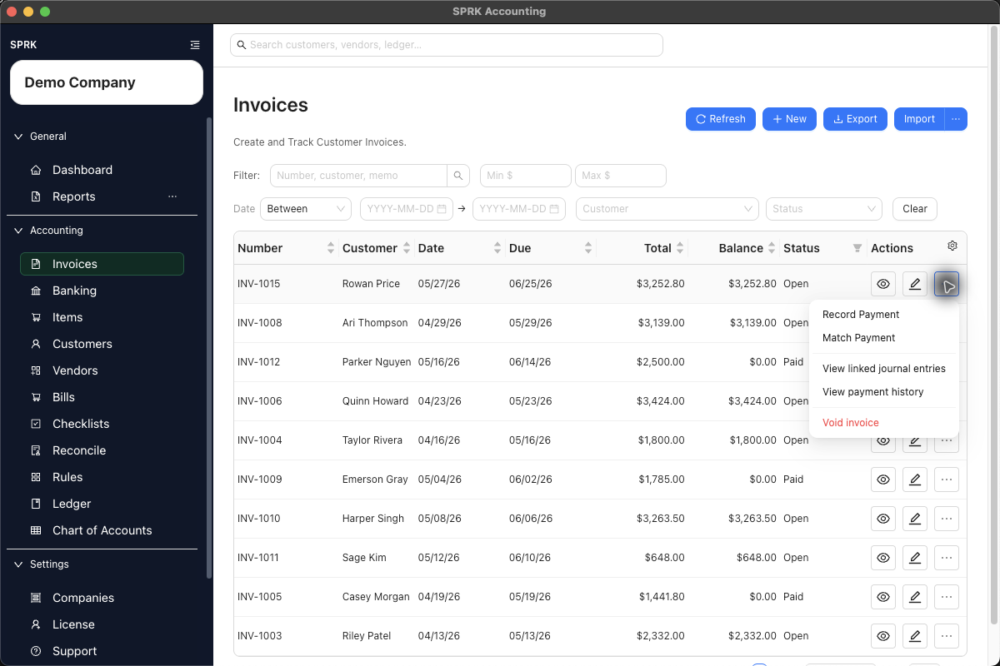
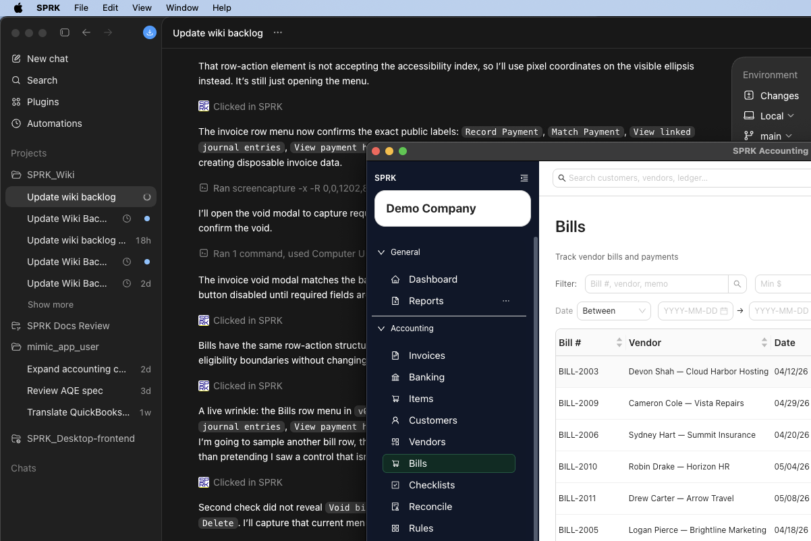
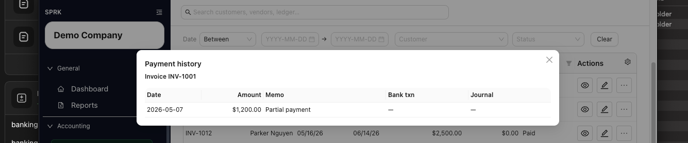
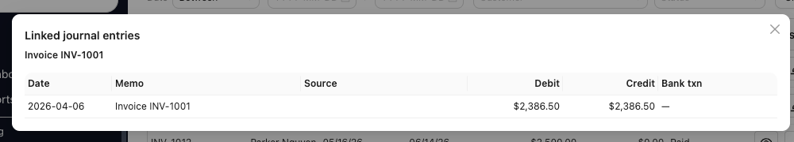
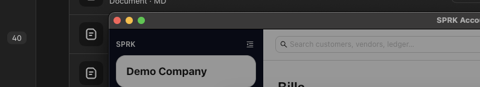
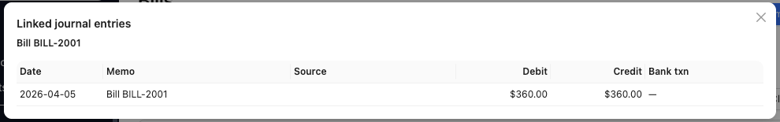

# Review Document Payment History and Linked Journals

Review invoice and bill payment history from the source document, then use linked journal review to understand the posting trail.

## When To Use This

Use this workflow when an invoice or bill balance changed and you need to trace whether the change came from a direct payment, a Banking match, or a linked journal action.

## Steps

1. Open `Invoices` or `Bills`.
2. Find the document by number, party, date, status, total, or balance.
3. Use the row action menu when you need document-side review.
4. For invoices, the current action menu can show `Record Payment`, `Match Payment`, `View linked journal entries`, `View payment history`, and `Void invoice` on eligible open rows.
5. For bills, use the visible row actions for payment, matching, payment history, and linked journal review.
6. Use `View payment history` to review applications without editing the document.
7. Use `View linked journal entries` to inspect the accounting trail.
8. If a correction is required, use the supported payment, void, reversal, or posted-document edit workflow instead of deleting or rewriting the linked journal trail manually.

## What Happens Next

You can explain why a receivable or payable balance changed and where to inspect the supporting accounting entry.

- Viewing payment history or linked journal entries does not post to the ledger.
- Recording or matching a payment can post a payment entry and update the document balance.
- Reversing a payment-linked journal can deactivate the payment application and reopen the document balance where the source workflow supports that action.
- Linked journals preserve audit history; corrections should use supported reversals or source-document actions.

## If Something Looks Wrong

- Treating payment history as an edit screen.
- Assuming bank-side matching and document-side payment review are the same workflow.
- Deleting a document or journal entry when the correct workflow is payment reversal, voiding, or posted-document correction.
- Assuming every linked journal is editable or reversible from every entry point.

## Business Scenario: Source Document Audit Trail

Use this scenario to train reviewers to move from a source document to payment history and linked journals without changing the document.

- Sample file: [11-document-payment-history-linked-journals.csv](../sample-files/v1-validation/11-document-payment-history-linked-journals.csv)
- Evidence:

The walkthrough confirmed that both invoice and bill source documents expose payment history and linked journal review directly from their action menus.

## Related

- [Create and open invoices](../sales-and-receivables/create-and-open-invoices.md)
- [Receive invoice payments](../sales-and-receivables/receive-invoice-payments.md)
- [Create and manage bills](../expenses-and-payables/create-and-manage-bills.md)
- [Review and classify bank transactions](../banking-and-cash-management/review-and-classify-bank-transactions.md)
- [Edit linked ledger and bank activity](./edit-linked-ledger-and-bank-activity.md)
