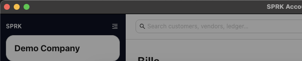
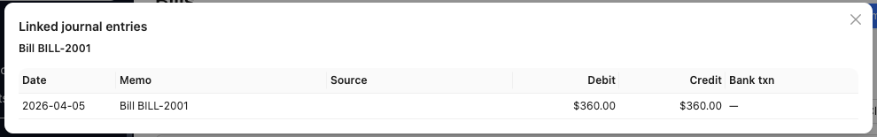

# Review Document Payment History and Linked Journals

<!-- Screenshot status: Review needed -->

Review invoice and bill payment history from the source document, then use linked journal review to understand the posting trail.

<!-- Last validated against SPRK source: 2026-08-27 -->

## When to use this

Use this guide when an invoice or bill balance changed and you need to trace whether the change came from a direct payment, a Banking match, or a linked journal action.

## Steps

1. Open `Invoices` or `Bills`.
2. Find the document by number, party, date, status, total, or balance.
3. Use the row action menu when you need document-side review.
4. For invoices, the current action menu can show `Print`, `Record Payment`, `Match Payment`, `View linked journal entries`, `View payment history`, and `Void invoice` on eligible rows.
5. For bills, use the visible row actions for payment, matching, payment history, and linked journal review.
6. Use `View payment history` to review applications without editing the document.
7. Use `View linked journal entries` to inspect the accounting trail.
8. If a payment must be undone, stay with the document's linked accounting trail:
   - Open `More` > `View linked journal entries` on the invoice or bill.
   - Open the journal entry for the payment, then select `Reverse`.
   - Choose the reversal date.
   - In `Confirm Source Document Reversal`, select `Reverse payment application` for an invoice payment or `Reverse bill payment application` for a bill payment.
   - Confirm only after checking the document, amount, and reversal date.
9. Use a document void only when the invoice or bill itself is wrong. Do not delete or rewrite the payment journal manually.

## What happens next

You can explain why a receivable or payable balance changed and where to inspect the supporting accounting entry.

- Recording or matching a payment can post a payment entry and update the document balance.
- Reversing a payment-linked journal can deactivate the payment application and reopen the document balance where the source workflow supports that action.
- Linked journals preserve audit history; corrections should use supported reversals or source-document actions.

## If something looks wrong

| What You See | What To Check | What To Do Next |
|---|---|---|
| A payment came from a bank match | Whether you are reviewing the pending bank row or the document's recorded payment | Use the linked journal to trace the posting before choosing a reversal |
| The payment remains in history after reversal | Whether it is shown as inactive or reversed and the document balance reopened | Keep the historical row; the reversal preserves the audit trail |

## Practice and examples

Use the practice file and screenshots to review payment history and linked journals from invoices and bills without changing the source document.

- Practice file: [document-payment-history-linked-journals.csv](../sample-files/practice/document-payment-history-linked-journals.csv)

Invoice and bill action menus include payment-history and linked-journal review surfaces.

## Related

- [Create and open invoices](../sales-and-receivables/create-and-open-invoices.md)
- [Receive invoice payments](../sales-and-receivables/receive-invoice-payments.md)
- [Create and manage bills](../expenses-and-payables/create-and-manage-bills.md)
- [Review and classify bank transactions](../banking-and-cash-management/review-and-classify-bank-transactions.md)
- [Edit linked ledger and bank activity](./edit-linked-ledger-and-bank-activity.md)
