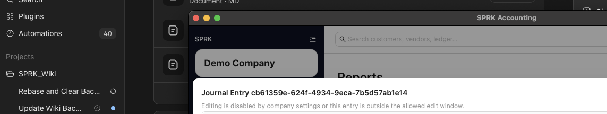

# Understand Audit-Sensitive Ledger Behavior

Review why some posted accounting records cannot be edited like scratch work, when to reverse instead of overwrite, and how SPRK protects history around ledger and bank-linked activity.

## When To Use This

Use this article when you are asking "why can't I edit this?" or "should I reverse this instead?" during accountant review.

## Practical Decision Guide

| Question | Better Next Step |
| --- | --- |
| The transaction belongs to an invoice, bill, check, payment, or bank row | Start with the source workflow |
| The original manual journal was wrong and should remain visible | Reverse it or post a correcting journal |
| The period is reviewed and you need a clean audit trail | Use reversal or a new adjusting entry |
| A nonposting or control account is not available in the journal drawer | Use the source workflow tied to that account, or choose a posting account |
| A reconciled bank-linked item looks wrong | Review linked ledger and reconciliation behavior before changing anything |

## Before You Start

- An active company is selected.
- You understand which existing entry or account you want to review or maintain.

## Steps

1. Treat saved journal entries as posted records, not scratch work.
2. Before editing an existing journal entry, confirm your company allows the kind of change you need:
   - memo edits can be restricted
   - date edits can be restricted
   - line amount edits can be restricted
   - dimension edits can be restricted
   - account changes are not allowed line-by-line in the current edit path
3. Confirm whether the account is a nonposting summary account, an account-level control account, or a company-level control account before trying to post it from a manual journal. Control accounts should be reached through their source workflow.
4. If a correction should preserve the original posting trail, use reversal behavior instead of trying to overwrite history.
5. For a new manual journal entry that should unwind automatically, use the create-time `Create reversing entry` switch in the journal drawer instead of waiting to reverse it later by hand.
6. For a new manual journal entry that should create bank-register rows, turn on the bank-register option, when the drawer exposes it, only when you want eligible Bank, Cash, or Credit Card lines mirrored into confirmed register activity.
7. When reversing an existing posted entry, choose the posting-date mode that fits the correction:
   - `today`
   - `original`
   - `custom`
8. For a confirmed bank transaction with a linked journal entry, open the journal from `Reconcile` and reverse from the linked journal modal.
9. Remember that a reversal creates a separate entry with flipped debit and credit amounts rather than deleting the original.
10. In `Chart of Accounts`, treat account deletion as deactivation. Prior activity remains part of the company history.

## What Happens Next

You understand which maintenance actions keep an audit trail and how they affect balances.

- Reversing a journal entry creates a new journal entry that flips each original debit and credit line, which offsets the original entry in the general ledger.
- The create-time auto-reversal option for manual journals still preserves history by creating a second offsetting entry on the scheduled reversal date.
- Opt-in bank-register rows created from a journal preserve the journal as the posting source. Excluding an unreconciled linked row removes that register row without unposting the journal, and reconciled linked rows are protected from exclusion in the linked-register modal.
- SPRK prevents reversing a reversal and prevents reversing the same original entry more than once.
- If a reversal is tied to an unreconciled bank transaction, SPRK excludes the original bank row for audit history.
- If a reversal is tied to a reconciled bank transaction, SPRK creates a confirmed correction bank transaction instead of changing the reconciled row.
- When journal edits are allowed, the saved entry itself is updated and an edit-audit record is stored alongside the before-and-after versions.
- Nonposting and control-account settings can block new manual journal posting to selected accounts without deleting the account or changing existing history.
- Marking an account inactive does not remove prior ledger activity or create a new journal entry.

## If Something Looks Wrong

- Assuming reversal deletes the original entry. It creates a separate offsetting entry.
- Assuming create-time auto-reversal is the same as editing a posted journal. The current manual-journal drawer schedules a separate future reversal entry.
- Assuming opt-in bank-register rows are editable accounting records separate from the journal. They mirror eligible journal lines and accounting corrections go back through the journal.
- Assuming linked bank reversal always changes the original bank row. Reconciled rows are preserved and corrected with a separate bank transaction.
- Expecting to swap an entry line to a different account during edit. The current edit rules do not allow account changes on existing lines.
- Treating a nonposting or configured control account as inactive or deleted because it is unavailable in new manual journal choices.
- Treating inactive accounts as erased accounts. Inactive status only changes availability for future use.

## Business Scenario: Reversal And Auto-Reversal Review

Use this scenario to train accountants on reversal-sensitive language: a correction should preserve the original entry, and an auto-reversal should create a separate future offset instead of overwriting the original.

- Sample file: [18-journal-reversal-auto-reversal.csv](../sample-files/v1-validation/18-journal-reversal-auto-reversal.csv)
- Evidence:

The walkthrough preserved the demo company and used the report drilldown surface for review evidence. Use the sample file as the trainer reference for a controlled reversal or auto-reversal exercise in a disposable company.

## Related

- [Record journal entries](./record-journal-entries.md)
- [Common accountant corrections](./common-accountant-corrections.md)
- [When to use journal entries vs source forms](./when-to-use-journal-entries-vs-source-forms.md)
- [Edit linked ledger and bank activity](./edit-linked-ledger-and-bank-activity.md)
- [Prepare and review ledger imports and exports](./understand-ledger-import-and-export-behavior.md)
- [Understand the chart of accounts structure](./understand-the-chart-of-accounts-structure.md)
