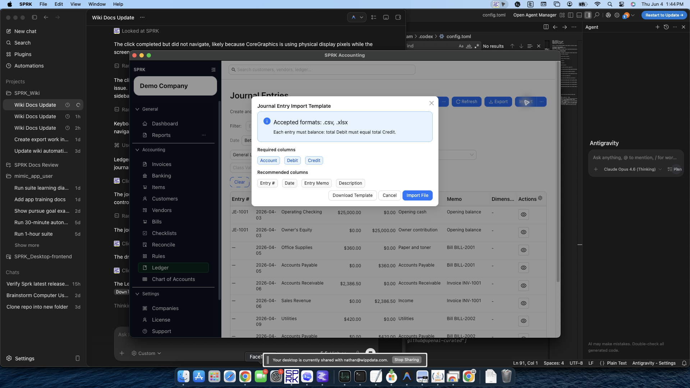
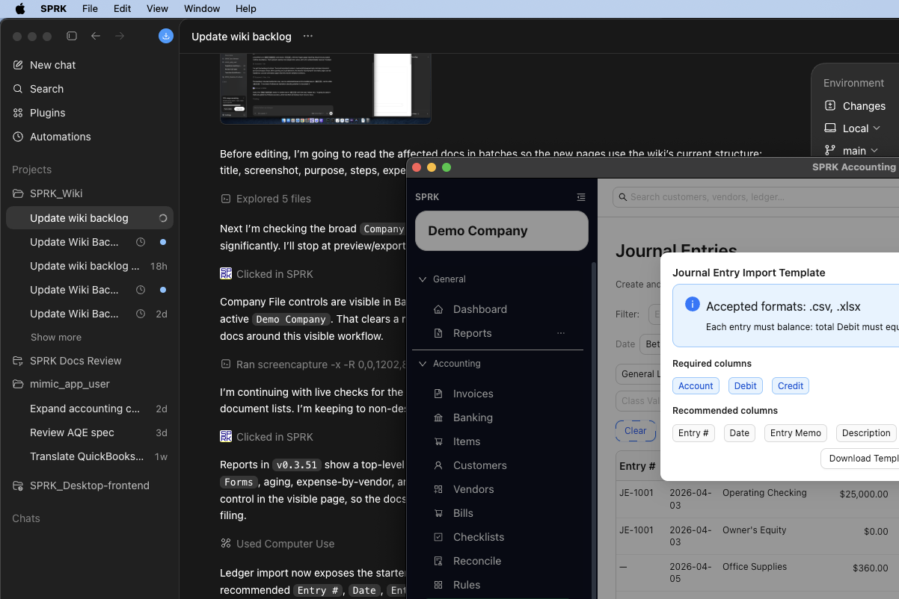

# Prepare and Review Ledger Imports and Exports

Move journal-entry data into or out of SPRK from the `Ledger` page, with an accountant review path for templates, account matching, preview totals, and post-import report checks.

## When To Use This

Use this article when you need to import journal-entry activity into SPRK, export journal-entry data for review outside the app, or prepare ledger data for migration cleanup.

## Before You Start

- An active company is selected.
- For imports, you have a source file in `.csv` or `.xlsx` format that matches the ledger workflow you intend to use.
- You understand which existing accounts should receive imported lines.

## Accountant Review Sequence

1. Confirm the active company.
2. Confirm the import belongs in `Ledger`, not `Banking`, invoices, bills, checks, or payments.
3. Download the current template if you are preparing a spreadsheet.
4. Match account labels to the accounts you intend to use.
5. Check that each journal entry balances before upload.
6. Preview the file in SPRK.
7. Compare preview totals and dates to the source file.
8. Confirm only when the preview matches your accounting intent.
9. Run `Trial Balance` or `General Ledger` after import to review the posted result.

## Steps

1. Open `Ledger`.
2. Choose the action that matches your goal:
   - `Export` to download the currently filtered journal-entry data.
   - `Import` to open the current starter modal before you pick a file.
3. In the current `Import` start modal, review the template guidance before continuing:
   - accepted formats are `.csv` and `.xlsx`
   - required columns are `Account`, `Debit`, and `Credit`
   - recommended columns include `Entry #`, `Date`, `Entry Memo`, and `Description`
   - `Download Template` gives you the starter file before upload
   - `Import File` continues to file selection after you review the requirements
4. For exports, review your current filters first because the export uses the rows visible in the ledger view.
5. For imports, select your file and review the server-generated preview before confirming.
6. Review preview columns and diagnostics. The current import path can surface entry number, date, entry memo, account, resolved account ID, description, debit, credit, and vendor information when those fields are present and resolved.
7. If SPRK detects missing account labels during import, resolve or create the accounts through the import flow, then let SPRK re-preview the same file before commit.
8. Confirm the import only after you have reviewed the preview totals, dates, descriptions, accounts, vendors, and validation messages.
9. After import completes, refresh the ledger if needed and review the newly created entries.

## What Happens Next

You can move journal-entry data in or out of the product with the current supported tools.

- Export creates a download file only. It does not create, edit, or reverse any ledger entries.
- Previewing a ledger import does not post.
- A valid confirmed ledger import commits as a batch. Do not treat previewed rows as partially posted unless the app confirms the batch.
- Import can create new accounts during account-resolution steps before the journal entries are posted, but those account creations do not affect balances on their own.
- Import is blocked when the file has validation errors, no usable journal lines, unresolved or ambiguous account labels, invalid vendors, out-of-balance entries, duplicate-batch conflicts, posting-cutoff conflicts, or other journal validation failures.
- If the same completed batch is retried, SPRK can return the existing journal entries instead of creating duplicates; if only part of a prior batch exists, the retry should be blocked rather than posting the remainder.

## If Something Looks Wrong

- Assuming export includes every journal entry in the company even when the ledger view is filtered.
- Skipping the starter modal and preparing a file without checking the current required and recommended columns.
- Confirming import before reviewing missing-account warnings.
- Preparing import files with account labels that do not match available accounts or the chosen resolution mapping.
- Assuming vendor matching is fuzzy. Import vendor references should match active vendor IDs or unique active vendor names/company/print-as values.
- Assuming QuickBooks-style or trial-balance-style source files bypass preview. They still need review before commit.

## Related

- [Before you import](../company-setup-and-migration/before-you-import.md)
- [Record journal entries](./record-journal-entries.md)
- [When to use journal entries vs source forms](./when-to-use-journal-entries-vs-source-forms.md)
- [Understand the chart of accounts structure](./understand-the-chart-of-accounts-structure.md)
- [Understand audit-sensitive ledger behavior](./understand-audit-sensitive-ledger-behavior.md)
