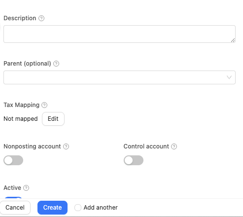

# Understand the Chart of Accounts Structure

Review how SPRK organizes accounts by code, parent-child hierarchy, type, subtype, posting role, control-account role, and active status so you can maintain a usable account list without changing posted balances.

## When To Use This

Use this article when you need to understand how accounts are grouped, created, edited, imported, exported, or deactivated in the `Chart of Accounts` page.

## Before You Start

- An active company is selected.
- You know whether you are adding a brand-new account, reorganizing an existing one, or reviewing the current structure.

## Steps

1. Open `Chart of Accounts`.
2. Review the page header tools:
   - `New` opens the account form.
   - `Refresh` reloads the list.
   - `Export` downloads the current chart as `chart-of-accounts.csv`.
   - `Import` accepts `.csv`, `.txt`, `.iif`, `.xls`, or `.xlsx` files.
3. Use the search field to find accounts by code or name.
4. Use the grouping controls to regroup the list and the expand or collapse controls to change how much of the hierarchy is visible.
5. Review the account list structure:
   - Accounts are sorted by code.
   - Child accounts can be linked by a saved parent account or inferred from account codes when the code structure supports it.
   - Filters let you narrow by `Type`, `Subtype`, `Status`, `Posting`, and `Control`.
   - The list can show `Nonposting` and `Control` columns so you can tell why an account is available for structure review but not every posting workflow.
   - If the company is configured with `Required account fields = Name`, account-code columns and code-first labels can disappear from the visible chart and related account pickers.
6. Select `New` or the edit pencil for an existing row when you need to maintain an account record.
7. When creating or editing an account, fill in the fields SPRK supports publicly:
   - `Code`
   - `Name`
   - `Type`
   - optional `Subtype`
   - optional parent account
   - optional description, bank number, or notes
   - `Nonposting account` when the account is a parent or summary account that should not receive posted activity directly
   - `Control account` when the account should be controlled by a subledger or source workflow instead of new manual journal lines
   - `Active`
8. If you import chart data, review account-role columns before relying on downstream pickers:
   - Spreadsheet-style account imports can map boolean fields such as `Nonposting Account` and `Control Account`.
   - Ordinary yes/no or true/false style values map to those switches.
   - A QuickBooks account type of `Nonposting` is not the same as SPRK's account-level `Nonposting account` switch.
9. Use status carefully:
   - Active accounts remain available for normal use.
   - Deleting an account from this page sets it inactive instead of removing its history.

## What Happens Next

You can organize the account list into a clearer structure and keep accounts available for downstream workflows.

- Creating, editing, importing, exporting, or deactivating accounts from `Chart of Accounts` does not post a journal entry by itself.
- These actions change account setup and availability, not existing account balances.
- Export produces a file only and does not change ledger data.
- `Nonposting account` keeps a parent or summary account visible in the chart but removes it from current posting-oriented account pickers unless the specific surface explicitly supports nonposting accounts.
- `Control account` marks an account as subledger controlled and can make it unavailable for new manual journal-entry posting. It is a posting restriction, not an inactive or deleted account.
- Name-only account presentation changes how accounts are shown and sorted in supported lists. It does not delete stored account codes or change balances.

## If Something Looks Wrong

- Expecting `Delete` to erase prior history. SPRK marks the account inactive instead.
- Importing parent relationships without valid `parentId` values.
- Treating subtype as required for every account when the page only exposes it as an optional field.
- Assuming missing visible account codes mean the codes were deleted. Check the company's `Required account fields` setting first.
- Assuming every active account appears in every selector. Nonposting accounts and control-restricted accounts can be hidden from posting, default-account, Banking, journal, or report selectors even when they remain visible in `Chart of Accounts`.
- Confusing account-level `Control account` with the company-level `Control accounts` setting. Both protect source-workflow accounts, but they are configured in different places.

## Related

- [Set up receivables defaults before invoicing](../sales-and-receivables/set-up-receivables-defaults-before-invoicing.md)
- [Record journal entries](./record-journal-entries.md)
- [Prepare and review ledger imports and exports](./understand-ledger-import-and-export-behavior.md)
- [Understand audit-sensitive ledger behavior](./understand-audit-sensitive-ledger-behavior.md)
