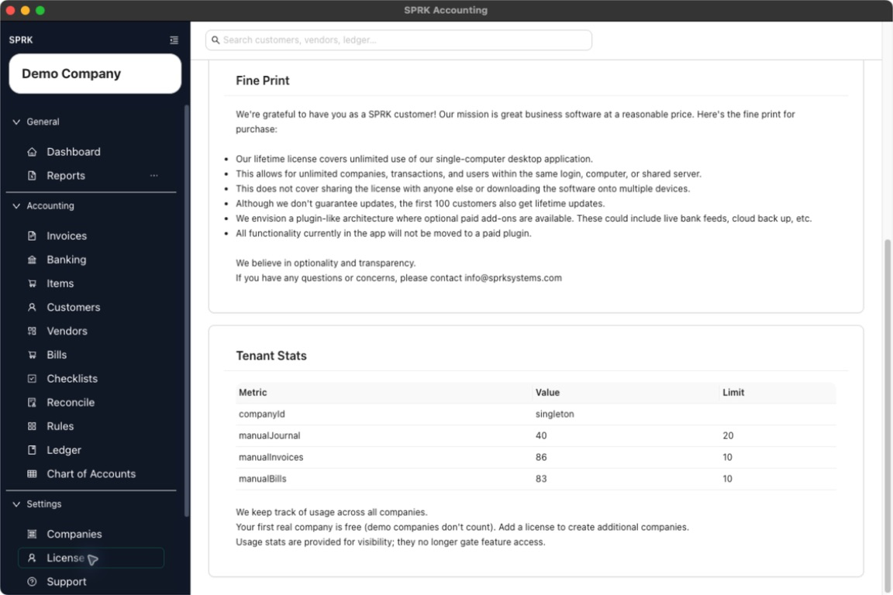

# Understand Usage Limits And Prompts

Use the `License` area to review the current usage table and understand which prompts are informational versus the ones tied to adding more real companies.

## When To Use This

Use this workflow when you want to understand what the visible usage values and limits mean before deciding whether you need to add a license.

## Before You Start

- You are signed in to SPRK.
- At least one company is available so the usage table can load.

## Steps

1. Open `License` from the `System` section in the sidebar.
2. Scroll to the `Tenant Stats` table.
3. Review each row’s `Metric`, `Value`, and `Limit`.
4. Read the note below the table that explains your first real company is free and that demo companies do not count toward that allowance.
5. Read the note that usage stats are provided for visibility.
6. Use this page together with company-creation workflows if you need to understand whether adding another real company may require a license.

## What Happens Next

You can interpret the current usage table as a workspace-wide visibility tool and understand that the main published licensing prompt is tied to creating additional real companies after the free allowance is used.

- Reviewing usage values does not create or reverse an accounting transaction.
- Reaching a visible limit in the table does not by itself post anything to the general ledger.
- License prompts affect what setup actions are available, not the balances in your books.

## If Something Looks Wrong

- Reading the usage table as a per-company limit when it is presented for the workspace as a whole.
- Assuming every visible limit blocks daily accounting work.
- Confusing demo companies with real companies when reading the free-company note.

## Related

- [View license information](./view-license-information.md)
- [Understand when an upgrade prompt may appear](./understand-when-an-upgrade-prompt-may-appear.md)
- [Create your first company](../company-setup-and-migration/create-your-first-company.md)
