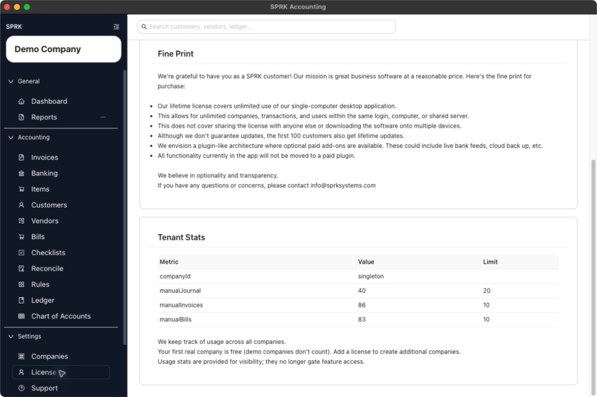

# Understand When An Upgrade Prompt May Appear

SPRK may show an upgrade or add-license prompt when you try to create another real company after using the free company allowance.

## Quick Reference

| Situation | What It Means | What To Do Next |
|---|---|---|
| You are creating your first real company | The free-company allowance may apply. | Continue the company-creation workflow and review any visible prompt. |
| You are creating another real company | SPRK may ask for a license if the free allowance is already used. | Review the prompt, then add a license or adjust the setup plan. |
| `Demo Company` is present | Demo companies do not count the same way as real companies for the free-company note. | Count real companies before deciding whether an upgrade is needed. |
| `Valid License` is shown | A license has already been saved. | Return to company creation after confirming the saved license details are correct. |
| `Buy License (Stripe)` is shown | SPRK is offering an external purchase path. | Use it only when your firm intends to buy or update a license. |

## Details

The clearest public upgrade prompt appears around additional real company creation. Seeing the prompt does not change historical accounting data.

Saving a license key changes workspace access and company-creation eligibility. Buying a license through the external Stripe link is outside the in-app accounting workflow unless you separately record that purchase in your books.

## If Something Looks Wrong

| What You See | What To Check | What To Do Next |
|---|---|---|
| An upgrade prompt appears while adding a company | Whether the workspace already has one real company | Add a license or adjust the setup plan before continuing. |
| Existing company pages still open after the prompt | Whether the prompt applies to the setup action you are taking | Continue existing work if SPRK allows it; resolve the prompt before creating the additional company. |
| The company count looks wrong | Whether `Demo Company` is included in the count | Count real companies separately from demo companies. |
| A license purchase needs to be recorded in the books | Whether your firm wants to track the external purchase in SPRK | Record it through the appropriate expense or bill workflow after purchase. |

## Related

- [View license information](./view-license-information.md)
- [Understand usage limits and prompts](./understand-usage-limits-and-prompts.md)
- [Create your first company](../company-setup-and-migration/create-your-first-company.md)
- [Switch between companies](../company-setup-and-migration/switch-between-companies.md)
