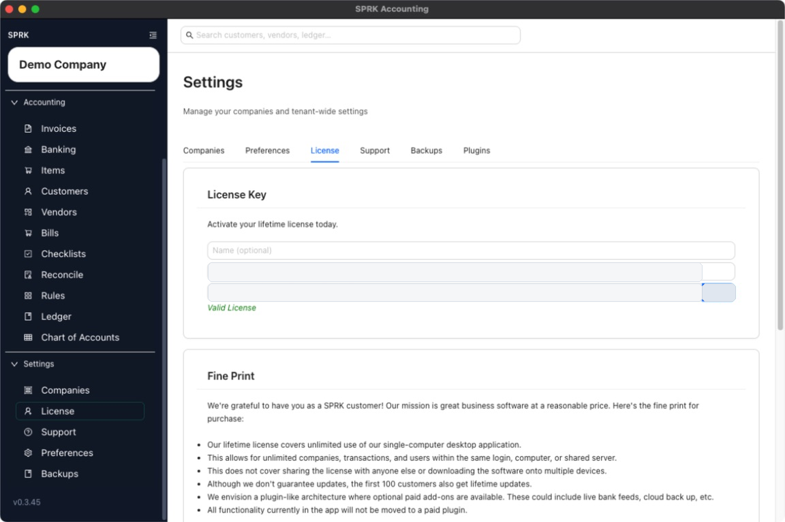
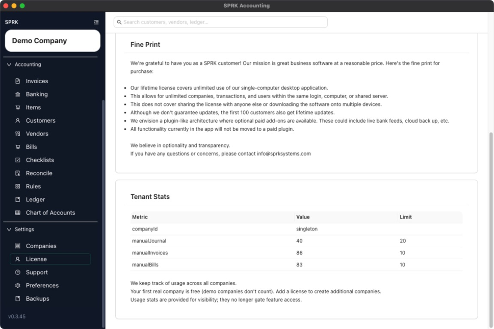

# View License Information

Open the `License` area to review the saved contact details, current license key status, usage table, and purchase link that SPRK currently exposes.

## Purpose

Use this workflow when you want to confirm whether a license is already saved for your workspace and review the licensing details visible in the app.

## Prerequisites

- You are signed in to SPRK.
- At least one company is available so the app can load tenant usage details.

## Steps

1. Open `License` from the `System` section in the sidebar.
2. Review the `License Key` card.
3. Review the saved `Name`, `Email`, and `License key` fields if they are present.
4. Look for the `Valid License` message if a license has already been saved.
5. If no license has been saved yet, review the `Buy License (Stripe)` button.
6. Review the `Fine Print` card for the current public license terms shown in the app.
7. Review the `Tenant Stats` table to see the usage metrics, current values, and listed limits across the workspace.

## Expected Result

You can review the licensing details currently visible in SPRK, including whether a license key is already saved, the public purchase link when it is shown, and the current workspace usage table. Current general ledger impact as of 2026-05-11:

- Opening the `License` area does not create, edit, or delete any journal entry.
- Viewing saved license details changes access visibility only and does not affect asset, liability, income, expense, or equity balances.
- Reviewing the usage table reports activity counts only and does not post a transaction to the general ledger.

## Common Mistakes

- Expecting the `License` area to show company-by-company accounting balances instead of tenant-wide license details.
- Treating the usage table as a billing statement.
- Assuming the absence of a `Valid License` message means your accounting data was changed.

## Related Articles

- [Understand usage limits and prompts](./understand-usage-limits-and-prompts.md)
- [Understand when an upgrade prompt may appear](./understand-when-an-upgrade-prompt-may-appear.md)

## Info

- App sections: `license`
- Last validated: 2026-06-05
- Screenshot status: `captured`
