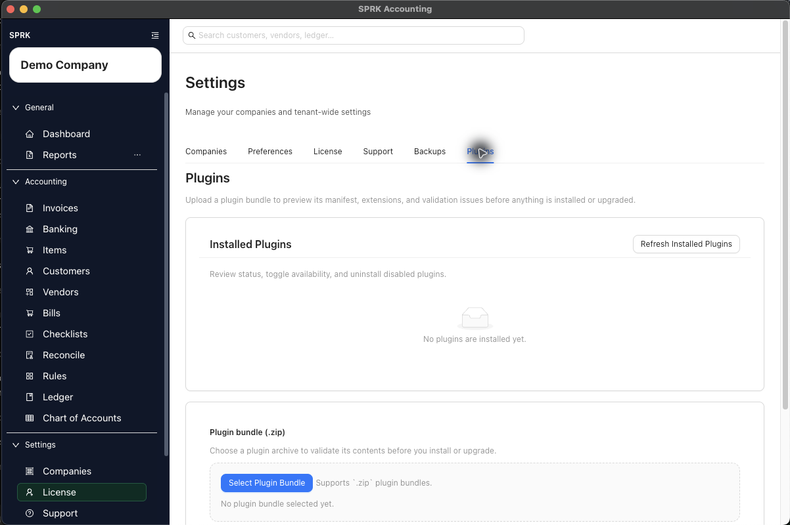

# Install and Manage Plugins

Use the `Plugins` settings tab to preview a trusted plugin `.zip`, install or upgrade it when validation passes, and manage installed plugin state.

## Purpose

Use this workflow when you receive a plugin bundle, need to upgrade an installed plugin, or want to confirm which plugin packages are available in the current tenant.

## Prerequisites

- You are signed in to SPRK.
- Your tenant is licensed for plugin access.
- You trust the plugin source and understand what the plugin is expected to add.
- You have the plugin `.zip` file available locally.
- You have checked the active company before validating company-scoped plugin behavior.

## Steps

1. Open `Settings`.
2. Select the `Plugins` tab.
3. Review `Installed Plugins`.
4. Select `Refresh Installed Plugins` if the inventory may have changed.
5. If no plugins are installed, expect the inventory area to show `No plugins are installed yet.`
6. In `Plugin bundle (.zip)`, select `Select Plugin Bundle`.
7. Choose the plugin `.zip` file.
8. After SPRK accepts the file, select `Preview Plugin`.
9. Review the preview details before installing or upgrading:
   - plugin name, publisher, version, and description
   - minimum app version
   - declared capabilities, including network, file, or secret access
   - declared extensions and extension types
   - warnings, validation issues, bundle limits, and hash checks
10. If preview reports an error, do not install or upgrade until the bundle or app version issue is resolved.
11. If preview shows `Ready to install` and the install or upgrade action is available, install or upgrade from the preview.
12. Return to `Installed Plugins`, refresh the list if needed, and confirm the plugin status.
13. For a compatible enabled `new_page` plugin, confirm that a `Plugins` group appears in the sidebar with the plugin pages.
14. To remove a plugin, select `Disable` first. SPRK enables `Uninstall` only after the plugin is disabled.
15. Select `Uninstall`, then confirm the removal prompt if you want to remove installed plugin metadata and company-state records.

## Expected Result

You can validate a plugin bundle before it changes the app runtime, then confirm the installed plugin inventory after install or upgrade. Current general ledger impact as of 2026-06-17:

- Opening the `Plugins` tab does not create or edit journal entries.
- Refreshing installed plugins reports plugin state only and does not post transactions.
- Previewing a plugin bundle validates metadata and package contents before install or upgrade; preview alone does not add runtime pages or change account balances.
- Installing or enabling a compatible `new_page` plugin can make new pages available under the sidebar `Plugins` group, but installation alone does not post accounting activity.
- Disabling a plugin removes its public runtime pages from navigation.
- Uninstalling a disabled plugin removes installed plugin metadata and company-state records.
- Using a plugin transaction page can have accounting impact if that extension defines a posting action. For example, a company-scoped transaction extension can post a journal entry when a user confirms the transaction.

## Runtime and Bundle Rules

SPRK separates plugin installation from public runtime visibility:

- Public runtime pages currently support `new_page` extensions for list and transaction pages.
- Backend pilot extension types can be installed for testing, but they are not shown in the app runtime.
- Plugins that require network, file, or secret capabilities can be installed for testing, but they are not shown in the app runtime.
- An installed plugin can therefore be present in inventory while still being invisible in normal app navigation.

Bundle preview validates package constraints before install or upgrade:

- Maximum uploaded bundle size: `10 MiB`.
- Maximum expanded bundle size: `25 MiB`.
- Maximum file count: `100` files.
- Maximum individual file size: `5 MiB`.
- Maximum manifest JSON size: `1 MiB`.
- Bundle paths must stay inside the plugin archive.
- Declared extension files must match their `sha256` values.

## Sample Bundle Notes

The sample employees bundle used for validation passed preview validation in SPRK `v 0.3.51` with `minAppVersion` set to `0.3.0`. The preview showed `Ready to install`, `No warnings or blocking issues were reported`, and these three company-scoped `new_page` extensions:

- `employees-page`: a list page for employee records.
- `payroll-settings-page`: a list page for payroll configuration and GL mappings.
- `payroll-runs-page`: a transaction page with payroll calculations, pay stub metadata, and confirm-time posting.

Installing the sample created a sidebar `Plugins` group with `Employees`, `Payroll Runs`, and `Payroll Settings`. Disabling the sample removed that sidebar group and enabled `Uninstall`. The uninstall confirmation removed the sample and returned `Installed Plugins` to `No plugins are installed yet.`

## Common Mistakes

- Installing or upgrading a bundle before reading preview warnings.
- Assuming `installed` always means visible in app navigation.
- Assuming plugin preview is a substitute for source and publisher trust checks.
- Forgetting that company-scoped plugin pages follow the active company context.
- Treating install or enable actions as posting actions. Posting depends on later use of the plugin page.
- Looking for `Uninstall` while a plugin is still enabled. Disable the plugin first.

## Related Articles

- [Use the Plugins settings tab](./use-the-plugins-settings-tab.md)
- [Control plugin availability by company](./control-plugin-availability-by-company.md)
- [Troubleshoot plugin pages that do not appear](./troubleshoot-plugin-pages-that-do-not-appear.md)
- [Understand company-aware navigation](../dashboard-and-navigation/understand-company-aware-navigation.md)

## Info

- App sections: `plugins`, `settings`
- Last validated: 2026-06-17
- Screenshot status: `captured`
