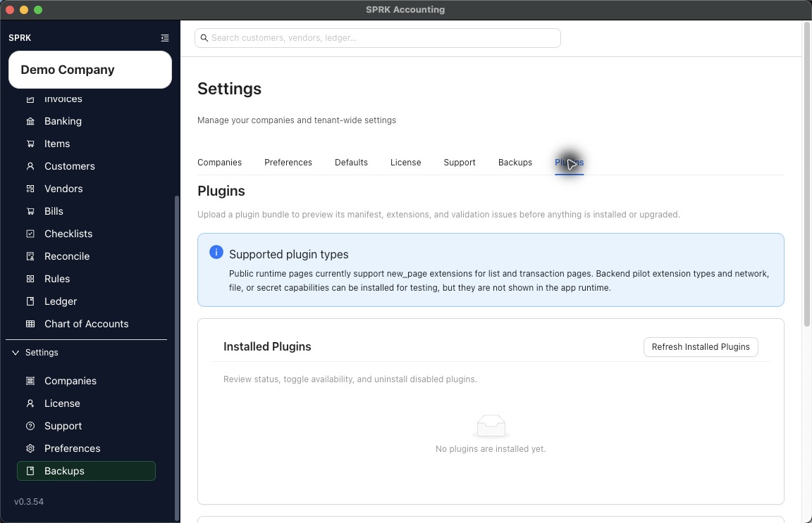

# Control Plugins (Beta) by Company

Check company context when an installed Plugin (Beta) should be used for one company but not another.

## When To Use This

Use this page when a plugin is installed, but users need to confirm whether its pages or records belong to the active company.

## Before You Start

- The plugin is already installed.
- You know which company should use the plugin.
- You can switch companies from the sidebar if needed.

## Steps

1. Confirm the active company in the sidebar.
2. Open `Settings` -> `Plugins`.
3. Refresh `Installed Plugins`.
4. Confirm the plugin is installed and enabled.
5. If the plugin row shows company availability controls, set them for the intended company.
6. If no company availability controls are visible, treat the plugin as workspace-installed and test visibility in the active company.
7. Look for the plugin page under the sidebar `Plugins` group.
8. Switch to another company only if you need to confirm the plugin's visibility there.
9. Return to the intended company before entering plugin records or transactions.

## What This Changes

Changing plugin availability changes whether users can reach plugin pages for the selected context. It does not create journal entries.

## If Something Looks Wrong

| What You See | What To Check | What To Do Next |
|---|---|---|
| The page is missing | The page is missing | Confirm the active company first |
| The plugin is disabled | The plugin is disabled | Enable it before checking navigation |
| The plugin is visible in one company but not another | The plugin is visible in one company but not another | Review any company availability controls |
| Company-specific plugin data looks wrong | Company-specific plugin data looks wrong | Stop and collect details before editing records |

## Related

- [Install and manage Plugins (Beta)](./install-and-manage-plugins.md)
- [Troubleshoot missing Plugins (Beta) pages](./troubleshoot-plugin-pages-that-do-not-appear.md)
- [Switch between companies](../company-setup-and-migration/switch-between-companies.md)
