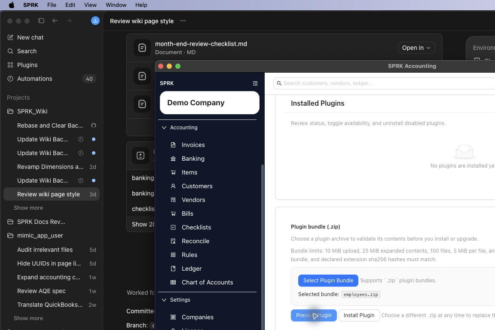
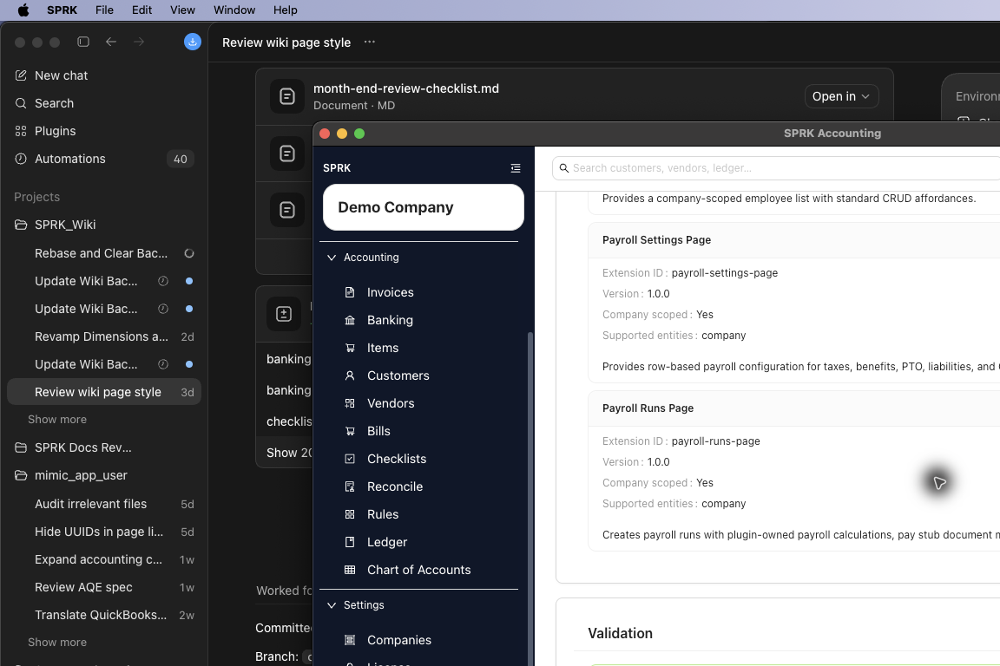

# Install and Manage Plugins (Beta)

Preview a trusted plugin, install or upgrade it when SPRK accepts the preview, and manage installed Plugins (Beta).

## When To Use This

Use this workflow when your firm receives a plugin, needs to upgrade an installed plugin, or needs to remove a plugin from normal use.

## Before You Start

- Confirm the plugin source is trusted.
- Confirm your workspace has plugin access.
- Keep users out of plugin-owned workflows while you install, upgrade, disable, or uninstall.
- Confirm the active company before testing company-specific plugin pages.

## Steps

1. Open `Settings` -> `Plugins`.
2. Select `Refresh Installed Plugins`.
3. Review `Supported plugin types` and the plugin-bundle limits before selecting a file.
4. If you are installing or upgrading, choose `Select Plugin Bundle`.
5. Select the trusted plugin file.
6. Select `Preview Plugin`.
7. Review the plugin name, publisher, version, description, warnings, runtime requirements, extensions, and available action.
   - Preview can block install or upgrade for app-version incompatibility, an older or same plugin version, invalid manifests, unsupported public runtime needs, or attempts to remove data-bearing extensions.
   - A plugin that needs network, file, or secret capabilities may be installable for testing but hidden from the public app runtime.
8. If the preview is not ready, stop and resolve the issue before installing or upgrading.
9. If the preview is ready and the install or upgrade action is available, continue.
10. Refresh `Installed Plugins`.
11. Confirm the plugin appears with the expected status.
12. If the plugin should add pages or report sources, confirm its card shows an appropriate runtime state before checking navigation or Reports.
13. To remove a plugin from use, disable it first.
14. If uninstall becomes available after disablement, use it only when you intend to remove the installed plugin record from SPRK.

## What Happens When You Install Or Disable

Installing or enabling a plugin can make plugin pages available in navigation. Disabling a plugin removes its visible pages from navigation. Uninstalling removes the installed plugin from the workspace when SPRK confirms the plugin has no protected records or accounting history.

These actions do not post accounting activity by themselves. A plugin may affect accounting later only if a user completes a posting workflow inside that plugin.

Uninstall can remain blocked even after a plugin is disabled when SPRK finds protected plugin-owned records, transaction-page records, linked journal entries, accounting schedules, posting runs, or similar stored plugin data.

## If Something Looks Wrong

- If the plugin does not appear after installation, refresh installed plugins.
- If uninstall is not available, disable the plugin first.
- If uninstall stays blocked after disablement, capture the plugin card message before contacting support.
- If expected pages are missing, confirm the plugin is enabled and the intended company is active.
- If expected report surfaces are missing, confirm the plugin is enabled, the installed row state has refreshed, and the plugin exposes a runtime-compatible report extension.
- If users should not use the plugin yet, leave it disabled until setup is complete.

## Business Scenario: Plugin Bundle Preview And Install Gate

Use this scenario to train staff to preview a trusted plugin bundle, inspect runtime extensions, and stop at the install gate until installation is intentional.

- Sample files:
  - [26-plugin-runtime-lifecycle.csv](../sample-files/v1-validation/26-plugin-runtime-lifecycle.csv)
  - [26-plugin-runtime-lifecycle-employees.zip](../sample-files/v1-validation/26-plugin-runtime-lifecycle-employees.zip)
- Evidence:

The walkthrough selected `employees.zip`, ran `Preview Plugin`, confirmed the preview passed validation, and did not install the plugin.

## Related

- [Use the Plugins (Beta) settings tab](./use-the-plugins-settings-tab.md)
- [Control Plugins (Beta) by company](./control-plugin-availability-by-company.md)
- [Troubleshoot missing Plugins (Beta) pages](./troubleshoot-plugin-pages-that-do-not-appear.md)
