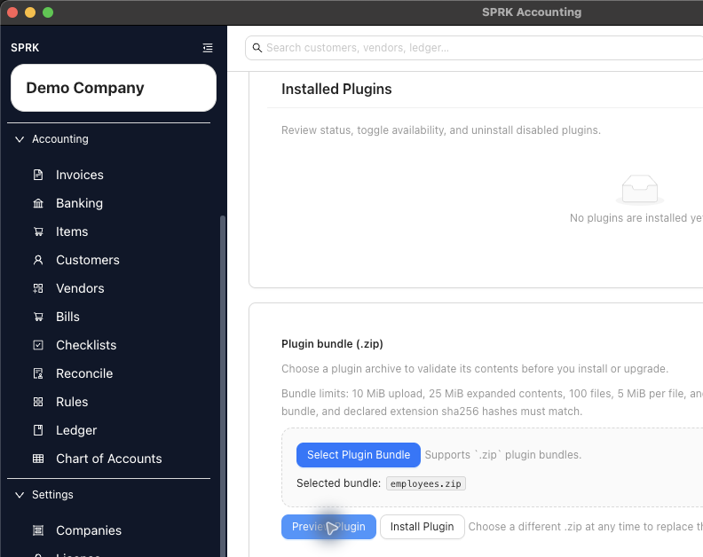
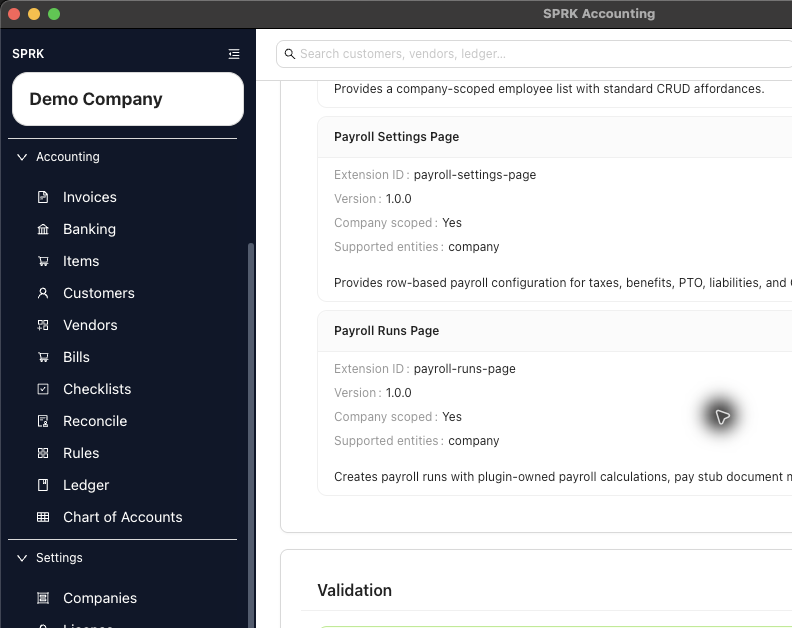

# Install and Manage Plugins (Beta)

<!-- Screenshot status: Review needed -->

Preview a trusted plugin, install or upgrade it when SPRK accepts the preview, and manage installed Plugins (Beta).

## When to use this

Use this guide when your firm receives a plugin, needs to upgrade an installed plugin, or needs to remove a plugin from normal use.

## Before you start

- Confirm the plugin source is trusted.
- Confirm your workspace has plugin access.
- Keep users out of plugin-owned workflows while you install, upgrade, disable, or uninstall.
- Confirm the active company before checking company-specific plugin pages.

## Steps

1. Open `Plugins` from the left sidebar.
2. Select `Refresh Installed Plugins`.
3. Review `Supported plugin types` and the plugin-bundle limits before selecting a file.
4. If you are installing or upgrading, choose `Select Plugin Bundle`.
5. Select the trusted plugin file.
6. Select `Preview Plugin`.
7. Review the plugin name, publisher, version, description, warnings, page availability requirements, extensions, and available action.
   - Preview can block install or upgrade for app-version incompatibility, an older or same plugin version, invalid bundle definitions, unsupported public page needs, or attempts to remove data-bearing extensions.
   - A plugin that needs network, file, or secret capabilities may be accepted for review but hidden from public app pages.
8. If the preview is not ready, stop and resolve the issue before installing or upgrading.
9. If the preview is ready and the install or upgrade action is available, continue.
10. Refresh `Installed Plugins`.
11. Confirm the plugin appears with the expected status.
12. If the plugin should add pages or report sources, confirm its card shows an appropriate page-availability state before checking navigation or Reports.
13. To remove a plugin from use, disable it first.
14. If uninstall becomes available after disablement, use it only when you intend to remove the installed plugin record from SPRK.

## What Happens When You Install Or Disable

Installing or enabling a plugin can make plugin pages available in navigation. Disabling a plugin removes its visible pages from navigation. Uninstalling removes the installed plugin from the workspace when SPRK confirms the plugin has no protected records or accounting history.

After installation, review where the plugin appears and which companies can use it. Accounting actions inside a plugin still follow SPRK's normal posting and review rules.

Uninstall can remain blocked even after a plugin is disabled when SPRK finds protected plugin-owned records, transaction-page records, linked journal entries, accounting schedules, posting runs, or similar stored plugin data.

## If something looks wrong

| What You See | What To Check | What To Do Next |
|---|---|---|
| The plugin does not appear after installation | Whether the installed-plugin list has refreshed | Select `Refresh Installed Plugins`. |
| Uninstall is not available | Whether the plugin is still enabled | Disable the plugin first. |
| Uninstall stays blocked after disablement | The blocked-action message on the plugin card | Capture the message before contacting support. |
| Expected pages are missing | Plugin enabled state, page availability, and active company | Confirm the plugin is enabled and the intended company is active. |
| Expected reports are missing | Plugin enabled state and report availability | Refresh installed plugins, then review Reports again. |
| Users should not use the plugin yet | Whether setup is complete | Leave it disabled until setup is complete. |

## Practice and examples

Use these practice files and screenshots to preview a trusted plugin bundle and stop at the install gate until installation is intentional.

- Practice files:
  - [plugin-lifecycle-practice.csv](../sample-files/practice/plugin-lifecycle-practice.csv)
  - [plugin-lifecycle-employees.zip](../sample-files/practice/plugin-lifecycle-employees.zip)

Preview shows bundle metadata and readiness before the plugin is installed.

## Related

- [Use the Plugins (Beta) settings tab](./use-the-plugins-settings-tab.md)
- [Control Plugins (Beta) by company](./control-plugin-availability-by-company.md)
- [Troubleshoot missing Plugins (Beta) pages](./troubleshoot-plugin-pages-that-do-not-appear.md)
