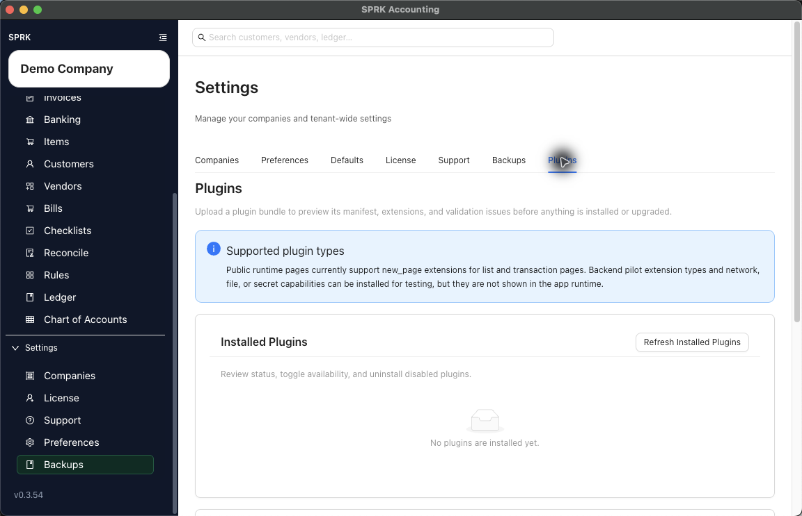

# Troubleshoot Missing Plugins (Beta) Pages

Use this support path when a Plugin (Beta) should add a page, but the page does not appear in SPRK navigation.

## When To Use This

Use this page after install, upgrade, enablement, or company switching when expected plugin pages are missing.

## Do This First

1. Confirm the active company in the sidebar.
2. Open `Settings` -> `Plugins`.
3. Select `Refresh Installed Plugins`.
4. Confirm the plugin is installed.
5. Confirm the plugin is enabled.
6. If you recently previewed a bundle, confirm the preview was actually installed or upgraded.
7. If the plugin page is company-specific, switch to the intended company and check navigation again.
8. Move away from the current page and back again after changing plugin state.

## Details To Capture

- Plugin name and version.
- Whether the plugin is installed, enabled, disabled, or missing from inventory.
- Active company.
- App version shown in the sidebar footer.
- Any preview warning or install message.
- Whether the sidebar shows a `Plugins` group.

## What This Changes

Troubleshooting visibility does not post transactions. Installing or enabling a plugin makes pages available; users still need to complete a workflow before accounting data changes.

## If Something Looks Wrong

- If the plugin was previewed but not installed, install it before expecting pages.
- If the plugin is disabled, enable it before checking navigation.
- If the wrong company is active, switch companies and check again.
- If preview warnings remain, resolve them before installing or upgrading.
- If the page still does not appear, contact support with the details above.

## Related

- [Install and manage Plugins (Beta)](./install-and-manage-plugins.md)
- [Control Plugins (Beta) by company](./control-plugin-availability-by-company.md)
- [Use the Plugins (Beta) settings tab](./use-the-plugins-settings-tab.md)
- [Collect the right details before contacting support](../support-and-troubleshooting/collect-the-right-details-before-contacting-support.md)
