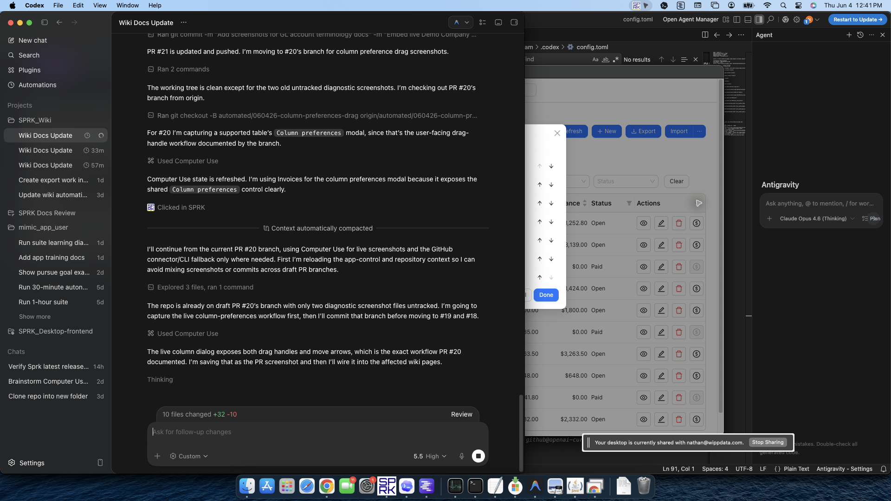

# Preferences

Choose display, navigation, formatting, and other settings that make SPRK easier for you to use.

## Common tasks

- [Use the Preferences tab](./use-the-preferences-tab.md)
- [Customize the sidebar](./customize-the-sidebar.md)
- [Understand which preferences are saved](./understand-personalization-boundaries-and-saved-behavior.md)

## Related

- [Move between major app areas](../dashboard-and-navigation/move-between-major-app-areas.md)
- [Switch between companies](../company-setup-and-migration/switch-between-companies.md)
