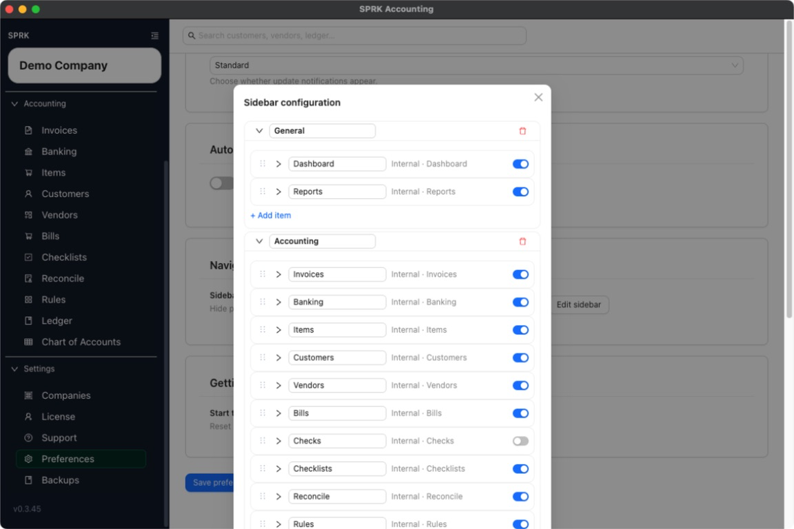

# Customize the Sidebar

Use the sidebar editor in `Preferences` to rename sections, reorder links, hide items, and add external links for your own navigation setup.

## Purpose

Use this workflow when you want the left sidebar to better match how you move through SPRK each day without changing underlying accounting data.

## Prerequisites

- You are signed in to SPRK.
- You know which pages you want to keep, rename, reorder, or hide.

## Steps

1. Open `Preferences`.
2. In the `Navigation` card, select `Edit sidebar`.
3. Review the sidebar configuration modal.
4. Update sections or items as needed:
   - Rename a section or item label.
   - Drag items to change their order.
   - Hide pages you do not want shown in your sidebar.
   - Add an external link when you want quick access to a related destination outside SPRK.
5. If an item supports icon changes, choose a different icon.
6. Save the sidebar configuration when you are finished.
7. Review the live sidebar to confirm the layout now matches your intended navigation.

## Expected Result

Your sidebar reflects your saved navigation preferences while keeping required system access in place. Current general ledger impact as of 2026-05-04:

- Sidebar changes do not create, edit, delete, or repost accounting transactions.
- Reordering or hiding links changes navigation only and does not change balances or company records.
- Adding an external link creates a shortcut in the interface, not a bookkeeping entry.

## Common Mistakes

- Expecting a hidden page to remove the underlying feature or its historical data.
- Renaming a sidebar label and assuming the actual page purpose changed with it.
- Trying to remove required settings access that SPRK keeps available for guardrail reasons.

## Related Articles

- [Use the Preferences tab](./use-the-preferences-tab.md)
- [Understand personalization boundaries and saved behavior](./understand-personalization-boundaries-and-saved-behavior.md)
- [Understand the sidebar and main navigation](../getting-started/understand-the-sidebar-and-main-navigation.md)
- [Move between major app areas](../dashboard-and-navigation/move-between-major-app-areas.md)

## Info

- App sections: `preferences`
- Last validated: 2026-06-05
- Screenshot status: `captured`
