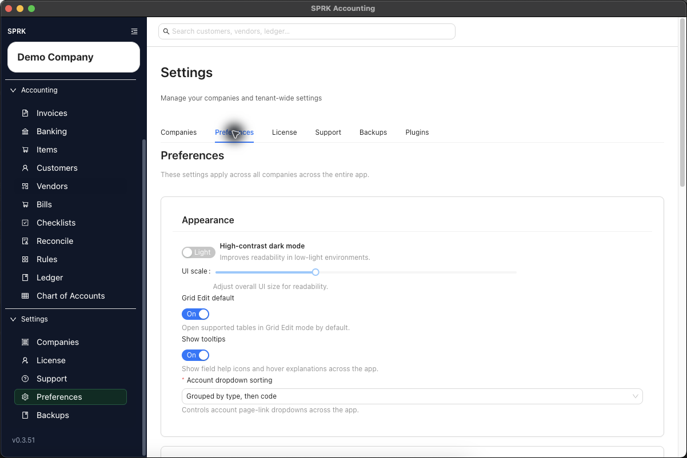

# Understand Personalization Boundaries and Saved Behavior

Learn which SPRK preferences follow your user profile, how broadly they apply, and what they do not change.

## When To Use This

Use this article when you want to understand whether a preference affects only your view, the whole app, or company accounting data.

## Key Points

- The Preferences page describes its settings as applying across all companies across the entire app.
- Theme, UI scale, tooltip visibility, display formatting, account-dropdown sorting, grid-edit startup behavior, automatic update prompts, and sidebar customization are personalization settings, not accounting transactions.
- Preferences can change how values and pages are presented without changing source amounts or posted history.
- The active company still matters for navigation context, but your user preferences are broader than a single company.
- SPRK keeps certain settings access available even when you customize the sidebar, so required configuration paths remain reachable.
- Column visibility and column order preferences affect how supported tables appear for your user profile, while required columns can remain protected by the product.
- Account-dropdown sorting affects supported account selectors, including report and transaction-entry selectors, so one user may see grouped account-type ordering while another user sees a flatter A-Z list.
- Supported column-preference dialogs can offer both drag handles and move-up or move-down controls for reordering, so users can choose the control style that fits the task.
- `Show tooltips` controls visible field-help icons and hover explanations where they exist; it does not remove fields, change required validation, or change accounting behavior.

## What Happens Next

You can distinguish between user-facing personalization and company accounting activity before making changes.

- Personalization settings do not post to the general ledger.
- Saved preferences do not move transactions between companies or reopen closed periods.
- Display-only formatting changes do not rewrite journal entries, invoices, bills, or reconciliations.
- Account selector ordering does not rename, activate, deactivate, or reorder accounts in the chart of accounts.
- Tooltip visibility changes help affordances only and does not disable validation or product guardrails.
- Changing supported table layouts, reordering columns, or enabling default Grid Edit changes your working view, not the underlying accounting data.
- When `Grid Edit default` is on, supported list pages can open directly into grid mode for your user profile; it does not force unsupported pages into grid mode.

## If Something Looks Wrong

- Assuming a formatting preference changed how a transaction was originally posted.
- Confusing app-wide user preferences with company-specific maintenance settings.
- Treating an account selector's order as proof that accounts were reorganized in company setup.
- Assuming column order preferences apply to every page identically.
- Treating a dragged column order as a shared company layout instead of a saved user preference.
- Turning off tooltips and then expecting field requirements or save checks to stop applying.
- Expecting sidebar personalization to override required product guardrails.

## Related

- [Use the Preferences tab](./use-the-preferences-tab.md)
- [Customize the sidebar](./customize-the-sidebar.md)
- [Use grid edit for bulk record maintenance](../dashboard-and-navigation/use-grid-edit-for-bulk-record-maintenance.md)
- [Switch between companies](../company-setup-and-migration/switch-between-companies.md)
