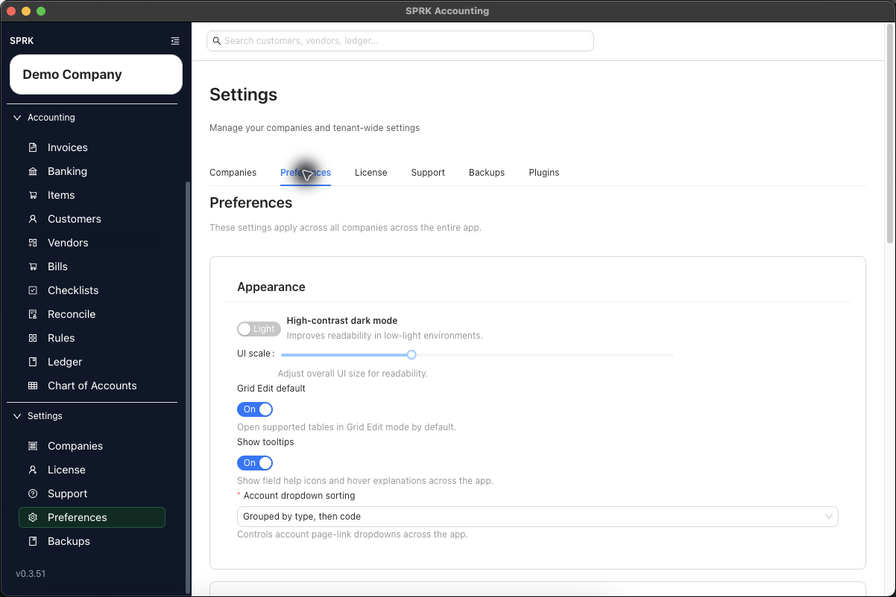

# Understand Which Preferences Are Saved

<!-- Screenshot status: Review needed -->

Learn which settings follow your user profile and which changes apply only to the current page or company.

## Quick reference

| Preference Area | What It Changes | What It Does Not Change |
|---|---|---|
| Theme and UI scale | How SPRK appears for your user profile. | Posted transactions, company setup, or other users' views. |
| Number, currency, and date formats | How values and dates display and how typed dates are interpreted. | Source amounts or posted transaction dates. |
| `Show tooltips` | Whether visible field-help icons and hover explanations appear where SPRK defines them. | Required fields, validation checks, or accounting behavior. |
| `Grid Edit default` | Whether supported list pages open in Grid Edit mode for your user profile. | Which records exist or whether unsupported pages use Grid Edit. |
| Account dropdown sorting | The order used by supported account selectors. | The chart of accounts, account names, account codes, or account status. |
| Column preferences | Visible optional columns and their order on supported tables. | The underlying accounting records behind those rows. |
| Sidebar customization | Which supported destinations are easier to reach from your sidebar. | Required product guardrails or the records stored in SPRK. |

## Details

The Preferences page describes its settings as applying across all companies across the app for your user profile. The active company still matters for navigation and accounting context, but preferences are broader than a single company.

Personalization settings change how SPRK is presented to you. Use company setup or the related accounting page when you need to change company records.

## If something looks wrong

| What You See | What To Check | What To Do Next |
|---|---|---|
| A posted amount or date still looks unchanged | Whether you changed a display preference rather than the source transaction | Edit the source record only through the relevant accounting workflow. |
| A setting behaves across companies | Whether it is a user preference rather than company maintenance | Use company setup pages for company-specific configuration. |
| Account selectors appear in a different order for another user | Each user's account dropdown sorting preference | Compare preferences before changing the chart of accounts. |
| Column order differs between pages | Whether that table supports saved column preferences | Adjust the supported table directly if needed. |
| A required field still blocks save after tooltips are hidden | Whether `Show tooltips` controls help visibility only | Complete the required field or validation check. |
| A required page remains visible after sidebar customization | Whether SPRK keeps that destination available as a product guardrail | Use the required page when the workflow needs it. |

## Related

- [Use the Preferences tab](./use-the-preferences-tab.md)
- [Customize the sidebar](./customize-the-sidebar.md)
- [Use grid edit for bulk record maintenance](../dashboard-and-navigation/use-grid-edit-for-bulk-record-maintenance.md)
- [Switch between companies](../company-setup-and-migration/switch-between-companies.md)
