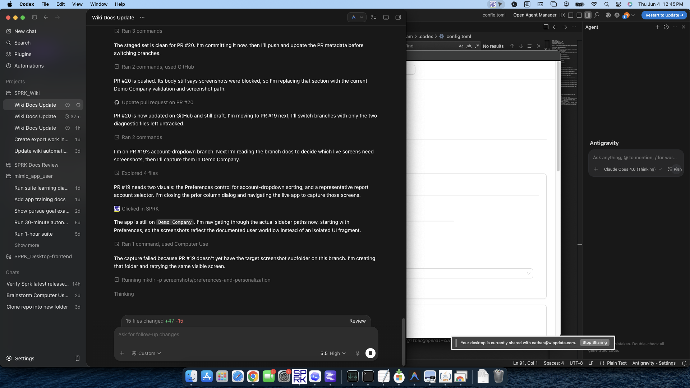

# Use the Preferences Tab

Open `Preferences` to manage app-wide appearance, formatting, date display, update notification, navigation, automation, and getting-started settings.

## Purpose

Use this workflow when you want to review or change how SPRK looks and behaves for your user profile across the app.

## Prerequisites

- You are signed in to SPRK.
- The active company shown in the sidebar is the company you intend to use while validating context-sensitive pages.

## Steps

1. Confirm the sidebar company selector shows the company you expect before you continue.
2. Open `Preferences` from the `System` section in the sidebar.
3. Review the `Appearance` card:
   - Use the theme toggle to switch between light and dark mode.
   - Adjust `UI scale` if you need larger or smaller interface sizing.
   - Turn on `Grid Edit default` if you want supported list pages to open in Grid Edit mode automatically.
   - Choose `Account dropdown sorting` when you want supported account selectors to be easier to scan. The visible choices are grouped by type then name, grouped by type then code, or flat A-Z.
   - The current helper text says this opens supported tables in Grid Edit mode by default.
4. Review the `Formatting` card:
   - Choose a `Number format`.
   - Choose a `Currency format`.
   - Choose a `Date format`. SPRK's standard default is `MM/DD/YYYY`, but your saved profile can use another visible format such as `YYYY-MM-DD`, `YYYY/MM/DD`, `MM-DD-YYYY`, `DD-MM-YYYY`, or `DD/MM/YYYY`.
   - Choose a `Decimal data entry` style.
5. When you type dates directly into date fields elsewhere in SPRK, use the order implied by your selected date format. Many date fields accept typed values with separators, and compact entries can normalize to the saved display format after the field accepts them.
6. Review column and list preferences when you need faster table cleanup:
   - Use `Grid Edit default` to choose whether supported list pages start in Grid Edit mode.
   - Open `Column preferences` from supported tables to choose visible optional columns and change their order.
   - Drag a column's reorder handle when you want to move it quickly, or use the move-up and move-down controls when keyboard or button controls are easier.
   - Leave required columns visible when SPRK keeps them protected.
7. Review the `Updates` card and choose the automatic update frequency you want.
8. Review the `Automation` card if you want to adjust supported default-account helpers.
9. Review the `Navigation` card if you want to tailor the sidebar layout later.
10. Review the `Getting started` card if you want the dashboard tour to appear again.
11. Save preferences when you finish if the page does not auto-save the changes you made.

## Expected Result

Your user-level preferences are applied across the SPRK app, including display, formatting, date-entry interpretation, grid-edit startup behavior, and update prompt behavior. Current general ledger impact as of 2026-06-05:

- Changing preferences does not create, edit, or delete a journal entry.
- Display and formatting updates change how information is shown to you, not the underlying transaction amounts.
- Changing `Date format` changes how date fields display and interpret typed dates; it does not rewrite posted transaction dates.
- Turning on `Grid Edit default` changes how supported pages open for your user profile, not which records exist or how they post.
- Changing `Account dropdown sorting` changes the order used by supported account page-link dropdowns across the app, not the chart of accounts itself.
- Changing column visibility or column order affects your working view on supported tables, not the accounting records behind those rows.
- Resetting the getting-started tour affects onboarding prompts only and does not change company books.

## Common Mistakes

- Treating Preferences as a company setup page instead of a user-level settings area.
- Assuming number or currency display choices recalculate posted balances.
- Typing compact dates without checking that the digits match your selected date order.
- Assuming `Grid Edit default` changes every page in SPRK instead of supported list pages only.
- Assuming account selectors always appear in one fixed order for every user.
- Assuming drag reordering in `Column preferences` replaces the move-up and move-down controls; both paths can be available on supported tables.
- Leaving the page before saving after making changes that are not auto-saved.

## Related Articles

- [Customize the sidebar](./customize-the-sidebar.md)
- [Understand personalization boundaries and saved behavior](./understand-personalization-boundaries-and-saved-behavior.md)
- [Use grid edit for bulk record maintenance](../dashboard-and-navigation/use-grid-edit-for-bulk-record-maintenance.md)
- [Create your first company](../company-setup-and-migration/create-your-first-company.md)
- [View available reports](../reports-and-financial-review/view-available-reports.md)
- [Choose or switch your active company](../getting-started/choose-or-switch-your-active-company.md)
- [Understand the sidebar and main navigation](../getting-started/understand-the-sidebar-and-main-navigation.md)

## Info

- App sections: `preferences`
- Last validated: 2026-06-05
- Screenshot status: `captured`
