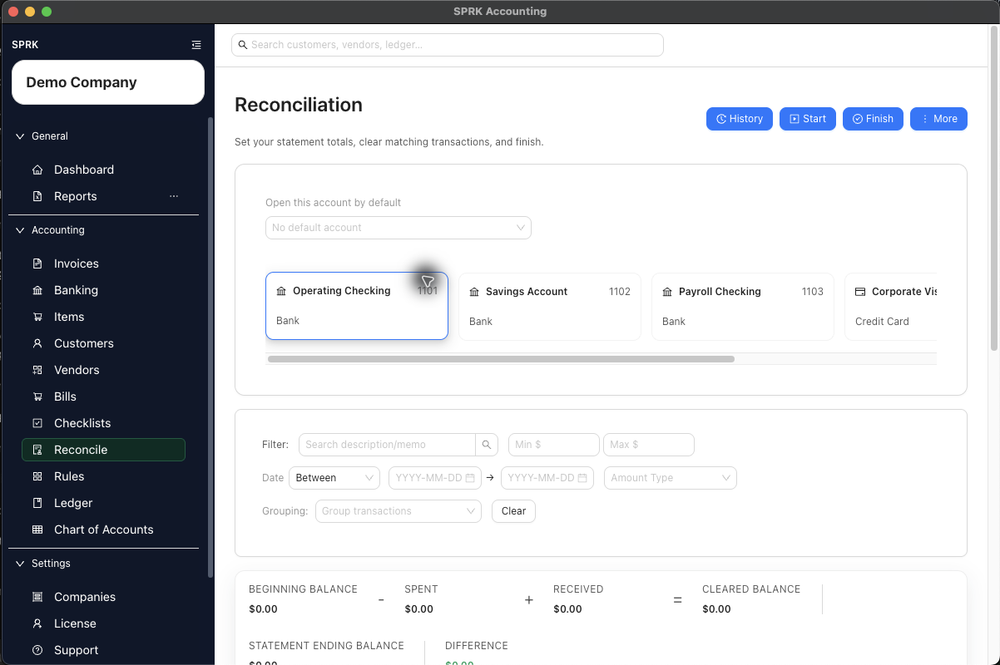

# Finish a Reconciliation

Clear the right confirmed transactions, monitor the difference, and finish the reconciliation only when the selected activity agrees to the statement ending balance.

## When To Use This

Use this workflow after a reconciliation session is started and you are ready to clear transactions and finalize the statement.

## Before You Start

- A reconciliation session is already active for the account.
- The account's `Statement opening balance`, `Statement ending balance`, and statement date range are already set.
- The transactions you plan to clear are confirmed and belong to the selected account.

## Steps

1. Open `Reconcile` for the correct account.
2. Confirm that the summary bar shows `Beginning balance`, `Spent`, `Received`, `Cleared balance`, `Statement ending balance`, and `Difference`.
3. Review the preselected transactions and adjust the selection as needed:
   - Leave selected only the confirmed transactions that should clear on the statement.
   - Remove transactions that fall inside the date range but should not clear yet.
   - Add any eligible confirmed transactions that belong on the statement and are still unselected.
4. Use filters, sorting, or grouping to review the list more efficiently.
5. Watch the summary bar as you change the selection:
   - `Cleared balance` is calculated from beginning balance, spent, and received totals.
   - `Difference` must reach zero before a normal reconciliation can finish.
6. When the difference is zero, select `Finish`.
   - If a later reconciliation period carries an opening balance that already equals the statement ending balance, SPRK can finish the quiet period with zero selected transactions.
7. If needed, use `Export` before finishing to download the current reconciliation table as a CSV review file.
8. After the reconciliation is posted, use `History` and `View report`, or use `More` > `Print Bank Rec`, when you need to review the bank reconciliation report for that posted statement period.

## What Happens Next

SPRK finalizes the reconciliation for the selected statement window.

- Finishing a reconciliation does not create a new journal entry in the general ledger.
- SPRK creates a posted reconciliation record for the account and statement ending date.
- Each selected confirmed bank transaction is stamped as reconciled, tied to that reconciliation record, and marked with a cleared date and statement end date.
- SPRK requires the difference to be zero for reconciliations with prior history.
- Later reconciliations can finish with no selected transactions when the carried opening balance already equals the statement ending balance.
- Posted reconciliation records can be reviewed later from reconciliation history and the Reports `Reconciliation` tab.

## If Something Looks Wrong

- Trying to finish while the difference is not zero.
- Clearing transactions from the wrong account.
- Expecting pending bank transactions to be available for final clearing.
- Selecting a row just to finish a quiet statement period when the beginning and ending balances already match.
- Assuming reconciliation changes the original account coding of a confirmed bank transaction.

## Related

- [Start a reconciliation](./start-a-reconciliation.md)
- [Match and unmatch transactions](./match-and-unmatch-transactions.md)
- [View and print bank reconciliation reports](./view-and-print-bank-reconciliation-reports.md)
- [Resolve common reconciliation exceptions](./resolve-common-reconciliation-exceptions.md)
