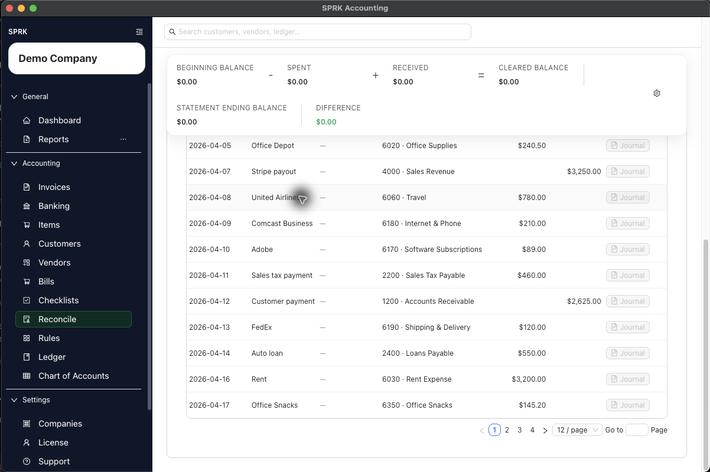

# Match and Unmatch Transactions

Link a reconciled bank line to a check when the workflow needs check-level support, and remove that link when the wrong check was chosen.

## When To Use This

Use this workflow when a bank transaction in reconciliation should be tied to a check record, or when an existing match needs to be removed.

## Before You Start

- You are in `Reconcile`.
- The selected account has at least one confirmed transaction available in the reconciliation table.
- The bank line is eligible for check matching.

## Steps

1. Open `Reconcile` and choose the correct account.
2. Locate the bank line you want to review.
3. Use the table filters or grouping options if you need to narrow the list by description, amount, date, or amount type.
4. In the row, select `Match`.
5. Review the match window:
   - The modal shows the bank-line description and amount.
   - It can also show reference details such as date or check number.
6. Choose the suggested check that matches the bank transaction.
7. If the line already shows a matched check and you need to remove it, use `Unmatch` from the row or from the match window.
8. Refresh the reconciliation table if you want to confirm the updated match state.

## What Happens Next

The bank line is either linked to the correct check or returned to an unmatched state.

- Matching or unmatching does not create a new general ledger entry.
- Matching stores or removes the relationship between the bank transaction and the check record.
- Reconciliation can still continue after matching, but the bank line must still be cleared through the reconciliation finish flow.
- SPRK does not allow unmatching a cleared check through the current unmatch behavior.

## If Something Looks Wrong

- Matching a bank line only by amount without checking date or check number.
- Assuming matching alone finishes reconciliation.
- Trying to use `Unmatch` after the linked check is already in a cleared state.

## Related

- [Start a reconciliation](./start-a-reconciliation.md)
- [Finish a reconciliation](./finish-a-reconciliation.md)
- [Work with checks](../expenses-and-payables/work-with-checks.md)
