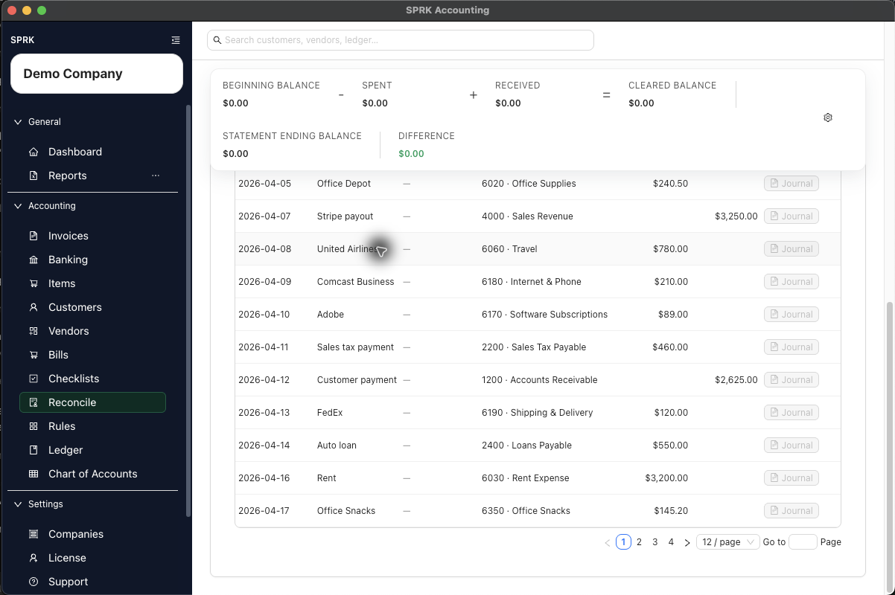

# Match and Unmatch Transactions

<!-- Screenshot status: Review needed -->

Link a confirmed bank transaction to a check while you are reconciling, and remove that link when the wrong check was chosen.

<!-- Last validated against SPRK source: 2026-08-27 -->

## When to use this

Use this guide when a bank transaction in reconciliation should be tied to a check record, or when an existing match needs to be removed.

## Before you start

- You are in `Reconcile`.
- The selected account has at least one confirmed transaction available in the reconciliation table.
- The bank line is eligible for check matching.

## Steps

1. Open `Reconcile` and choose the correct account.
2. Locate the bank line you want to review.
3. Use the table filters or grouping options if you need to narrow the list by description, amount, date, or amount type.
4. In the row, select `Match`.
5. Review the match window:
   - The modal shows the bank-line description and amount.
   - It can also show reference details such as date or check number.
6. Choose the suggested check that matches the bank transaction.
7. If the line already shows a matched check and you need to remove it, use `Unmatch` from the row or from the match window.
8. Refresh the reconciliation table if you want to confirm the updated match state.

## What happens next

The bank line is either linked to the correct check or returned to an unmatched state.

- Matching or unmatching does not create a new general ledger entry.
- Matching stores or removes the relationship between the bank transaction and the check record.
- Reconciliation can still continue after matching, but the bank line must still be cleared through the reconciliation finish flow.
- SPRK does not allow unmatching a cleared check through the current unmatch behavior.

This action does not match an invoice or bill and does not confirm a pending bank row. For those jobs, open `Banking`, stay on `Pending`, and use `Match bank transaction`. Selecting a row in `Reconcile` and finishing with a zero difference is what marks it reconciled.

## If something looks wrong

| What You See | What To Check | What To Do Next |
|---|---|---|
| The wrong check is suggested | Whether the date, check number, and amount agree | Do not match on amount alone; compare the identifying details |
| A check is matched, but the statement is not reconciled | Whether the row is selected and the difference is zero | Complete the remaining statement review, then use `Finish` |

## Related

- [Start a reconciliation](./start-a-reconciliation.md)
- [Finish a reconciliation](./finish-a-reconciliation.md)
- [Work with checks](../expenses-and-payables/work-with-checks.md)
