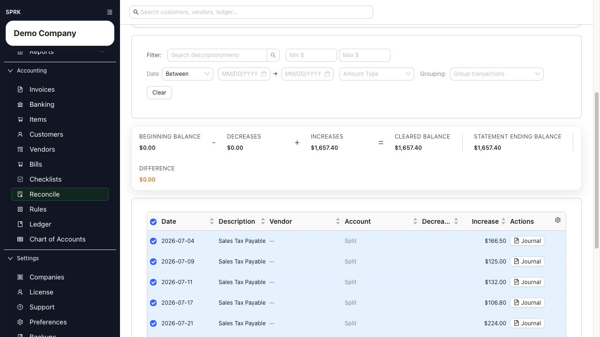

# Reconcile General Ledger Accounts

<!-- Screenshot status: Review needed -->

Reconcile an eligible balance-sheet account to a supporting statement or schedule, even when it is not a bank or credit-card register.

<!-- Last validated against SPRK source: 2026-08-27 -->

## When to use this

Use this workflow for a balance-sheet account that your company has enabled for reconciliation, such as a loan, clearing account, prepaid balance, fixed-asset balance, or another account supported by an outside statement or schedule.

## Before you start

- The account is an active asset, liability, or equity account.
- `Reconcile account` is enabled on the account.
- The account is not marked nonposting.
- You have the statement or supporting schedule and know its ending date and balance.

## Steps

1. Open `Reconcile` and choose the account.
2. Select `Start`.
3. Review `Statement opening balance (locked)`. The first reconciliation starts at $0 automatically; later periods carry the ending balance from reconciliation history.
4. Enter `Statement ending date`.
5. Enter `Statement ending balance` using the account's normal balance sign.
6. Select `Start`.
7. Compare the ledger activity with the statement or schedule. General-ledger accounts use `Decreases`, `Increases`, `Decreases Only`, and `Increases Only` instead of the bank-register labels `Spent` and `Received`.
8. Select only the posted ledger lines supported by the period's evidence.
9. When `Difference` is zero, select `Finish` and review the confirmation.

## What happens next

Finishing stores a posted reconciliation session and the selected ledger-line references. It does not create another journal entry. The next reconciliation uses the last posted session as its opening reference. Reconciliation reports for this account use the posted ledger lines selected in this workflow.

The first-time bank choices `Start at $0 — New account` and `Use a Ledger Entry to establish the opening balance` apply to bank-register reconciliation, not this general-ledger path.

## If something looks wrong

| What You See | What To Check | What To Do Next |
|---|---|---|
| The account is missing | Account type, `Reconcile account`, active status, and nonposting status | Edit the account setup only if this balance should be supported by formal reconciliation |
| The activity uses `Spent` and `Received` | Whether the account has a bank, cash, or credit-card subtype | Follow the bank-register reconciliation guide for that account |
| The difference is not zero | Ending balance sign, statement date, and selected increases and decreases | Compare each selected line with the statement or schedule before finishing |
| A prior-period ledger correction is needed | Whether the line belongs to a posted reconciliation | Use the supported reversal or correction and review the reconciliation impact |

## Related

- [Start a reconciliation](./start-a-reconciliation.md)
- [Finish a reconciliation](./finish-a-reconciliation.md)
- [Resolve common reconciliation exceptions](./resolve-common-reconciliation-exceptions.md)
- [Understand the chart of accounts structure](../ledger-and-chart-of-accounts/understand-the-chart-of-accounts-structure.md)
- [Common accountant corrections](../ledger-and-chart-of-accounts/common-accountant-corrections.md)
