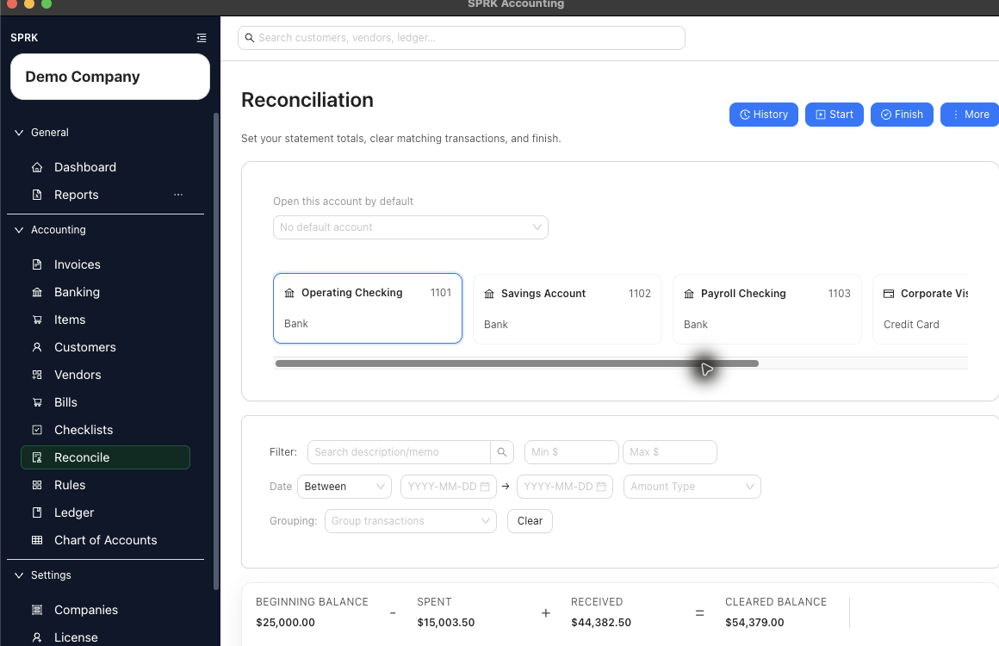
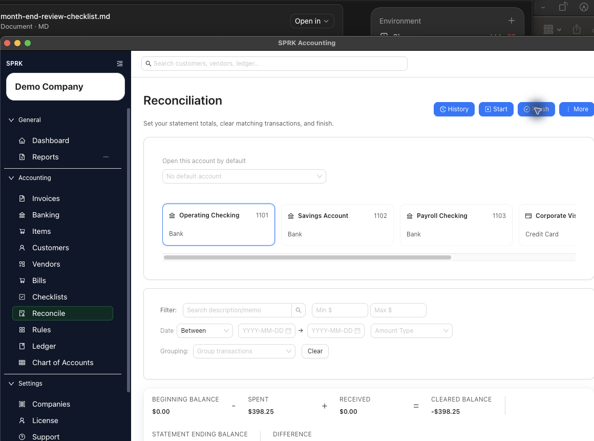

# Start a Reconciliation

Open the reconciliation workflow for a bank or credit card account, review the statement dates and balances that SPRK locks or derives, and start the clearing session correctly.

## When To Use This

Use this workflow when you are ready to begin reconciling one bank or credit card account against a statement.

## Before You Start

- An active company is selected.
- The bank or credit card account you want to reconcile already exists.
- You are ready to confirm that the selected account matches the statement you are holding, even if SPRK opens a saved default account automatically.
- The transactions you expect to clear have already been confirmed in SPRK.
- For a first-time reconciliation with no prior reconcile history, you know which journal entry should serve as the opening balance anchor for that account.

## Steps

1. Open `Reconcile`.
2. In the account picker near the page header, choose the bank or credit card account you want to reconcile.
   - If SPRK opens a saved default account automatically, confirm that it matches the statement before you continue.
3. Select `Start`.
4. Review the `Start reconciliation` window:
   - If SPRK finds a prior reconciliation for that account, the `Statement opening date` and `Statement opening balance` fields are locked from the last posted reconciliation before the selected statement ending date.
   - If SPRK does not find a prior reconciliation, select the `Opening balance journal entry` that should anchor the account's first reconciliation.
5. For a first-time reconciliation, confirm that SPRK derives the opening and ending values from the selected journal entry before continuing.
6. If this is not the first reconciliation, enter or confirm the `Statement ending date`.
   - Use the calendar control or type the date directly in the order set by your `Preferences` date format.
7. If this is not the first reconciliation, enter the `Statement ending balance`:
   - Use a positive number for bank accounts.
   - Use a negative number for credit accounts.
8. Select the modal action to continue:
   - `Start` begins a normal reconciliation session when a prior reconciliation exists.
   - `Reconcile` completes the opening anchor flow immediately when this is the first reconciliation and you are using the journal-entry anchor.

## What Happens Next

The reconciliation workflow is initialized with statement dates and balances for the selected account.

- Starting a normal reconciliation session does not create a new general ledger entry.
- The page loads confirmed transactions for the selected account and preselects those that fall inside the statement window.
- Eligible unreconciled confirmed rows can still appear for manual selection even when their transaction date is after the statement ending date. Use statement evidence to decide whether a later-dated row belongs on the current statement.
- A first-time opening anchor also does not create a journal entry. It creates a posted reconciliation record so future reconciliations have an opening balance reference.

## If Something Looks Wrong

- Starting on the wrong bank or credit card account.
- Choosing the wrong opening balance journal entry for the first reconciliation.
- Entering a positive ending balance for a credit account.
- Typing a statement date in a different order than your saved date-format preference.
- Expecting SPRK to let you edit the opening balance from a prior posted reconciliation.
- Assuming the statement ending date alone hides every later-dated confirmed row. Account, confirmed status, unreconciled state, and statement judgment still matter.

## Business Scenario: Zero-Difference Monthly Reconciliation

Use this scenario to train a reviewer to clear statement transactions, reach a zero difference, and post the reconciliation.

- Sample file: [06-reconciliation-statement-items.csv](../sample-files/v1-validation/06-reconciliation-statement-items.csv)
- Evidence:

The walkthrough confirmed that selected statement rows can tie to the entered ending balance and that posting the reconciliation creates history for later report review.

## Related

- [Choose bank and credit card accounts](../banking-and-cash-management/choose-bank-and-credit-card-accounts.md)
- [Finish a reconciliation](./finish-a-reconciliation.md)
- [Match and unmatch transactions](./match-and-unmatch-transactions.md)
- [View and print bank reconciliation reports](./view-and-print-bank-reconciliation-reports.md)
- [Resolve common reconciliation exceptions](./resolve-common-reconciliation-exceptions.md)
- [Use the Preferences tab](../preferences-and-personalization/use-the-preferences-tab.md)
