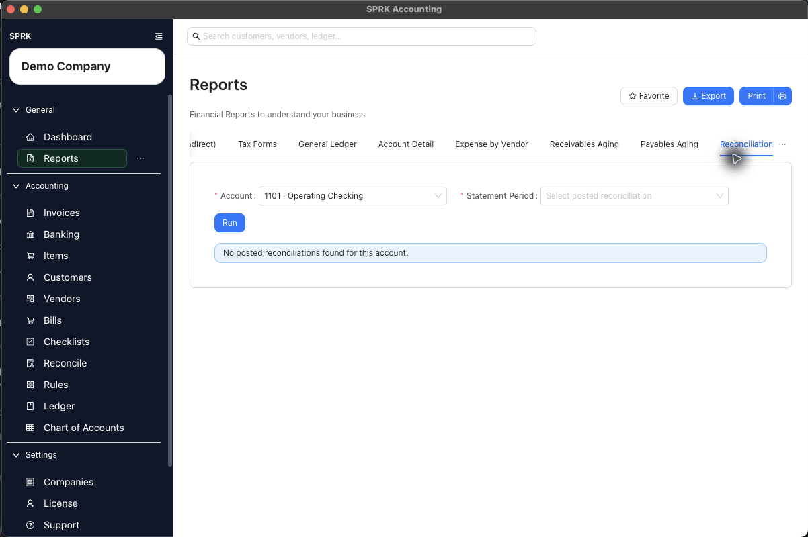

# View and Print Bank Reconciliation Reports

Open the bank reconciliation report from an active reconciliation account or from posted reconciliation history, then review the report output without changing ledger activity.

## When To Use This

Use this workflow when you need support for a completed bank or credit card reconciliation, or when you want to check whether a posted reconciliation report is available for an account.

## Before You Start

- The correct active company is selected.
- The bank or credit card account has been selected in `Reconcile`.
- A posted reconciliation period exists if you need a populated reconciliation report.

## Steps

1. Open `Reconcile`.
2. Select the bank or credit card account you want to review.
3. To open the report path from the active reconciliation page:
   - Select `More`.
   - Select `Print Bank Rec`.
   - SPRK opens `Reports` on the `Reconciliation` tab with the selected account filled in.
4. If the report asks for `Statement Period`, select the posted reconciliation period you want to review.
5. Select `Run`.
6. To open a report from posted history instead:
   - Return to `Reconcile`.
   - Select the same account.
   - Select `History`.
   - Find the posted reconciliation row.
   - Use `View report` from the row action when it is available.
7. Review the report context before printing or sharing it:
   - Confirm the account.
   - Confirm the statement period.
   - Review the summary values and cleared transaction sections.
8. Use `Print` if you need a PDF or paper copy, or `Export` if the report exposes an export action for the current output.

## What Happens Next

SPRK opens the reconciliation report area for the selected account and posted statement period.

- Opening, running, printing, or exporting a reconciliation report does not create new ledger activity.
- The report is review output tied to a posted reconciliation session.
- If the selected account has no posted reconciliation periods, SPRK shows that no posted reconciliations were found for the account instead of generating a populated report.
- History rows only expose `View report` when there is posted reconciliation history to view.

## If Something Looks Wrong

- Looking for reconciliation reports only on the general Reports page and missing the `Print Bank Rec` shortcut from `Reconcile`.
- Expecting a report before the reconciliation has been posted.
- Treating a printed report as a way to edit or reopen a posted reconciliation.
- Choosing the wrong account before opening `Print Bank Rec`, which pre-fills the report account from the active selection.

## Related

- [Start a reconciliation](./start-a-reconciliation.md)
- [Finish a reconciliation](./finish-a-reconciliation.md)
- [Resolve common reconciliation exceptions](./resolve-common-reconciliation-exceptions.md)
- [View available reports](../reports-and-financial-review/view-available-reports.md)
