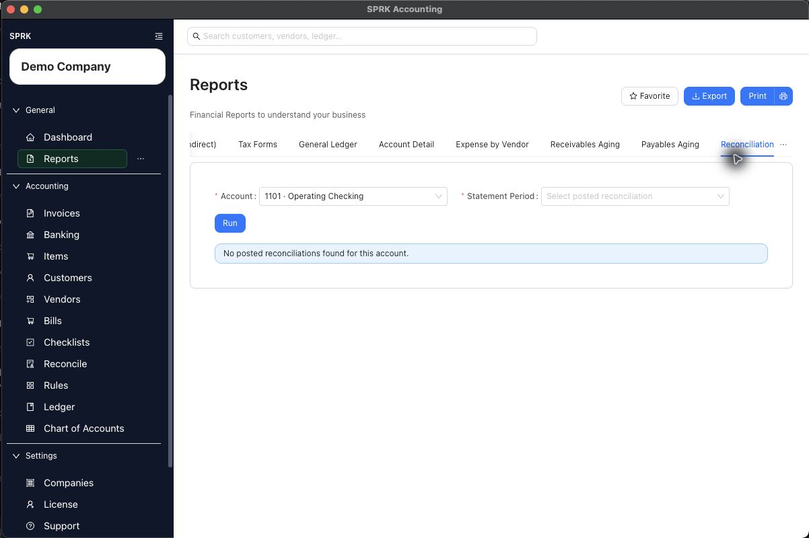
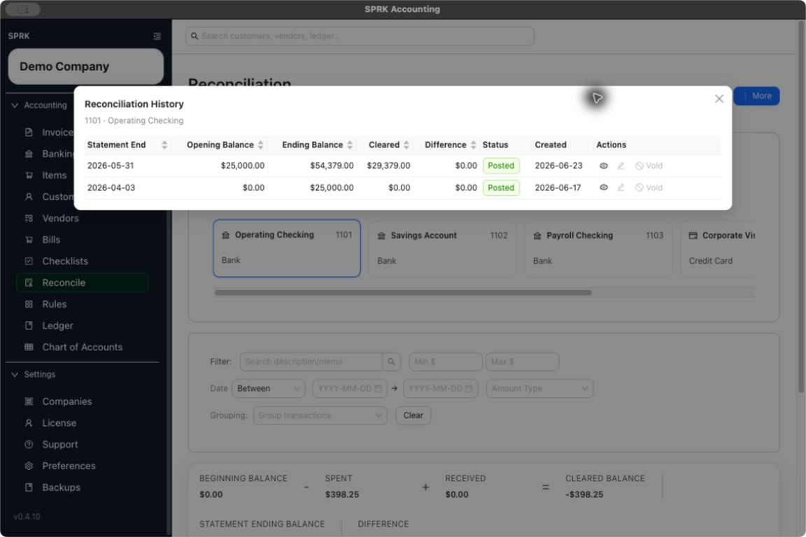
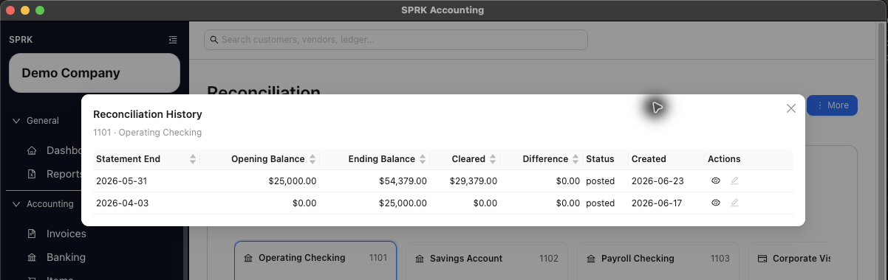
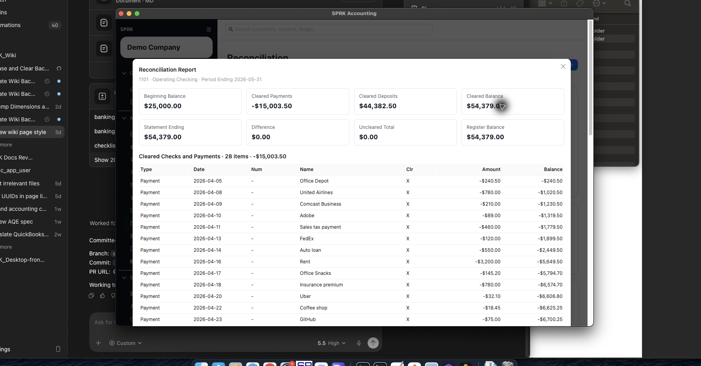

# View and Print Bank Reconciliation Reports

<!-- Last validated: 2026-07-15 (SPRK 0.4.10, Demo Company) -->
<!-- Screenshot status: Current; posted-history actions captured 2026-07-15 -->

Open the bank reconciliation report from an active reconciliation or posted reconciliation history, then review, print, or export the statement-period results.

## When to use this

Use this guide when you need support for a completed bank or credit card reconciliation, or when you want to check whether a posted reconciliation report is available for an account.

## Before you start

- The correct active company is selected.
- The bank or credit card account has been selected in `Reconcile`.
- A posted reconciliation period exists if you need a populated reconciliation report.

## Steps

1. Open `Reconcile`.
2. Select the bank or credit card account you want to review.
3. To open the report path from the active reconciliation page:
   - Select `More`.
   - Select `Print Bank Rec`.
   - SPRK opens `Reports` on the `Reconciliation` tab with the selected account filled in.
4. If the report asks for `Statement Period`, select the posted reconciliation period you want to review.
5. Select `Run`.
6. To open a report from posted history instead:
   - Return to `Reconcile`.
   - Select the same account.
   - Select `History`.
   - Find the posted reconciliation row.
   - Use `View report` from the row action when it is available.

7. Review the report context before printing or sharing it:
   - Confirm the account.
   - Confirm the statement period.
   - Review the summary values and cleared transaction sections.
8. Use `Print` if you need a PDF or paper copy, or `Export` if the report exposes an export action for the current output.

## What happens next

SPRK opens the reconciliation report area for the selected account and posted statement period.

- The report reflects the posted reconciliation period and selected statement items.
- The report is review output tied to a posted reconciliation session.
- If the selected account has no posted reconciliation periods, SPRK shows that no posted reconciliations were found for the account instead of generating a populated report.
- History rows only expose `View report` when there is posted reconciliation history to view.
- `Posted` history is the normal report-producing state. If a journal correction explicitly voids an affected session, the session stays in history as `Voided`, is not used for future opening balances, and should not be treated as a normal printable posted report.

## If something looks wrong

| What You See | What To Check | What To Do Next |
|---|---|---|
| A history row is `Voided` | Expecting it to behave like a normal posted report row | Keep it as audit history and use the current posted or later reconciliation period for normal report review |

## Practice and examples

Use the practice file and screenshots to review the report action generated from a completed reconciliation.

- Practice file: [reconciliation-report-export.csv](../sample-files/practice/reconciliation-report-export.csv)

Posted history exposes a report action, and the report includes statement-period detail for later review.

## Related

- [Start a reconciliation](./start-a-reconciliation.md)
- [Finish a reconciliation](./finish-a-reconciliation.md)
- [Resolve common reconciliation exceptions](./resolve-common-reconciliation-exceptions.md)
- [View available reports](../reports-and-financial-review/view-available-reports.md)
