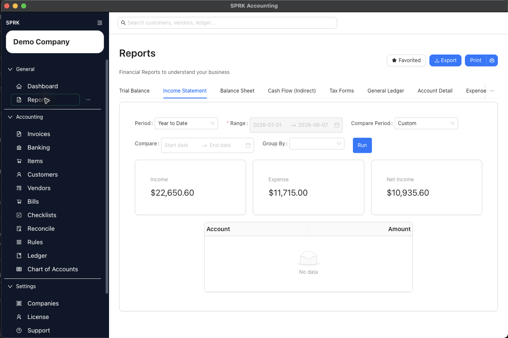

# Reports and Financial Review

Open the Reports area, run the report you need, set date controls, review supporting detail, and understand report navigation inside SPRK.

## In This Section

- [View available reports](./view-available-reports.md)
- [Export transactions from reports](./export-transactions-from-reports.md)
- [Use report drilldown behavior](./use-report-drilldown-behavior.md)
- [Review financial results inside the product](./review-financial-results-inside-the-product.md)
- [Interpret report navigation without accounting advice](./interpret-report-navigation-without-accounting-advice.md)

For reconciliation-specific report access from `Reconcile`, see [View and print bank reconciliation reports](../reconciliation/view-and-print-bank-reconciliation-reports.md).

## Info

- App sections: `reports`
- Last validated: 2026-06-05
- Screenshot status: `captured`
