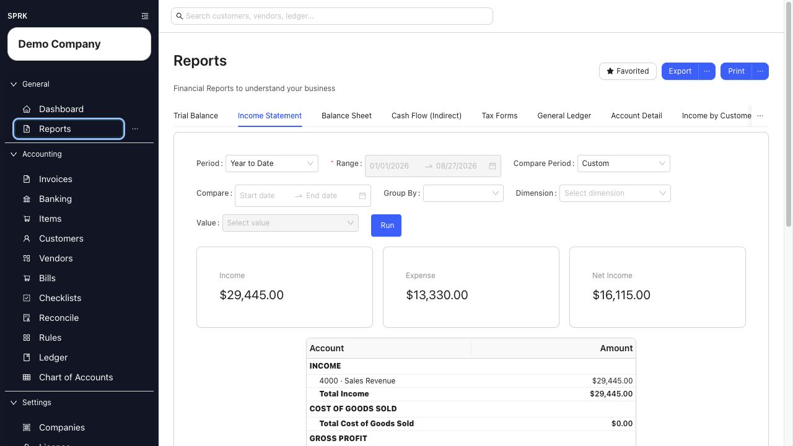

# Reports and financial review

Run reports, open supporting detail, and review financial results.

## Start here

- [See the reports available in SPRK](./view-available-reports.md)
- [Review financial results](./review-financial-results-inside-the-product.md)

## Common tasks

- [Run Income by Customer](./run-income-by-customer.md)
- [Run Schedule C](./run-schedule-c.md)
- [Export transactions from a report](./export-transactions-from-reports.md)
- [Open supporting details from a report](./use-report-drilldown-behavior.md)

## Related

- [Follow the month-end review checklist](../checklists-and-period-end-work/month-end-review-checklist.md)
- [Make common accountant corrections](../ledger-and-chart-of-accounts/common-accountant-corrections.md)
