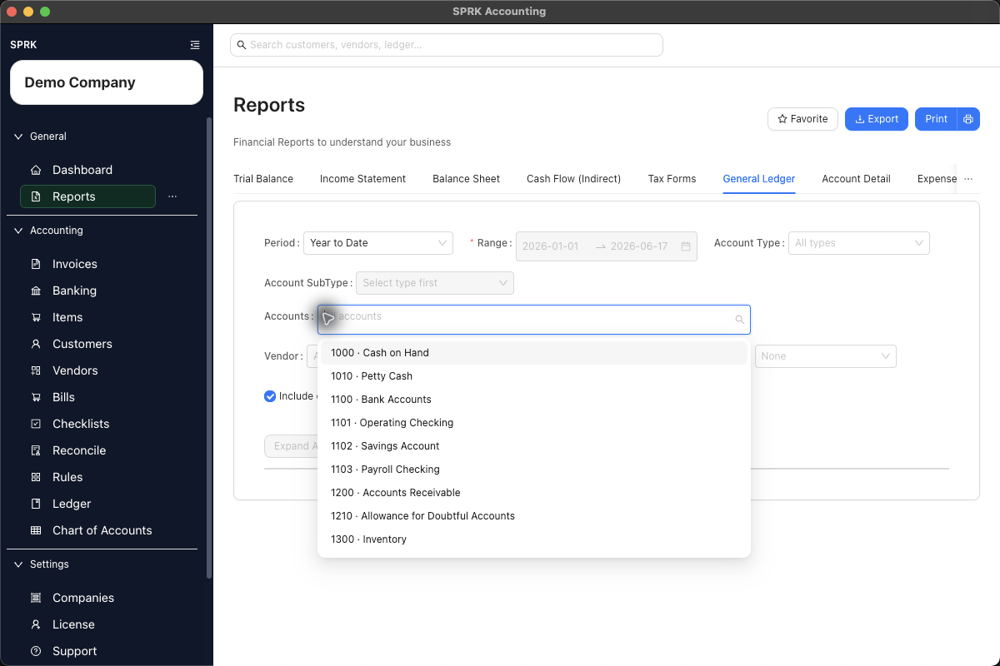

# Export Transactions from Reports

Run transaction detail from the `Reports` page, narrow the results to the account or ledger slice you need, and export or print the report for review outside SPRK.

## Purpose

Use this workflow when you need transaction-level report detail for an account, subtype, or ledger slice and need to send the results to a client or reviewer as a spreadsheet or PDF.

## Prerequisites

- You are signed in to SPRK.
- The correct active company is selected.
- The transactions you expect to review are already posted.
- You know the date range and account you want to report on.

## Steps

1. Open `Reports` from the left sidebar.
2. Select the report view that exposes transaction detail:
   - Use `General Ledger` when you want ledger activity by account for a date range.
   - Use `Account Detail` when you want detail for one selected account.
3. Set the date range for the activity you need to review.
4. Narrow the report before you export:
   - In `General Ledger`, use the current filter bar as needed: `Account Type`, `Account SubType`, `Accounts`, `Vendor`, `Text`, `Group By`, and `Include opening balance`.
   - In `Account Detail`, select the required account and optional text filter.
   - Account selectors follow your `Account dropdown sorting` preference, so the list may be grouped by account type or shown as a flat A-Z list depending on your saved preference.
5. Select `Run`.
6. Review the results before exporting:
   - Confirm the active company is correct.
   - Confirm the date range is correct.
   - Confirm the report rows are limited to the account or ledger slice you intended.
   - Confirm the transaction dates, descriptions, accounts, debits, credits, balances, and any visible dimension columns match the review request.
7. To create a spreadsheet file for the active report context, select `Export`.
8. To create a PDF, select `Print`, then use the system print dialog to save or print the report as a PDF.
9. Open the exported or printed file and confirm it contains the expected filtered detail before sending it outside SPRK.
   - Current General Ledger CSV exports include `Account Code`, `Account Name`, `Date`, `Entry #`, `Memo`, `Description`, `Name`, `Debit`, `Credit`, and `Balance`.
   - If the current report includes dimensions in the live table, confirm those dimensions are also present in the exported output where SPRK exposes them.

## Expected Result

SPRK produces an outbound copy of the current report results for review outside the app. Current general ledger impact as of 2026-06-17:

- Running the report does not post, edit, reverse, or reclassify journal entries.
- Export and print actions do not change ledger balances.
- The exported or printed file reflects the report filters in effect at the time you create it, rather than exporting unfiltered rows from other pages of the result set.
- The current visible Reports page exposes active-report `Export` and `Print` controls. Do not promise a batch report package unless that target build exposes an export-many or package action.
- Report exports are review outputs, not tax filing, payroll filing, or statutory submission workflows.

## Common Mistakes

- Exporting before selecting the correct active company.
- Forgetting to rerun the report after changing the account, type, vendor, text, or date filter.
- Assuming `Export` creates a PDF. Use `Print` and the system PDF option when you need a PDF.
- Assuming `Export` creates a complete tax package or agency filing.
- Sending the file before opening it and confirming the account and date range.
- Expecting an inactive or unavailable account to appear in every account selector.
- Assuming another user's account selector order will match yours if your `Account dropdown sorting` preferences differ.

## Troubleshooting

If the account you need is not available in the `Accounts` filter, or the selector shows `No data` after you type the account name:

1. Check `Chart of Accounts` and confirm the account exists for the active company.
2. Confirm the account is active.
3. Confirm the account name or code matches what you are searching for.
4. Try the other transaction-detail report view, such as `Account Detail` instead of `General Ledger`.
5. Open `Preferences` and check `Account dropdown sorting` if the account appears in an unexpected part of the list.
6. If the account exists and is active but still does not appear in the report filter, contact support with the company name, account name, account code, report name, date range, and a screenshot of the missing account selector.

## Related Articles

- [View available reports](./view-available-reports.md)
- [Review financial results inside the product](./review-financial-results-inside-the-product.md)
- [Use report drilldown behavior](./use-report-drilldown-behavior.md)
- [Understand the chart of accounts structure](../ledger-and-chart-of-accounts/understand-the-chart-of-accounts-structure.md)

## Info

- App sections: `reports`, `ledger`, `chart-of-accounts`
- Last validated: 2026-06-17
- Screenshot status: `captured`
