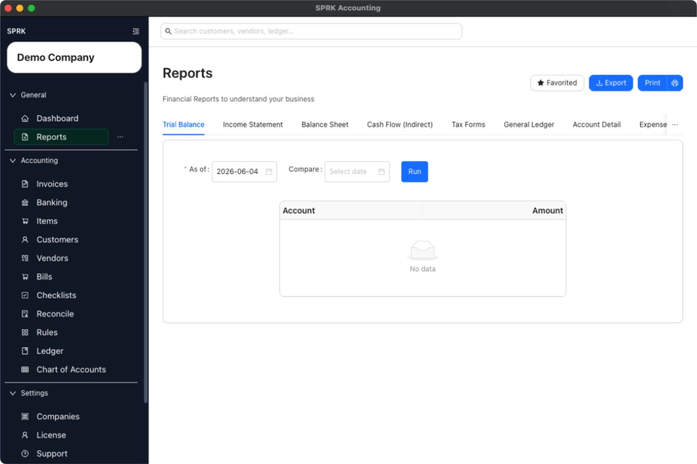

# Interpret Report Navigation Without Accounting Advice

Understand what each report area is for, move between reports and supporting detail, and keep the workflow focused on product navigation rather than accounting conclusions.

## Purpose

Use this article when you want a product-usage explanation of how report navigation works in SPRK without turning the page into accounting, tax, or legal advice.

## Prerequisites

- You are signed in to SPRK.
- The correct active company is selected.

## Steps

1. Open `Reports` from the sidebar when your goal is review, not data entry.
2. Use the report tabs to switch between financial views rather than leaving the page for each report type.
3. Treat the report header actions separately:
   - `Export` saves the current report rows.
   - `Print` opens the current report print flow.
4. Use date controls first, then run the report before interpreting the result.
5. When you need the detail behind a number, use drilldown if the report exposes it.
6. When a number appears wrong, move to the workflow that owns the original transaction or ledger entry to correct it. Do not treat the report page as the correction tool.

## Expected Result

You can navigate the Reports area confidently and understand what each control is for without using the page as a source of accounting advice. Current general ledger impact as of 2026-05-04:

- Report navigation is read-only.
- Export and print are presentation actions, not posting actions.
- Moving from a report into supporting detail does not alter the journal entries being reviewed.

## Common Mistakes

- Asking the report page to answer accounting-policy questions that depend on professional judgment.
- Confusing product navigation guidance with advice about how accounts should be classified.
- Trying to fix source data from the report page instead of using the owning workflow.

## Related Articles

- [View available reports](./view-available-reports.md)
- [Use report drilldown behavior](./use-report-drilldown-behavior.md)
- [Review financial results inside the product](./review-financial-results-inside-the-product.md)

## Info

- App sections: `reports`
- Last validated: 2026-05-04
- Screenshot status: `captured`
