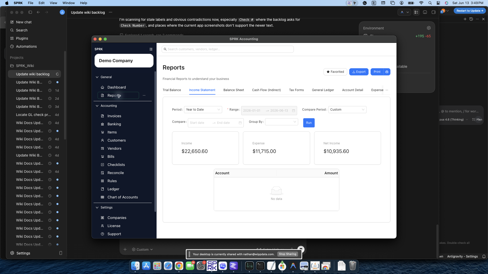
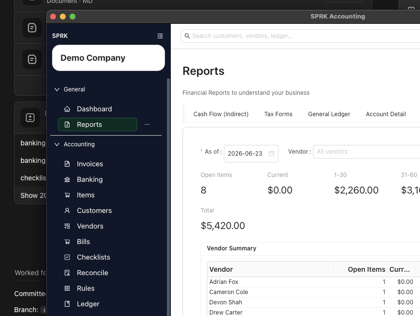
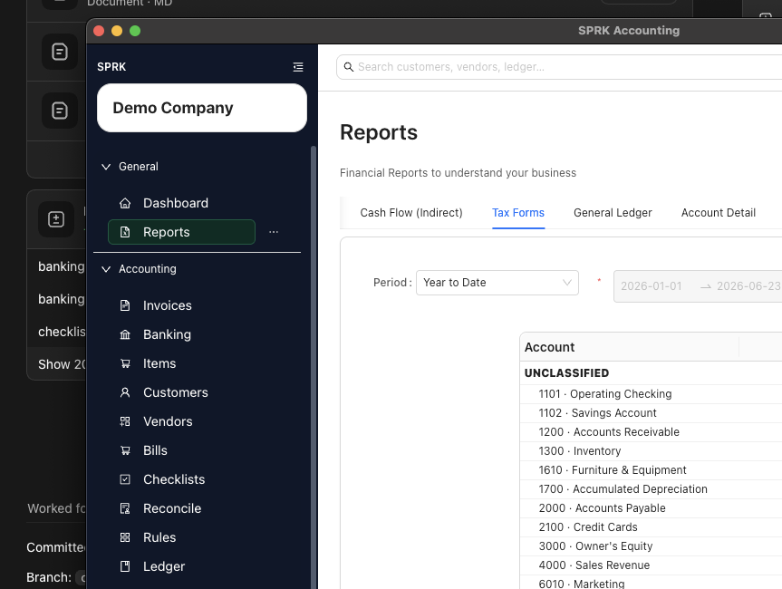

# Review Financial Results Inside the Product

Run financial reports in SPRK as a practical review sequence: scan account balances, review statements, drill into unusual activity, and decide which source workflow should hold any correction.

## When To Use This

Use this workflow when you want to review company results by period, prepare month-end reporting, investigate unusual balances, or check whether AR, AP, banking, and ledger activity agree.

## Before You Start

- You are signed in to SPRK with the correct active company selected.
- The transactions and journal entries you expect to review are already posted.
- You know the time period or date you want to evaluate.

## Steps

1. Open `Reports`.
2. Start with the report that matches your review stage:
   - `Trial Balance` for a first scan of account balances.
   - `Balance Sheet` for assets, liabilities, and equity as of the review date.
   - `Income Statement` for income, expenses, and net income for the period.
   - `General Ledger` or `Account Detail` when a balance needs supporting detail.
3. Choose any additional report that matches your review goal:
   - `Income Statement` for period-based income and expense review.
   - `Balance Sheet` for balances as of a date.
   - `Trial Balance` for account balances as of a date.
   - `Cash Flow (Indirect)` for period-based cash-movement review.
   - `Reconciliation` for posted bank or credit card reconciliation report output.
   - `General Ledger` for filtered transaction detail by type, subtype, account, vendor, or text.
   - `Account Detail` for transaction detail on one selected account.
   - `Expense by Vendor` when you need vendor spending detail, including the visible `1099` filter when you are reviewing tagged vendors.
4. Set the period or date controls for the selected report. You can use the calendar controls or type dates directly when the field is editable; typed dates should follow your saved `Preferences` date order.
   - Supported report selectors are searchable and sorted so longer account or vendor lists are easier to narrow.
5. If you are on `Income Statement`, add a compare period when you want side-by-side period review.
6. If you are on `Income Statement`, use `Group By` when you want the report split by month, quarter, or year.
7. Select `Run`.
8. Review the summary totals and report rows shown on the page.
   - In `General Ledger`, use `Group By` when you want account-type, subtype, or nested type-and-subtype sections before expanding account detail.
   - Statement and trial-balance rows follow account code when codes are present and fall back to account name when codes are blank.
9. If something looks unusual, use drilldown where available to inspect the supporting entries instead of guessing from the summary alone.
   - Supported statement cards, subtotals, totals, and rows can drill into grouped supporting detail, not only single-account leaf rows.
   - Grouped drilldowns can represent account scopes such as `Income`, `Expense`, `Net Income`, `Assets`, `Liabilities`, `Equity`, or `Net change in cash`.

## What Happens Next

You can review current report totals and detailed lines directly in SPRK for the selected company and period.

- Report totals reflect posted activity already stored in SPRK.
- Running or rerunning the report does not create, reverse, or reclassify any journal entry.
- Compare-period and grouping views reorganize the display only; they do not change source transactions.
- Account-code or account-name ordering changes display consistency only; it does not change balances.
- Running a reconciliation report reads a posted reconciliation period for the selected account; it does not reopen or change that reconciliation.
- Filtering `Expense by Vendor` by `1099` changes which vendors are included in the review; it does not create forms, file taxes, or change the vendor records by itself.
- Plugin-backed report output appears only when the installed plugin is enabled, runtime-compatible, and accepted by SPRK's report runtime.

## If Something Looks Wrong

- Using the wrong report for the question you are trying to answer.
- Comparing periods without checking that the date ranges match your intent.
- Typing date shortcuts without confirming they match your selected date-format order.
- Treating report output as a substitute for reviewing the underlying entries when a balance looks unexpected.
- Assuming a report review changes the ledger automatically. Any correction still has to happen through the relevant transaction or journal-entry workflow.
- Expecting a plugin report to appear just because a plugin was installed. Confirm the plugin is enabled and runtime available first.

## Business Scenario: Aging, Expense, And Tax Mapping Review

Use this scenario to train reviewers to move beyond the core statements into payables aging and tax-form mapping review without implying tax filing or compliance submission.

- Sample file: [21-aging-expense-tax-mapping-review.csv](../sample-files/v1-validation/21-aging-expense-tax-mapping-review.csv)
- Evidence:

The walkthrough confirmed that aging and tax-form views are in-product review tools. They do not file returns, submit agency forms, or change vendor/customer setup by themselves.

## Related

- [Month-end review checklist](../checklists-and-period-end-work/month-end-review-checklist.md)
- [Common accountant corrections](../ledger-and-chart-of-accounts/common-accountant-corrections.md)
- [View available reports](./view-available-reports.md)
- [Export transactions from reports](./export-transactions-from-reports.md)
- [Use report drilldown behavior](./use-report-drilldown-behavior.md)
- [View and print bank reconciliation reports](../reconciliation/view-and-print-bank-reconciliation-reports.md)
- [Use the Preferences tab](../preferences-and-personalization/use-the-preferences-tab.md)
