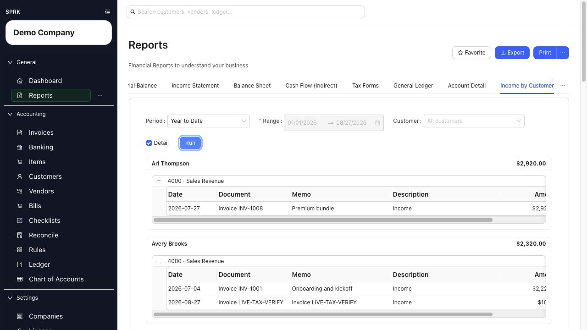

# Run Income by Customer

<!-- Screenshot status: Review needed -->

Review posted income by customer, then open account and invoice detail when you need to explain a balance.

<!-- Last validated against SPRK source: 2026-08-27 -->

## When to use this

Use `Income by Customer` to compare customer contribution, investigate an income amount, or support customer-level review for a selected period.

## Steps

1. Open `Reports` and select `Income by Customer`. If the tab is not visible, use the tab overflow menu.
2. Choose `Period` and review the `Range`.
3. Leave `Customer` blank for all customers, or choose one customer.
4. Keep `Detail` selected when you want document-level rows.
5. Select `Run`.
6. Review each customer total and the income accounts underneath it.

7. Select an amount to open its register detail. In detailed results, select an invoice number to review the invoice information or use `View` to open the linked journal entry.
8. Use `Export` or `Print` when you need a working copy.

## What happens next

The report uses posted income activity and its customer or invoice links. Correct a customer or invoice issue from its source page, then run the report again.

## If something looks wrong

| What You See | What To Check | What To Do Next |
|---|---|---|
| A customer is missing | Date range, customer filter, and whether posted income carries that customer link | Clear the filter and inspect the source invoice or journal detail |
| A total differs from an invoice list | Whether you are comparing posted income with invoice balances or payment status | Use the linked journal detail to identify what the report includes |
| `No income activity` appears | Active company, selected range, and customer filter | Adjust those filters, then run again |

## Related

- [View available reports](./view-available-reports.md)
- [Use report drilldown behavior](./use-report-drilldown-behavior.md)
- [AR review workflow](../sales-and-receivables/ar-review-workflow.md)
- [Understand invoice general ledger impact](../sales-and-receivables/understand-invoice-general-ledger-impact.md)
