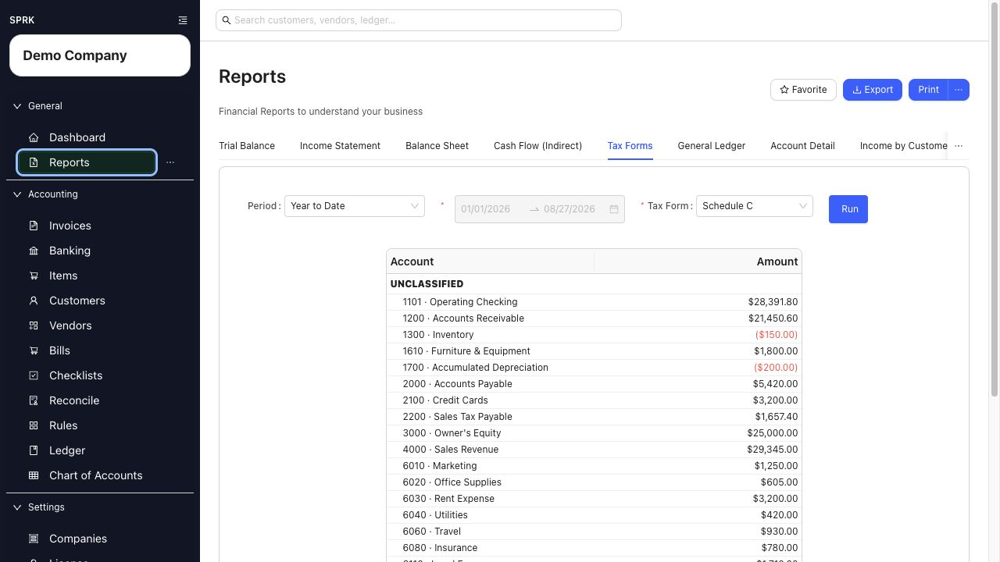

# Run Schedule C

Use SPRK's `Schedule C` report to review income and expense accounts grouped into Schedule C lines before tax preparation.

<!-- Last validated against SPRK source: 2026-08-27 -->

## When To Use This

Use this report when you want a Schedule C-oriented review of posted activity. It is a review aid for your accountant or tax preparer; it does not file a tax return.

## Steps

1. Open `Reports` and select `Tax Forms`. If the tab is not visible, use the tab overflow menu.
2. Choose `Period` and review the `Range`.
3. In `Tax Form`, keep `Schedule C` selected.
4. Select `Run`.
5. Review the income, expense, and `Unclassified` sections. An amount in `Unclassified` needs account-mapping review before you rely on the report.

6. Use supported report rows to inspect the posted activity behind an amount.
7. Use `Export` or `Print` when you need a working copy for review.

## What Happens Next

Running, exporting, or printing this report does not post or change accounting entries. Correct the underlying account or transaction through its original workflow, then run the report again.

## If Something Looks Wrong

| What You See | What To Check | What To Do Next |
|---|---|---|
| Expected activity is missing | Active company, date range, and whether the transaction is posted | Correct the filter or finish the source transaction before rerunning |
| Amounts appear in `Unclassified` | Schedule C mapping on the underlying accounts | Review the account setup with your accountant before tax preparation |
| The report does not match a filed return | Whether later tax adjustments were made outside SPRK | Reconcile the difference with your tax preparer's final workpapers |

## Related

- [View available reports](./view-available-reports.md)
- [Use report drilldown behavior](./use-report-drilldown-behavior.md)
- [Common accountant corrections](../ledger-and-chart-of-accounts/common-accountant-corrections.md)
