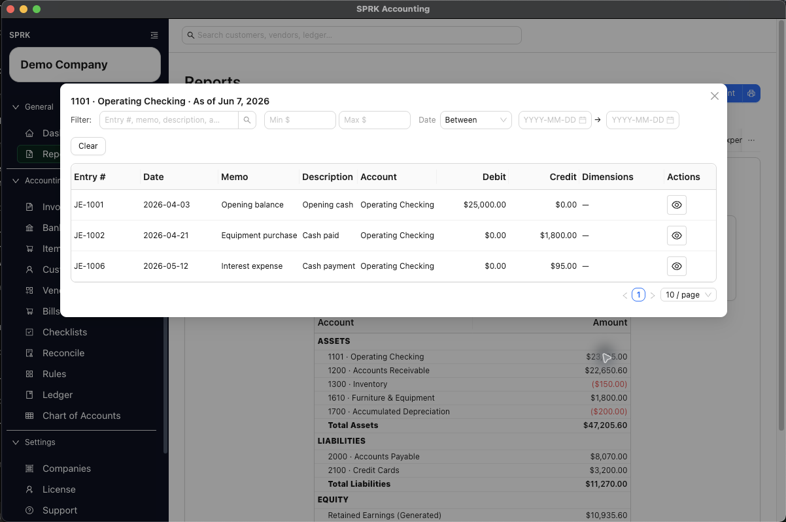

# Use Report Drilldown Behavior

Open a report row with supporting detail when SPRK exposes drilldown, then review the underlying journal entries without changing the original posting.

## Purpose

Use this workflow when you want to move from a report total or account row into the supporting journal-entry detail behind that amount.

## Prerequisites

- You are on the `Reports` page.
- The report you are using has been run for the date or period you want to inspect.
- The row you want to inspect has a non-zero amount and supports drilldown.

## Steps

1. Open `Reports`.
2. Run a statement report such as `Income Statement` or `Balance Sheet`.
3. Review the report rows and locate the account amount you want to inspect.
4. Select the clickable amount on a supported report row.
5. Review the drilldown window that opens:
   - The window title uses the account label and the report date context, such as `4000 · Sales Revenue · Jan 1, 2026 – Jun 4, 2026` for a range-based report.
   - Range-based reports open detail for the report date range.
   - As-of reports open detail through the selected as-of date.
   - Open-ended drilldown contexts can use date filters such as `Before` or `After` instead of a two-date range.
6. Review the supporting journal entries in the drilldown table.
7. Use the drilldown filters if you need to narrow the supporting rows further:
   - Text filter for entry number, memo, description, or account.
   - Minimum and maximum amount filters.
   - Date modes `On`, `Before`, `After`, or `Between`.
8. Close the drilldown window when you are done and return to the report.

## Expected Result

SPRK opens a supporting-entry view for the selected account and date context so you can trace report amounts back to posted activity. Current general ledger impact as of 2026-06-04:

- Drilldown does not create a correcting entry or edit an existing one.
- Drilldown only exposes journal entries that are already posted in the ledger for that company and date context.
- Closing the drilldown window leaves the underlying report and ledger unchanged.

## Common Mistakes

- Expecting every report row to be clickable. Drilldown only applies where SPRK exposes a supported account row with a non-zero amount.
- Assuming drilldown edits the transaction you are viewing. It is a review window, not an edit step.
- Forgetting that an as-of report uses detail up to the selected date, not only activity on that one date.

## Related Articles

- [View available reports](./view-available-reports.md)
- [Export transactions from reports](./export-transactions-from-reports.md)
- [Review financial results inside the product](./review-financial-results-inside-the-product.md)
- [Interpret report navigation without accounting advice](./interpret-report-navigation-without-accounting-advice.md)

## Info

- App sections: `reports`, `ledger`
- Last validated: 2026-06-04
- Screenshot status: `captured`
