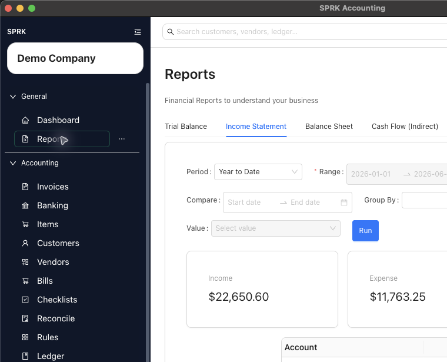

# View Available Reports

<!-- Screenshot status: Review needed -->

Use this report catalog to choose the SPRK report that fits the review question before running, exporting, printing, or drilling into results.

## Quick reference

| Report Or Area | Use It For | Where It Matters |
|---|---|---|
| `Trial Balance` | Account balances by debit and credit | Period review, cleanup, and accountant checks |
| `Income Statement` | Income, expenses, and net income | Operating results and compare-period review |
| `Balance Sheet` | Assets, liabilities, and equity | Financial position review |
| `Cash Flow (Indirect)` | Cash flow review | Cash movement interpretation |
| `Schedule C` | Income and expense activity grouped for Schedule C review | Tax-preparation review; not filing |
| `Tax Forms` | Tax-form review where available | Review only; not tax filing or agency submission |
| `General Ledger` | Posted transaction detail by account | Drilldown, account review, and export |
| `Account Detail` | One account's activity | Account-level investigation |
| `Expense by Vendor` | Vendor spending and 1099-oriented review | Vendor review and expense analysis |
| `Income by Customer` | Posted income grouped by customer and account | Customer contribution and invoice-detail review |
| `Receivables Aging` | Unpaid customer balances | AR review and collection follow-up |
| `Payables Aging` | Unpaid vendor balances | AP review and payment planning |
| `Reconciliation` | Posted reconciliation reports | Bank reconciliation history |
| Plugin-provided reports | Reports added by compatible installed plugins | Available only when the plugin is enabled and its report is available |

## Details

1. Open `Reports` from the left sidebar.
2. Confirm the page header shows `Reports`.
3. Select the tab that matches your review question. Use the tab overflow menu if a report is not visible in the first row.
4. Set the date controls required for that tab:
   - Range-based reports use a period preset and date range.
   - As-of reports use an as-of style date.
   - Date fields can be selected from the calendar or typed directly.
   - Typed dates should follow your saved `Preferences` date order.
5. Review report-specific filters:
   - `Income Statement` supports compare-period controls and optional grouping.
   - `Tax Forms` requires a tax-form selection before you run it.
   - `Expense by Vendor` includes vendor and date filters, and can expose a `1099` filter with `All`, `Yes`, and `No`.
   - `General Ledger` adds filters for `Account Type`, `Account SubType`, `Accounts`, `Vendor`, `Text`, `Group By`, and optional `Include opening balance`.
   - Aging reports and `Reconciliation` require the filters shown on their tabs.
6. Select `Run`.
7. Review the table and any summary cards that appear.
8. If needed, use `Export` to save the current report rows or `Print` to open the print workflow for the active report.

Reports show posted data for the active company. `Export` and `Print` use the current report view.

## If something looks wrong

| What You See | What To Check | What To Do Next |
|---|---|---|
| A report looks blank | Active company, date range, filters, and posted activity | Adjust the context and run the report again |
| A report tab uses different date controls | Whether the report is range-based or as-of | Use the controls shown on that report tab |
| Typed dates normalize unexpectedly | Saved date-format preference | Enter dates in the order shown in `Preferences` |
| You need files from several reports | Whether only the active report is selected | Export each needed report from its own tab |
| A plugin report is missing | Plugin enablement, company access, and report availability | Refresh plugin status and check Reports again |
| `Tax Forms` looks like a filing workflow | Whether you are reviewing report output only | Use it as review output, not tax filing or agency submission |

## Practice and examples

- Practice file: [report-export-practice.csv](../sample-files/practice/report-export-practice.csv)

## Related

- [Review financial results inside the product](./review-financial-results-inside-the-product.md)
- [Export transactions from reports](./export-transactions-from-reports.md)
- [Use report drilldown behavior](./use-report-drilldown-behavior.md)
- [Run Schedule C](./run-schedule-c.md)
- [Run Income by Customer](./run-income-by-customer.md)
- [View and print bank reconciliation reports](../reconciliation/view-and-print-bank-reconciliation-reports.md)
- [Use the Preferences tab](../preferences-and-personalization/use-the-preferences-tab.md)
- [Troubleshoot missing Plugins (Beta) pages](../plugins/troubleshoot-plugin-pages-that-do-not-appear.md)
