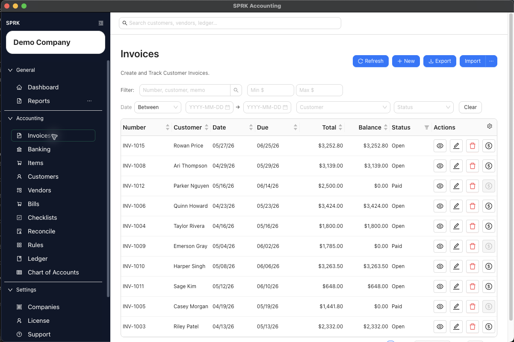

# AR Review Workflow

Use this accounts receivable review workflow to check customers, invoices, payments, receivables aging, and revenue detail before reporting.

## When To Use This

Use this workflow before month-end reporting, before contacting customers about balances, or when receivables totals on reports do not look right.

## Before You Start

- The correct company is active.
- Customer records and invoice items are set up.
- Customer invoices and payments for the period have been entered or imported through the supported workflows.

## Steps

1. Review customer records for duplicate or incomplete names.
2. Review invoice defaults before entering more invoices.
   - Confirm payment terms.
   - Confirm invoice items and revenue accounts.
3. Open the invoice list and filter or sort for open, overdue, voided, or recently paid invoices.
4. Review invoices that should have been paid.
5. Receive payments against the invoice records when customer money has been received.
6. Review payment history from the invoice or customer context when a balance looks wrong.
7. Run `Receivables Aging` if available.
8. Run `Income Statement` and review revenue totals for the period.
9. Use drilldown or `General Ledger` detail when revenue or AR balances do not match expectations.
10. Correct invoice or payment issues in the receivables workflow before using journal entries.

## What Happens Next

AR review helps confirm that customer balances, invoice status, payment application, AR aging, and revenue reporting are telling the same story.

## If Something Looks Wrong

- Do not post a journal entry to clear a customer balance before checking invoice payment status.
- Do not treat a paid bank deposit as proof that the invoice payment was applied correctly.
- Do not rely on aging reports until invoices and payments have been entered.
- Do not change revenue accounts casually after invoices have already been posted.
- Do not review AR without confirming the active company.

## Related

- [Manage customers](./manage-customers.md)
- [Set up receivables defaults before invoicing](./set-up-receivables-defaults-before-invoicing.md)
- [Create and open invoices](./create-and-open-invoices.md)
- [Receive invoice payments](./receive-invoice-payments.md)
- [Understand invoice general ledger impact](./understand-invoice-general-ledger-impact.md)
- [Review financial results inside the product](../reports-and-financial-review/review-financial-results-inside-the-product.md)
