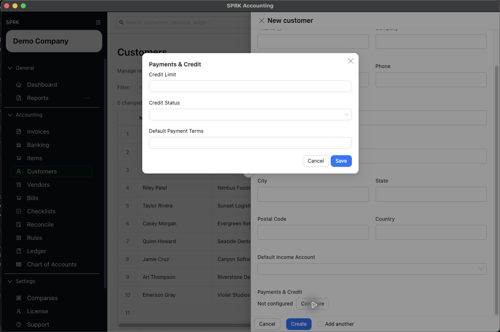

# Configure Customer Payment Terms and Credit

Set customer-level payment and credit defaults before invoicing so due dates, receivables follow-up, and internal review expectations stay more consistent.

## When To Use This

Use this page when you want a customer record to carry standard payment terms, a visible credit review status, or a credit limit before your team starts creating invoices.

## When To Use This Setup

- Set customer terms when most invoices for the customer should start from the same due-date pattern.
- Use company `Sales / Invoicing` defaults when most new invoices across the company should start from the same terms before customer-specific setup is applied.
- Set a credit status when your team needs a visible reminder to pause, review, or use a stricter collection approach before opening invoices.
- Set a credit limit when you want the customer record to show a reference amount for receivables review and follow-up.

## Before You Start

- You can open `Customers`.
- The customer record already exists, or you are ready to create it.
- You know whether the customer should use standard terms such as `Net 15`, `Net 30`, or `Due on receipt`.

## Steps

1. Open `Customers`.
2. Create a new customer or edit an existing one.
3. In the customer drawer, review the core customer details first so the record is easy to identify later.
4. Open `Payments & Credit`.
5. Review `Terms` first:
   - Use this field when the customer usually follows the same payment window.
   - SPRK can use the saved customer terms to fill invoice `Payment Terms`.
   - When invoice terms fill automatically, SPRK can also calculate a starting `Due Date` from the invoice date.
6. Review `Credit status` next:
   - Choose the status that best matches how your team wants to review future invoices.
   - Common visible options include `Approved`, `Credit Hold`, `Cash Only`, `On Hold`, and `Review Required`.
7. Review `Credit limit` if you want the customer record to show a reference amount for receivables review.
8. Save the customer.
9. When creating an invoice later, review the filled `Payment Terms` and `Due Date` instead of assuming they are always correct for that specific job.
10. Use the customer row action for `AR Aging` when you need to review open balances, terms, and overdue timing for that customer after invoices are posted.

## What Happens Next

The customer record keeps payment and credit defaults together, new invoices can start with the customer's payment terms already filled in, and receivables follow-up stays easier to review by customer.

## Downstream Effects

- Customer terms can prefill invoice `Payment Terms` and help SPRK calculate a due date from the invoice date.
- Company-level `Default invoice payment terms` can seed invoices that do not already have a customer or invoice-specific terms value.
- Common terms such as `Due on receipt`, `Due upon receipt`, `EOM`, `x/y net N`, and `Net N` can calculate due dates. Review unusual freeform terms manually.
- Invoice-level terms still need review because a one-off invoice may need a different due date than the customer default.
- If an invoice has its own terms, receivables aging can show the invoice-specific terms for that invoice instead of falling back to the customer default.
- Receivables aging can show terms and overdue timing alongside the customer balance, which helps with collection follow-up.
- Recording a payment is still a separate workflow. Changing terms or credit settings does not reduce an invoice balance.

## If Something Looks Wrong

- Treating customer terms as permanent invoice instructions without reviewing the actual invoice date and due date.
- Using `Paid` or another invoice status change instead of the payment workflow when money is collected.
- Assuming a credit status blocks or approves customer activity automatically. Use it as a visible control point unless your team has verified a stronger workflow around it.
- Forgetting to revisit older customer defaults after payment expectations change.

## Related

- [Manage customers](./manage-customers.md)
- [Set up receivables defaults before invoicing](./set-up-receivables-defaults-before-invoicing.md)
- [Create and open invoices](./create-and-open-invoices.md)
- [Receive invoice payments](./receive-invoice-payments.md)
- [Understand invoice general ledger impact](./understand-invoice-general-ledger-impact.md)
