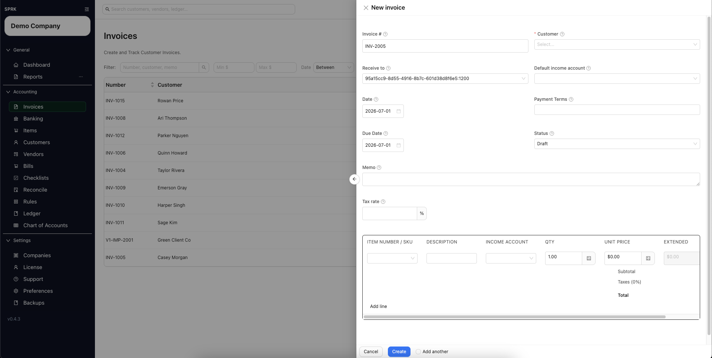
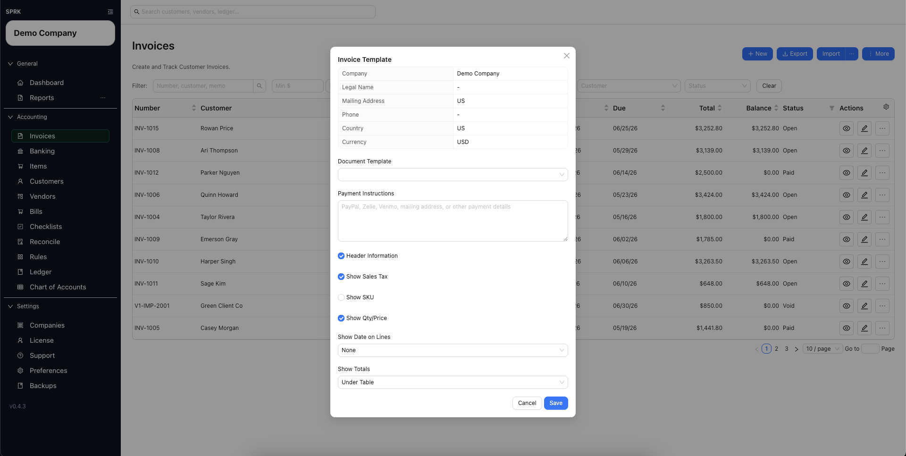
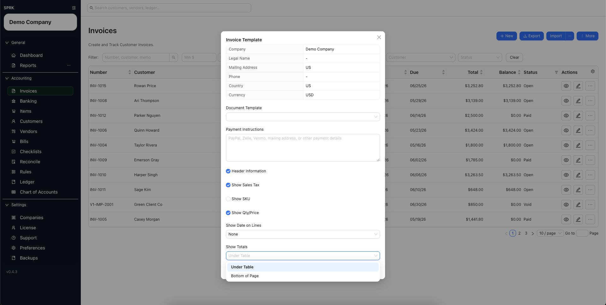
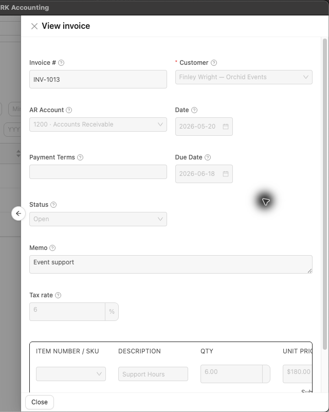
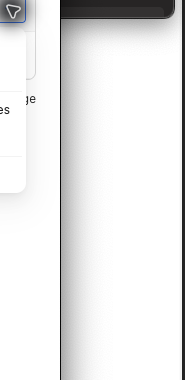
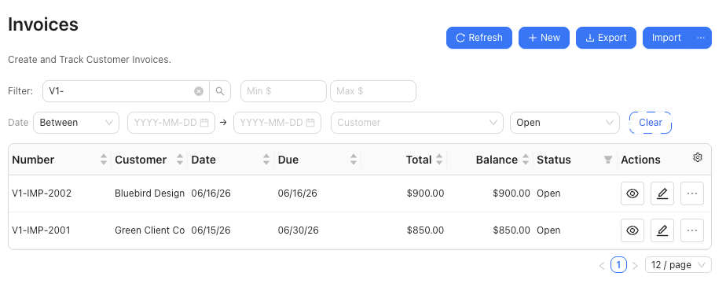

# Create and Open Invoices

Build invoices from customers and items, choose whether they post through receivables or settle immediately, print customer-facing copies, and reopen them later when you need to review or update the details.

## When To Use This

Use this workflow when you need to create a new customer invoice, decide whether it should stay in draft or move to open status, and return to existing invoices from the invoice list.

## Before You Start

- A customer record exists, or you are ready to add one from the invoice drawer.
- The invoice amount can be built from one or more lines.
- Your company is ready to use invoices in receivables workflows.
- You know whether this invoice should use an Accounts Receivable control account or a cash, bank, or credit-card settlement account in `Receive to`.
- If the company uses name-only account presentation, account pickers such as `Receive to` can show names without code-first labels.
- If the company uses `Description only` item identification, supported item selectors may hide item numbers while still keeping the saved item records.
- If the customer uses saved payment terms, you are ready to review the filled due date before saving.

## Create a new invoice

1. Open `Invoices`.
2. Select `New`.
3. Complete the invoice header:
   - `Invoice #`
   - `Customer`
   - `Receive to`
   - `Default income account`
   - `Date`
   - `Payment Terms`, if needed
   - `Due Date`
   - `Status`
   - `Memo`
   - `Tax rate`, if needed
4. If company `Sales / Invoicing` defaults are configured, review the starting payment terms, due date, and workflow status before you continue.
   - `Default invoice payment terms` can seed a new invoice when no customer or invoice value is already supplied.
   - `New invoice workflow` can start new invoices as `Draft` or `Open`, depending on company setup.
5. If the selected customer already has saved payment terms, review the `Payment Terms` value SPRK fills in for you.
6. Review the resulting `Due Date` before saving:
   - If the invoice does not already have a manual due date, SPRK can calculate one from the invoice date and payment terms.
   - Common supported terms such as `Due on receipt`, `Due upon receipt`, `EOM`, `x/y net N`, and `Net N` can calculate due dates. Treat unusual freeform terms as values to review manually.
   - If you need an exception for this invoice, replace the default due date with the agreed date before you save.
7. Recheck the due date any time you change the customer, invoice date, or negotiated payment timing for this invoice.
8. Choose `Receive to` carefully:
   - Use an Accounts Receivable control account when the invoice should stay on the open accrual path.
   - Use a cash, bank, or credit-card settlement account only when the invoice is being recorded as paid immediately.
   - Receivable control routing and settlement-account routing are alternative paths, not two fields to combine on the same invoice.
9. Add one or more invoice lines.
10. Use `Item Number / SKU` or `Description` to pull matching item details into the line when available.
   - In companies set to `Description only`, supported item-entry helpers may show descriptions without item numbers.
11. Review quantity, unit price, line `Income account`, and extended amount on each line.
   - `Default income account` fills blank line income accounts when the drawer supports that fallback.
   - The line-level `Income account` is the posting source for that line.
12. If the customer or item does not exist yet, create it inline from the invoice drawer and continue without leaving the page.
13. Decide how the invoice should be saved:
   - `Draft` keeps the invoice unposted.
   - `Open` moves the invoice into an active receivables state when `Receive to` is an Accounts Receivable control account.
   - Choosing a settlement account in `Receive to` can route the invoice through the paid-now path instead of leaving an open receivable.
14. If you choose `Open`, confirm `Receive to`, due date, and lines one more time before saving.
15. Save the invoice.
   - If you edit and save an invoice that has already posted, SPRK can show `Save Posted Invoice` before it changes the posting.
   - Review the available strategy before continuing: `Post adjustment journal entry`, `Reverse and repost`, or `Edit existing journal entry`.
   - Adjustment dates can use `Today`, `Original posting date`, or `Custom date`.
   - Reversal dates can use `Original posting date`, `Today`, or `Custom date`; repost dates can use `Document date`, `Today`, or `Custom date`.
   - Changes to `Receive to`, line income accounts, default income account, dates, totals, or posted status are accounting-sensitive once the invoice has posted.
16. Review the invoice list to confirm the expected status, total, balance, terms, and due date.

## Open an existing invoice

1. Open `Invoices`.
2. Find the invoice in the list.
3. Use the row action for `View` when you only need to review the invoice.
4. Use the row action for `Edit` when you need to update the invoice details.
5. Use the row action menu when you need source-document actions such as `Print`, `Record Payment`, `Match Payment`, `View linked journal entries`, `View payment history`, or `Void invoice`.
6. Confirm the invoice number, customer, date, due date, status, total, and balance before making changes.

## Print an Invoice

1. Open `Invoices`.
2. Use the row action `Print` when you want to print directly from the invoice list without opening edit mode first.
3. Use `More` > `Invoice Template` when you need to change the company-wide print layout.
4. Review the visible print settings before saving:
   - `Header Information`
   - `Show Sales Tax`
   - `Show SKU`
   - `Show Qty/Price`
   - `Show Date on Lines`
   - `Show Totals`
5. Leave settings on when you want the full customer-facing layout. When no print settings have been saved yet, SPRK uses the full printable layout.
6. Use the switches and choices for specific presentation needs:
   - `Header Information` controls the company header block. Invoice metadata and `Bill To` details remain part of the invoice layout.
   - `Show Sales Tax` controls the sales-tax total line.
   - `Show SKU` controls the SKU column.
   - `Show Qty/Price` controls quantity and unit-price columns together.
   - `Show Date on Lines` can use `None`, `Due Date`, or `Invoice Date` as one shared date column for invoice lines.
   - `Show Totals` can place totals `Under Table` or at the `Bottom of Page`.
7. Review the printed preview before sending it to a customer. The current customer-facing layout can include the centered company contact block, `Bill To`, invoice metadata, lines, totals, optional memo, and optional `Payment Instructions` from company settings.
   - Treat this as the current customer-standard invoice layout, not a catalog of interchangeable invoice templates.

## Import Invoice Files

Use invoice import when you already have invoice rows in a spreadsheet or CSV and want SPRK to create grouped invoice documents after preview.

- Grouped rows can use visible headers such as `Customer Name`, `Due Date`, `SKU` or `Item`, `Memo`, `Tax Rate`, `Status`, `Amount`, `Line Amount`, and `Extended Amount`.
- Account-routing headers can include `Receive to`, `Default Income Account`, and `Line Income Account`.
- `Receive to` follows the same routing rule as the drawer: an Accounts Receivable control account keeps the imported invoice on the accrual path, while a non-control cash, bank, or credit-card settlement account imports as paid-now.
- `Default Income Account` fills blank line income accounts; `Line Income Account` remains the posting source of truth.
- SPRK expects a customer, at least one line, valid line account or item details, positive quantities, and non-duplicate invoice numbers.
- Imports that try to mix receivable control routing and settlement-account routing for the same invoice are rejected instead of silently guessing the posting path.

## Void an unpaid open invoice

1. Use `Void invoice` only when it is visible on an eligible posted-like invoice row.
2. Confirm the invoice is `Open` and its full balance still equals its total.
3. Do not use this path for draft, partial, paid, or already voided invoices.
4. In `Void invoice`, choose `Today`, `Original invoice date`, or `Custom date`.
5. Enter a non-empty reason.
6. Confirm only when you intend SPRK to post a reversal, set the invoice to `Void`, zero the invoice balance, and preserve void audit details.

## What Happens Next

The invoice appears in the invoice list with the expected number, customer, totals, balance, payment timing, and status. Reopened invoices can be reviewed in view mode, updated in edit mode, reviewed through payment history, or corrected through supported source-document actions. Posted invoice saves follow the strategy you choose when SPRK prompts, and `Edit existing journal entry` can be unavailable when company policy or prior adjustment history does not allow it.

## If Something Looks Wrong

- Leaving the invoice in `Draft` when you expected it to move into the active receivables workflow.
- Choosing `Paid` in the invoice status field and assuming that is the same as recording a payment.
- Leaving `Receive to` blank when you expect the invoice to move into an open receivables or paid-now state.
- Choosing a cash or bank settlement account in `Receive to` when you meant to keep an unpaid customer balance open.
- Assuming `Default income account` posts by itself. Review the line-level `Income account` values before saving.
- Forgetting that `Customer` is required.
- Skipping a review of the due date after customer terms or invoice dates change.
- Assuming customer payment terms are always correct for exceptions, rush jobs, or negotiated one-off dates.
- Changing an existing invoice without checking its current balance and status first.
- Treating `Save Posted Invoice` as a routine draft save. It is an audit-sensitive choice about how SPRK should preserve or adjust the posted entry.
- Expecting item numbers to appear in every company. `Description only` item identification can hide item numbers in supported item and invoice workflows.
- Assuming the printed invoice includes payment history or ledger detail. The print layout is customer-facing invoice output.
- Trying to void an invoice that already has active payments. Reverse or unapply active payments first where the product supports that correction.
- Treating `Void invoice` as delete. It preserves the invoice and creates reversal history.

## Business Scenario: Open Invoice Review And Grouped Import

Use this scenario to train staff on invoice detail review, row actions, and the grouped-line CSV import claim for service-business invoices.

- Sample files:
  - [08-ar-customer-item-invoice-payment.csv](../sample-files/v1-validation/08-ar-customer-item-invoice-payment.csv)
  - [09-invoice-import-grouped-lines.csv](../sample-files/v1-validation/09-invoice-import-grouped-lines.csv)
- Evidence:

Validation note: the grouped invoice import walkthrough passed in SPRK v0.3.57. The screenshot shows the two expected open invoices created from [09-invoice-import-grouped-lines.csv](../sample-files/v1-validation/09-invoice-import-grouped-lines.csv).

## Related

- [Set up receivables defaults before invoicing](./set-up-receivables-defaults-before-invoicing.md)
- [Configure customer payment terms and credit](./configure-customer-payment-terms-and-credit.md)
- [Receive invoice payments](./receive-invoice-payments.md)
- [Understand invoice general ledger impact](./understand-invoice-general-ledger-impact.md)
- [Review document payment history and linked journals](../ledger-and-chart-of-accounts/review-document-payment-history-and-linked-journals.md)
- [Manage customers](./manage-customers.md)
- [Manage items for invoicing](./manage-items-for-invoicing.md)
