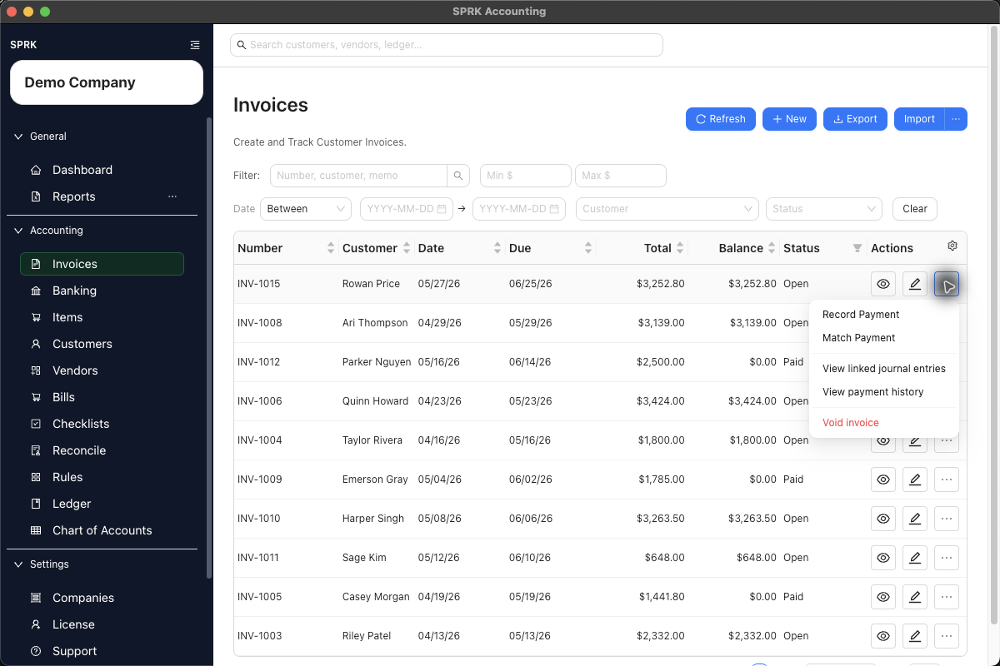

# Choose an Invoice Task

<!-- Screenshot status: Review needed -->

Choose the invoice guide that matches what you need to do.

## Start here

If you are entering a new invoice, go directly to [Create an invoice](./create-invoices.md). Use the choices below for other invoice work.

## Choose an invoice task

| Goal | Use | Check First |
|---|---|---|
| Enter a new customer invoice | [Create invoices](./create-invoices.md) | Customer, `Receive to`, due date, line accounts, and invoice status |
| Review or update an existing invoice | [Review and edit invoices](./review-and-edit-invoices.md) | Invoice status, balance, payment history, and posted-save prompts |
| Print a customer-facing invoice | [Print invoices](./print-invoices.md) | Invoice details, company header, sales tax, SKU, quantity/price, dates, and totals |
| Import grouped invoice rows from a file | [Import invoices](./import-invoices.md) | Customers, line accounts, duplicate invoice numbers, and `Receive to` routing |
| Record or match money received | [Receive invoice payments](./receive-invoice-payments.md) | Open balance, `Deposit to`, payment amount, and whether the bank row should be matched |
| Void or correct a posted invoice | [Void or correct invoices](./void-or-correct-invoices.md) | Active payments, linked journals, invoice status, balance, and reversal date |
| Understand invoice posting consequences | [Understand invoice general ledger impact](./understand-invoice-general-ledger-impact.md) | Whether the invoice is draft, open, paid-now, paid, voided, or corrected |

## Before You Commit

- Confirm the active company before creating or changing invoice records.
- Review whether `Receive to` should use an Accounts Receivable control account or a cash, bank, or credit-card settlement account.
- Review line-level `Income account` values before saving or importing.
- Check customer terms and due date before sending the invoice to a customer.
- Review payment history before voiding or changing an invoice with activity.
- Treat posted-save prompts, void confirmation, and paid-now routing as accounting-sensitive choices.

## What Not To Assume

- `Paid` status is not the same thing as recording or matching a payment.
- `Default income account` is not a substitute for reviewing line-level income accounts.
- Printed invoice output is customer-facing; it does not include payment history or ledger review detail.
- Voiding an invoice is not deleting it. A supported void preserves the invoice and reversal history.
- Customer defaults and company defaults seed values; they do not remove the need to review each invoice.

## Practice and examples

- Practice reference: [receivables-customer-item-invoice-payment.csv](../sample-files/practice/receivables-customer-item-invoice-payment.csv)

## Related

- [Set up receivables defaults before invoicing](./set-up-receivables-defaults-before-invoicing.md)
- [Configure customer payment terms and credit](./configure-customer-payment-terms-and-credit.md)
- [Manage customers](./manage-customers.md)
- [Manage items for invoicing](./manage-items-for-invoicing.md)
- [Review document payment history and linked journals](../ledger-and-chart-of-accounts/review-document-payment-history-and-linked-journals.md)
